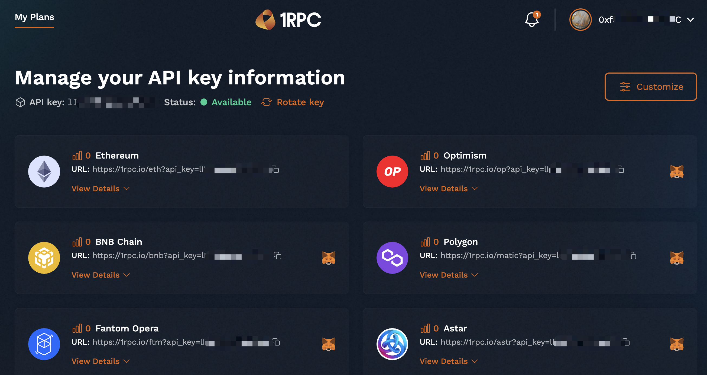
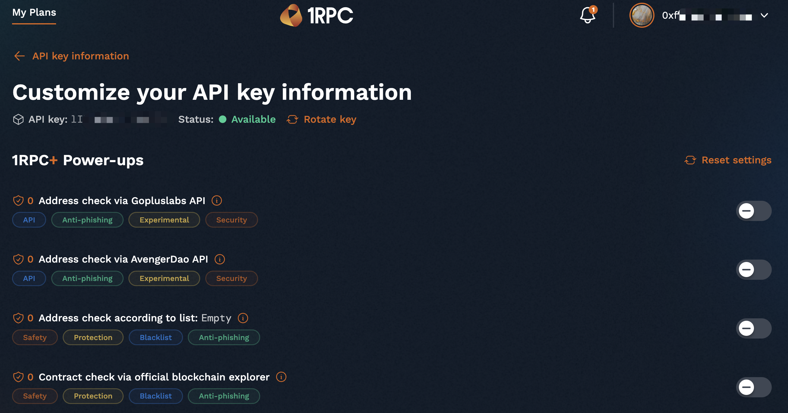
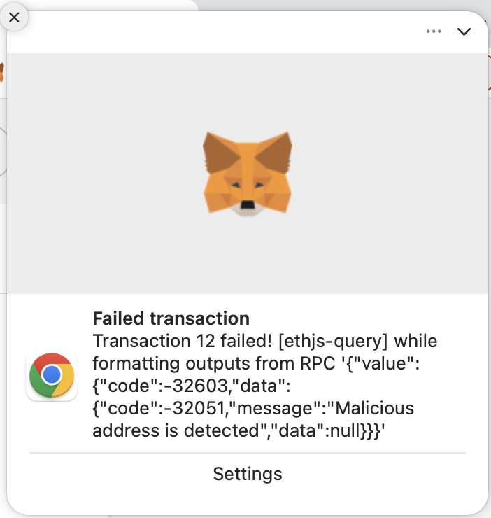
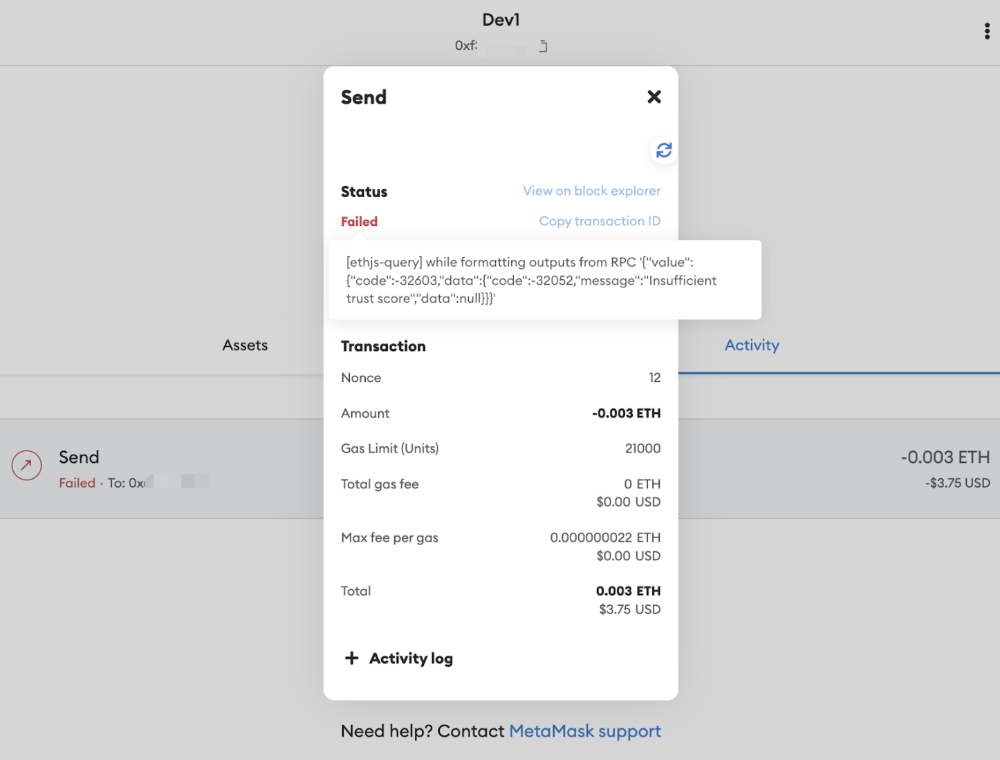

# 1RPC+

## Overview

1RPC+ is the premium version of 1RPC, it provides customization rules including anti-phishing detections with dedicated endpoints. Premium users can view their daily usage in the 1RPC+ dashboard and customize their own rules to validate the write requests to the blockchain.

## How to join 1RPC+

Visit https://www.1rpc.io/ and click the `Join the wait-list` button, file the necessary info and our admins will periodically approve a certain list to invite more and more users to 1RPC+.

## Features

- ### Anti-phishing

    1RPC+ has implmenetated some anti-phishing rules by Automata team, and also integrated some 3rd party API to improve the safety. All analysis data will be deleted after the request relays. It returns a specified error code and error message if any rule hits, and updates the usage count to the user's plan.

- ### Customization

    1RPC+ users can customize their own rules to validate the write requests, to get addtional checks in RPC level and increase the asset security in a smooth way. Users can view the number of the times the rules take effect in the past 14 days in the customization page.

## Dashboard

After the first successful login, 1RPC+ will generate a default plan with an API key, users can use the endpoints with the API key and configure them to the supported wallets or extensions. The one-click add-on button for Metamask extension is supported and it will help users to configure in a lightweight way. Users can view the network details and manually add the network to the wallets or extensions by clicking the `View Details` dropdown button.

{style="zoom:80%"}

## Usage

In the dashboard, users can view their daily usages for each network next to the statistics icon. The usage will be reset everyday (00:00 UTC).

Currently it's a beta version and the daily usage quota for each premium user is ???. Users can pay and get a higher quota in the future version.

## Customization rules

{style="zoom:80%"}

If a write request hit any of the enabled rules, 1RPC+ will returns a specified error code and error message. Here is an example in Metamask extension.

{style="zoom:50%"}
{style="zoom:50%"}


### Rules details

- #### Rate Limitation
    * Rule ID: 001
    * Rule Name: Rate limitation
    * Rule Details: If it reaches the daily rate limit, 1RPC+ will stop the upcoming requests until the next day (00:00 UTC).
    * Error code: -32001
    * Error message: Exceeded the quota usage
    * Example:
    ```shell
    {"jsonrpc": "2.0", "error": {"code": -32001, "message": "Exceeded the quota usage"}, "id": 1}
    ```

- #### Address check according to users’ customized list
    * Rule ID: 002
    * Rule Name: Address check according to users’ customized list
    * Rule Details: 1RPC+ will encrypt and save users’ customized address lists as a part of the customization configuration. Users can choose to use either whitelist or blacklist in this config. For each eth_sendRawTransaction request, 1RPC+ will decode it and deserialize the interactive addresses, and validate these addresses by using users’ config.
    * Support methods:
        * approve
        * setApprovalForAll
        * transferFrom
        * safeTransferFrom
        * transfer
    * Error code: -32002
    * Error message: Invalid address
    * Example:
    ```shell
    {"jsonrpc": "2.0", "error": {"code": -32002, "message": "Invalid address"}, "id": 1}
    ```

- #### Address check on uniswap transaction
    * Rule ID: 003
    * Rule Name: Address check on uniswap transaction
    * Rule Details: 1RPC+ will ensure beneficial address is signer
    * Support contracts
        * Ethereum Mainnet:
            * V3 Router: 0xE592427A0AEce92De3Edee1F18E0157C05861564
            * V3 Router2: 0x68b3465833fb72A70ecDF485E0e4C7bD8665Fc45
            * V2 Router: 0xf164fC0Ec4E93095b804a4795bBe1e041497b92a
            * V2 Router2: 0x7a250d5630B4cF539739dF2C5dAcb4c659F2488D
        * Polygon Mainnet:
            * V3 Router: 0xE592427A0AEce92De3Edee1F18E0157C05861564
            * V3 Router2: 0x68b3465833fb72A70ecDF485E0e4C7bD8665Fc45
        * Optimism:
            * V3 Router: 0xE592427A0AEce92De3Edee1F18E0157C05861564
            * V3 Router2: 0x68b3465833fb72A70ecDF485E0e4C7bD8665Fc45
        * Arbitrum One:
            * V3 Router: 0xE592427A0AEce92De3Edee1F18E0157C05861564
            * V3 Router2: 0x68b3465833fb72A70ecDF485E0e4C7bD8665Fc45
        * Celo Mainnet:
            * V3 Router2: 0x5615CDAb10dc425a742d643d949a7F474C01abc4
    * Support methods:
        * V3 Router:
            * exactInput
            * exactInputSingle
            * exactOutput
            * exactOutputSingle
        * V3 Router2:
            * exactInput
            * exactInputSingle
            * exactOutput
            * exactOutputSingle
            * swapExactTokensForTokens
            * swapTokensForExactTokens
        * V2 Router:
            * swapExactTokensForTokens
            * swapTokensForExactTokens
            * addLiquidity
            * addLiquidityETH
            * removeLiquidity
            * removeLiquidityETH
            * removeLiquidityWithPermit
            * removeLiquidityETHWithPermit
            * swapETHForExactTokens
            * swapExactETHForTokens
            * swapTokensForExactETH
            * swapExactTokensForETH
        * V2 Router2:
            * swapExactTokensForTokens
            * swapTokensForExactTokens
            * addLiquidity
            * addLiquidityETH
            * removeLiquidity
            * removeLiquidityETH
            * removeLiquidityWithPermit
            * removeLiquidityETHWithPermit
            * swapETHForExactTokens
            * swapExactETHForTokens
            * swapTokensForExactETH
            * swapExactTokensForETH
            * removeLiquidityETHSupportingFeeOnTransferTokens
            * removeLiquidityETHWithPermitSupportingFeeOnTransferTokens
            * swapExactETHForTokensSupportingFeeOnTransferTokens
            * swapExactTokensForETHSupportingFeeOnTransferTokens
            * swapExactTokensForTokensSupportingFeeOnTransferTokens
    * Error code: -32003
    * Error message: Recipient is suspicious
    * Example:
    ```shell
    {"jsonrpc": "2.0", "error": {"code": -32003, "message": "Recipient is suspicious"}, "id": 1}
    ```

- #### Address check via Gopluslabs API
    * Rule ID: 051
    * Rule Name: Address check via Gopluslabs API
    * Rule Details: 1RPC+ will decode users' eth_sendRawTransaction request to deserialize the interactive addresses, and send these addresses to [Gopluslabs API](https://twitter.com/GoplusSecurity) to verify whether any of them is malicious, which should follow the Gopluslabs's [Terms of Use](https://gopluslabs.io/terms-of-use).
    * Support methods:
        * approve
        * setApprovalForAll
        * transferFrom
        * safeTransferFrom
        * transfer
    * Support networks: 
        * Ethereum Mainnet
        * BNB Smart Chain
        * Polygon Mainnet
        * Fantom Opera
        * Arbitrum One
        * Avalanche
    * Error code: -32051
    * Error message: Malicious address is detected
    * Example:
    ```shell
    {"jsonrpc": "2.0", "error": {"code": -32051, "message": "Malicious address is detected"}, "id": 1}
    ```

- #### Address check via AvengerDAO API
    * Rule ID: 052
    * Rule Name: Address check via AvengerDAO API
    * Rule Details: Users can configure a trust level for the accounts the transaction is going to interact with, which will be used to compare with the [AvengerDAO API](https://www.avengerdao.org/) result. 1RPC+ will decode users' eth_sendRawTransaction request to deserialize the interactive addresses, and send these addresses to AvengerDAO API to verify whether any of them is potentially malicious or not by using the trust level comparison, which should follow the AvengerDAO's Terms of Use.
    * Support methods:
        * approve
        * setApprovalForAll
        * transferFrom
        * safeTransferFrom
        * transfer
    * Support networks: All EVM compatible networks
    * Error code: -32052
    * Error message: Insufficient trust score
    * Example:
    ```shell
    {"jsonrpc": "2.0", "error": {"code": -32052, "message": "Insufficient trust score"}, "id": 1}
    ```

- #### Contract check via official blockchain explorer
    * Rule ID: 053
    * Rule Name: Contract check via official blockchain explorer
    * Rule Details: 1RPC+ will decode users' eth_sendRawTransaction request to deserialize the interactive contracts, and verify whether the contract is validated or not from the official blockchain explorer API.
    * Terms of Use of official blockchain explorer 1RPC+ uses:
        * Ethereum mainnet: [etherscan](https://etherscan.io/terms).
        * BNB smart chain: [bscscan](https://bscscan.com/terms).
        * Polygon mainnet: [polygonscan](https://polygonscan.com/terms).
        * Arbitrum One: [arbiscan](https://arbiscan.io/terms).
        * Moonbeam: [moonbeam](https://moonscan.io/terms).
        * Avalanche: [snowtrace](https://snowtrace.io/terms).
        * Optimism: [optimistic](https://optimistic.etherscan.io/terms).
        * Fantom Opera: [ftmscan](https://ftmscan.com/terms).
    * Error code: -32053
    * Error message: Unverified contract
    * Example:
    ```shell
    {"jsonrpc": "2.0", "error": {"code": -32053, "message": "Unverified contract"}, "id": 1}
    ```
