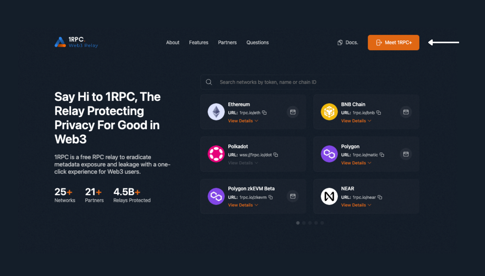
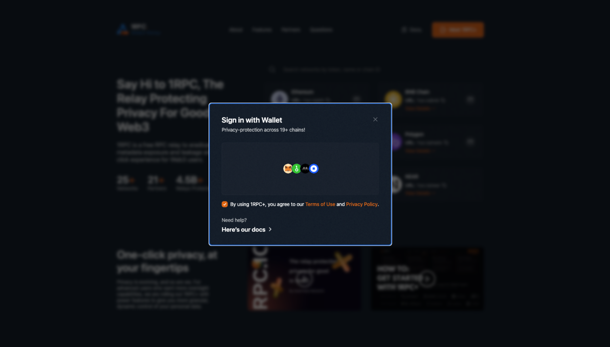
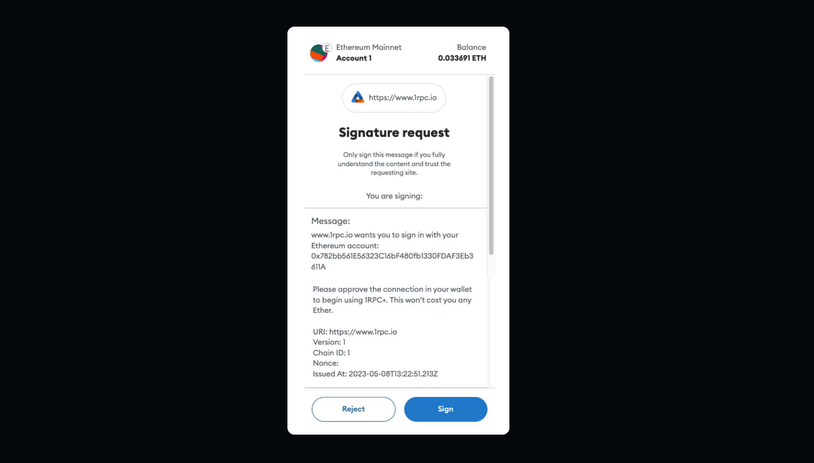
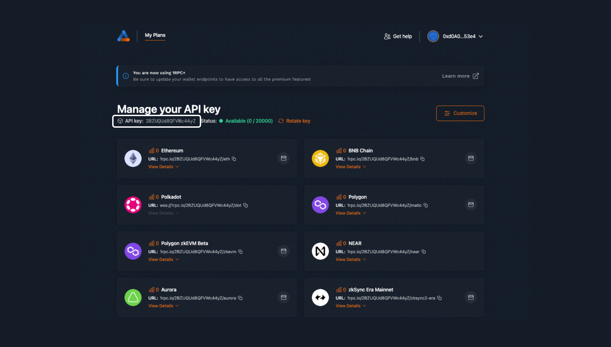
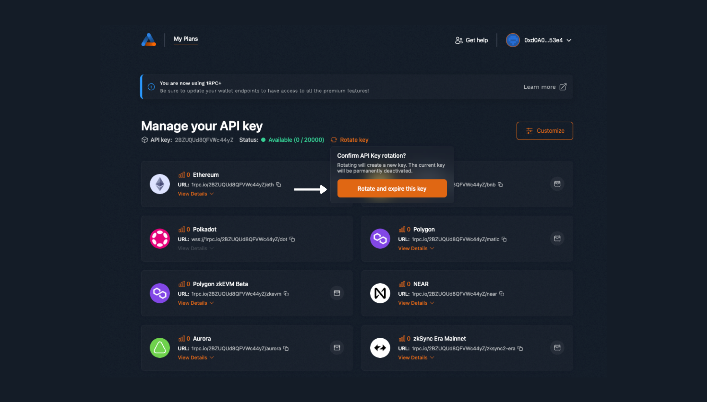
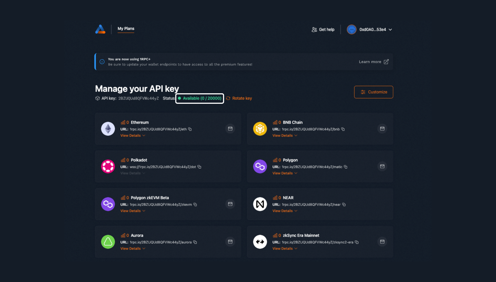
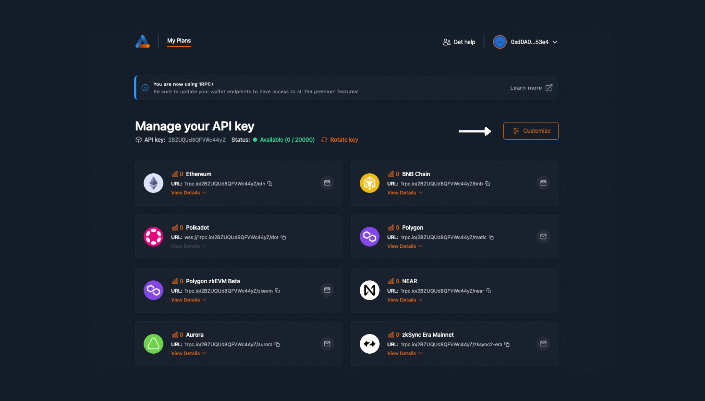
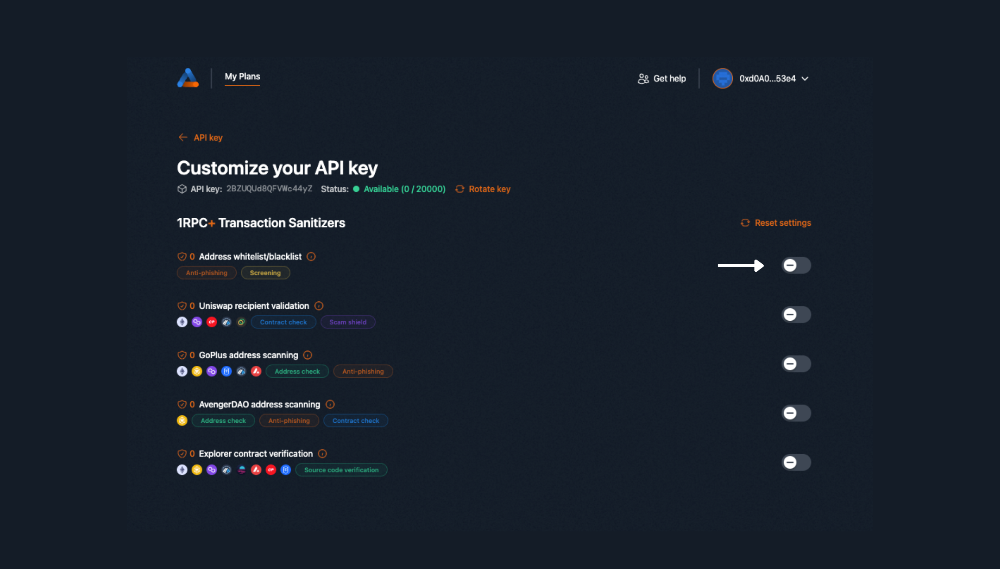

# User Guide

Click on 'Meet 1RPC+' on the top right of the page. 

{style="zoom:100%"}

A pop-up will appear. Click on the wallet icons to connect your wallet. 

{style="zoom:100%"}

Sign the message to begin using 1RPC+. 

{style="zoom:100%"}

This is the dashboard for 1RPC+ members. The API key on the dashboard is private to you and is used to generate 1RPC+ URLs across all supported networks. Do not share this key publicly to avoid misuse or abuse by others. 

{style="zoom:100%"}

To create a new API key, click on "Rotate Key". Note that the existing key will be deactivated permanently, as will all other 1RPC+ endpoints associated with it. For instance, the URL for Ethereum on that API key will no longer be in use. Click on the wallet icon to connect your wallet using your new API key. 

{style="zoom:100%"}

The status gives an indication of the daily limit for the number of relays supported on 1RPC+ for each user. The counter resets on UTC+0 00:00 each day. 

{style="zoom:100%"}

Click on the wallet icon to switch to 1RPC+ instantly. Here we’re using MetaMask as an example to illustrate what that would look like.

{style="zoom:100%"}

Sign the following messages to switch to 1RPC+ on the network. 

{style="zoom:100%"}

# Transaction Sanitizers

Click on "Customize" on the top right of the 1RPC+ dashboard. 

{style="zoom:100%"}

This is where you will be able to add and edit transaction sanitizers. Click on the information icon to learn more about each rule. 

* To enable a sanitizer, simply click on the toggle button to switch it on. 
* To disable it, click on the same button to switch it off. 
* 1RPC+ helps to remember the same settings if you rotate your API key. 
* Click on “Reset settings” to clear any previous selections. 
* The shield icon is accompanied by a numerical value that represents the total count of transactions identified as fraudulent or malicious, and which are subsequently blocked by the transaction sanitizer.

{style="zoom:100%"}

## Address whitelist/blacklist

* Users can either create a blacklist or whitelist
* To create a list, input the address into the column and click Enter. A valid address will turn green and become a correct entry.
* To delete the list or edit the list title, click on the 3 vertical dots beside it. 
* To add a new list, click on ‘Create a new list’ at the top 

##  Uniswap recipient validation
* 1RPC+ matches the recipient’s address against its sender to confirm the validity of the address.
* This ensures that you’re swapping tokens to the correct recipient address. 

## GoPlus address scanning
* 1RPC+ decodes the addresses that the user interacts with and verifies whether any of them is malicious by using [GoPlus address API](https://gopluslabs.io/).

## AvengerDAO address scanning
* 1RPC+ decodes the addresses that the user interacts with and ensures that the trust score based on risk levels provided by [AvengerDAO Meter](https://www.avengerdao.org/docs/meter/consumer-api/Endpoints#data) satisfies the threshold specified by the user.
* The trust score is an indicator of the level of vigilance and caution exercised, with higher scores corresponding to more stringent checks. 

## Explorer contract verification
* 1RPC+ ensures that the contract that you are interacting with is verified on the chain’s official blockchain explorer. e.g., etherscan for Ethereum.
* Verification means that the source code of the contract is made accessible for public viewing on the blockchain explorer. 

Should a transaction fail, users can click on the error message to find out more about the transaction sanitizer that was applied. Alternatively, read more about rules and limitations on 1RPC+ [here](./spec.md). 

{style="zoom:100%"}
