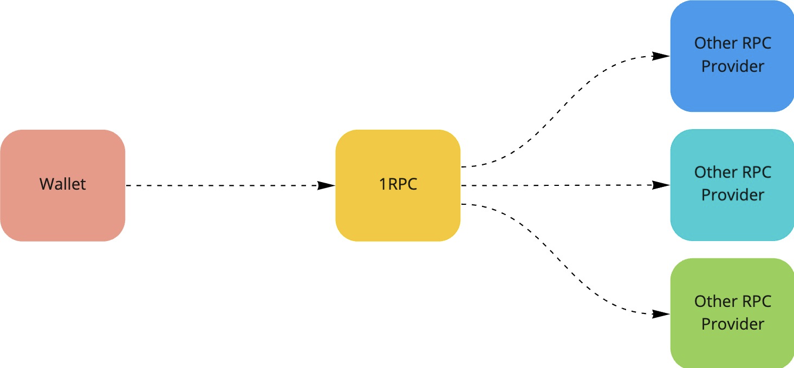

# Design

{style="zoom:80%"}

1RPC is a proxy that forwards user requests transparently to other RPC providers. It has a very lightweight design that is able to scale to support high volume of traffic without compromising its zero-tracking guarantee and compatibility with existing blockchain RPC protocols.

## Tracking Prevention

A typical RPC endpoint could see the user request that contains **metadata** and **data**:

* Metadata

    * IP address (Geolocation)

    * User agent (Browser version, OS platform)

    * Request timestamp (Timezone)

* Data

    * Read requests that RPC providers do not have to know, such as wallet addresses.

    * Write requests that will be eventually public on chain, if executed successfully.

With the exception of data that will be public on chain, all the other metadata / data should remain private to users and other parties should not be able to access or collect it. 1RPC uses many different techniques to prevent the unnecessary collection of user privacy, which prevents tracking from RPC providers.

### Metadata Masking

When users choose 1RPC, it talks to other RPC providers on their behalf. That means the metadata attached to a particular request is no longer the user’s - it is replaced by 1RPC relay’s metadata. This ensures that the original user metadata is hidden from RPC providers.

### Random Dispatching

Requests via 1RPC are randomly dispatched to other RPC providers, which breaks the linkability when a user consecutively sends multiple requests containing different wallet addresses. Now,  RPC providers will see only shuffled requests coming from different users, which renders it impossible to link the data to a particular user.

### Request Caching

Certain read-only queries will be cached to reduce the response time and further reduce the information passed to RPC providers. The caching policy currently uses LRU (least recently used) and may be upgraded in the future to a more advanced policy to balance between lower response time, higher hit ratio and lower retention (for better privacy).

### Multicall Disassociation

Sometimes a single RPC call contains multiple batched queries (**`multicall`** transaction), leading to immediate exposure of the linkability between these requests. Where possible 1RPC will detect the multicall transactions and disassemble it into individual requests to avoid [doxxing multiple wallets at the same time](https://medium.com/hoprnet/derp-example-1-metamask-linkability-6b26ba42072f).

### Burn after relaying

1RPC will immediately discard any metadata and data after successfully relaying a request. There is a very short time window that the request will be alive within 1RPC node. To avoid the collection from 1RPC node itself, secure enclave technology is used to provide integrity and privacy. This guarantees that the information will be burnt after use and the node itself will not be able to keep the information or send it to other 3rd parties.

## Phishing Detection

This feature is only supported in our beta endpoints, https://beta.1rpc.io. You need to manually replace the https://1rpc.io with the beta one to get this functionality. It will return a phishing detection error with error code -32000.

```shell
{"jsonrpc": "2.0", "error": {"code": -32000, "message": "Phishing detection error"}, "id": "1"}
```

### Domain check
Leveraging open and public efforts on tracking phishing domains (e.g., [CryptoScamDB](https://cryptoscamdb.org/)), 1RPC can detect whether the request comes from a suspicious website. This will be the last line of defense to help reduce the risk of a user signing a transaction on a malicious website.

### Address check
Some significant transactions like approve, setApprovalForAll, transferFrom and safeTransferFrom, 1RPC will extract addresses such as spender, and check whether these addresses have suspicious behavior through APIs such as [@SlowMist_Team](https://twitter.com/SlowMist_Team), [@GoplusSecurity](https://twitter.com/GoplusSecurity) etc.

Supported networks

* Ethereum Mainnet
* BNB Chain Mainnet
* Polygon Mainnet
* Arbitrum One
* Avalanche Contract Chain

## Compatibility

1RPC is JSON RPC compliant and will forward user requests transparently to the supported blockchain protocol. It utilizes the data availability from other 3rd-party RPC providers and provides the best aggregated RPC experience.
