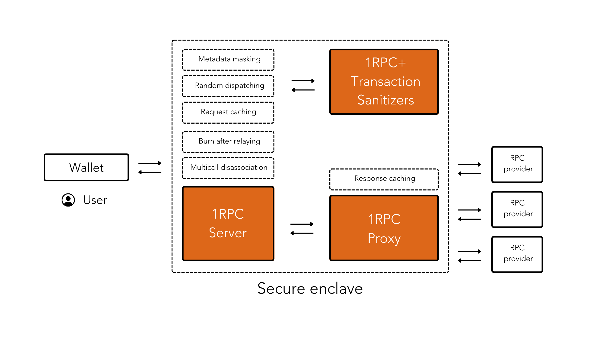

## Design

{style="zoom:100%"}

1RPC employs a number of methods for users' data and metadata to remain private before requests are relayed to RPC providers. Its lightweight design is able to scale to support high traffic volume. 

## Overview 

There are a few terms to get yourself familarized with to understand the full extent of what 1RPC does and what it has to offer. 

When users perform any kind of action, such as viewing their balance, creating a transaction or bidding for an NFT, requests are submitted to the blockchain through an RPC. Typically, the RPC endpoint would be able to view, and sometimes store, such requests. These requests might contain both user data and metadata. 

* Data: Information related to any interaction on-chain is considered data

    * Read requests such as wallet addresses, usually out of scope in terms of need-to-know 
    * Write requests which will be made public on-chain, if executed successfully

* Metadata: While not data itself, metadata provides or suggests information about data

    * IP address (Geolocation)
    * User agent (Browser version, OS platform)
    * Request timestamp (Timezone)

## Zero tracking by 1RPC 

### Metadata Masking

1RPC replaces metadata attached to a user’s request with its own. What happens as a result is that the original metadata attached to a particular request, and any personal information that could identify the user, is removed from the view of RPC providers. 

### Random Dispatching

1RPC dispatches requests randomly to RPC providers, breaking the linkability between wallets when a user sends multiple requests from different addresses consecutively. Shuffling requests as such makes it impossible to log the association between accounts with the same private key.

### Request Caching

Certain read-only queries are cached to reduce response time and reduce the information load passed to RPC providers. The current LRU (least recently used) policy will be upgraded as we learn more about usage and capacity requirements.

### Burn after relaying

1RPC neither stores nor collects metadata/data that passes through the relay, which are discarded once the request is completed. Because the RPC endpoint runs in a secure enclave, it is not possible for 1RPC to view, access, or tamper with the metadata within.

### Multicall Disassociation

A single RPC call that contains multiple batched queries can reveal the relationship between an umbrella of different accounts under the same wallet. When possible, 1RPC disassembles multicall transactions into its individual requests to prevent exposure. 
