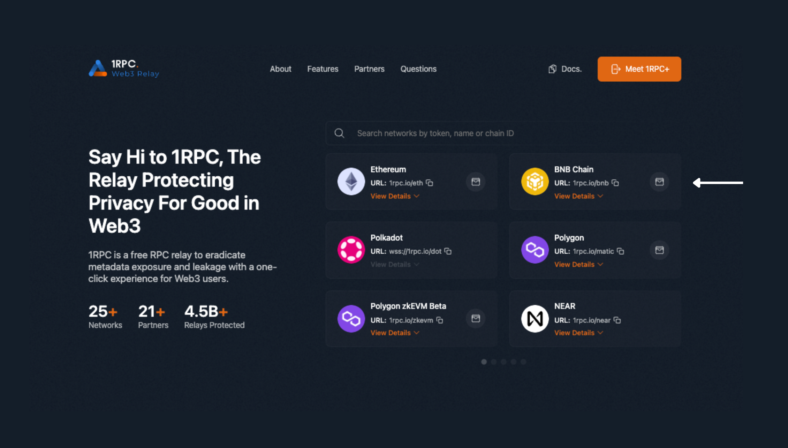
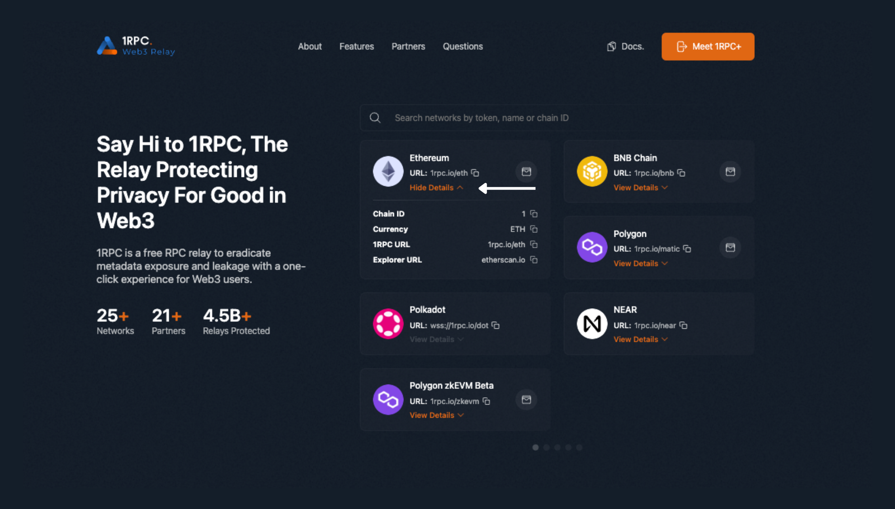
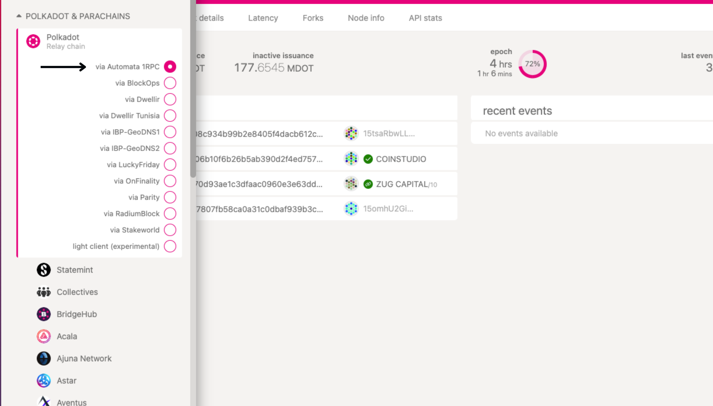

# User Guide

## User

Visit [1RPC](https://www.1rpc.io/). Search for the network by token, name or Chain ID, or scroll through the list.

{style="zoom:100%"}

Click on the wallet icon to switch to 1RPC instantly. 

{style="zoom:100%"}

Alternatively, click on View Details. Copy the network information to your wallet settings. 

{style="zoom:100%"}

For Substrate blockchains, switch to 1RPC on [Polkadot.js](https://polkadot.js.org/apps/)

{style="zoom:100%"}

## Developer

Replace the existing URL with 1RPC's endpoint URL to interact with the blockchain.

=== "Curl"

    ```shell
    curl --request POST \
        --url https://1rpc.io/eth \
        --header 'Accept: application/json' \
        --header 'Content-Type: application/json' \
        --data '
    {
        "id": 1,
        "jsonrpc": "2.0",
        "method": "eth_blockNumber"
    }
    '
    ```

=== "Go"

    ```go
    package main

    import (
        "context"
        "fmt"
        "github.com/ethereum/go-ethereum/ethclient"
    )

    func main() {
        const url = "https://1rpc.io/eth"  // url string
        
        rpcClient,err := ethclient.Dial(url)
        
        if err != nil {
            panic(err)
        }
        
        blockNumber, err := rpcClient.BlockNumber(context.Background())
        
        if err != nil {
            panic(err)
        }
        
        fmt.Println(blockNumber)
    }
    ```

=== "Web3.js"

    ```javascript
    const Web3 = require('web3');

    const url = 'https://1rpc.io/eth'  // url string

    const web3 = new Web3(new Web3.providers.HttpProvider(url));

    web3.eth.getBlockNumber((error, blockNumber) => {
        if(!error) {
            console.log(blockNumber);
        } else {
            console.log(error);
        }
    });
    ```

=== "Python"

    ```py
    from web3 import Web3
            
    def test_block_number(self):
        url = 'https://1rpc.io/eth'  # url string
        
        web3 = Web3(HTTPProvider(url))
        print(web3.eth.block_number)
    ```

=== "Websocket"

    ```shell
    $ wscat -c wss://1rpc.io/dot

    > {"jsonrpc":  "2.0", "id": 0, "method":  "system_chainType"}
    ```
