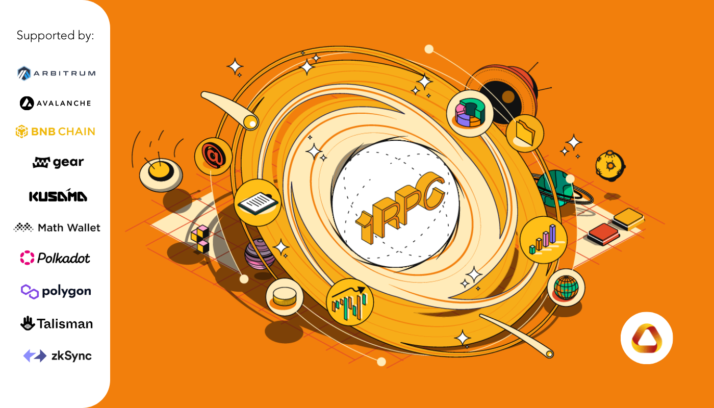
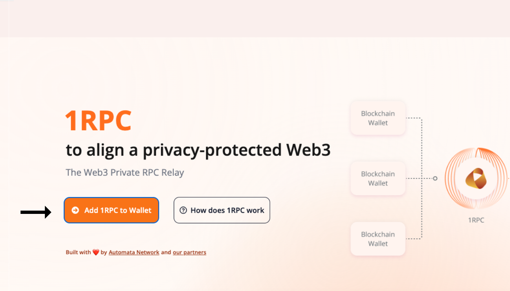

# Introduction

## Overview

{style="zoom:80%"}

1RPC is a free and private RPC relay that protects Web3 users when accessing RPC endpoints. It tunnels user requests via distributed relays to other RPC providers whilst preventing the tracking of user metadata such as IP address, device information and wallet linkability. It offers protection on user privacy without compromising compatibility with existing blockchain RPC protocols.

To avoid metadata tracking from other RPC providers, 1RPC relays user requests and avoids any direct communication between user and RPC providers. In addition, the 1RPC nodes immediately delete any metadata after relaying the requests successfully. The connections between users, 1RPC and RPC providers are TLS secured which further prevents any tracking from other network providers. 

1RPC is created to be an open initiative from the blockchain infrastructure community. We are motivated by a common good mission to help build a better Web3 and we encourage anyone who values user privacy to join this open collaboration.

## Motivation

The majority of the users in Web3 don’t know their **private metadata is exposed to 3rd party RPC providers.** Every time a user **connects their wallet**, an RPC endpoint is connected, which receives a tremendous amount of **identifying information** even before initiating a transaction.

For example, as soon as you start up Metamask, an `eth_call` request is sent to Infura (Metamask’s default RPC), who could potentially have access to private **metadata such as your IP address, browser version, OS platform**, etc. Additionally, the request will try to get the balance of all your addresses added to Metamask - effectively exposing all your wallet addresses and the association between them, linked to your metadata, to RPC providers. 

The information is received, collected, and potentially stored and analyzed by RPC providers. This data harvesting is concerning enough to raise the alarm, but should a data breach occur to an RPC provider, the leakage could lead to more attacks on users via “social engineering” attacks, phishing attacks, and even physical danger.

## Features

- ### Zero tracking

    1RPC relays user requests to RPC providers and shield user’s private metadata, including IP address, device information, and wallet association. 1PRC does not save or track such information.

- ### Anti-phishing

    1RPC detects phishing requests from malicious domains and stops relaying malicious transactions. 

- ### Multi-chain compatibility

    1RPC is compliant with JSON RPC 2.0 standard and supports multiple blockchain protocols (e.g., EVM, Substrate) via HTTPS and WSS.

## Supported Networks

| Network Name | 1RPC URL | Chain ID | Currency Symbol | Block Explorer URL |
|:------------:|:--------:|:--------:|:---------------:|:------------------:|
| ETH Mainnet | https://1rpc.io/eth | 1 | ETH | https://etherscan.io |
| BNB Chain Mainnet | https://1rpc.io/bnb | 56 | BNB | https://bscscan.com |
| Polygon Mainnet | https://1rpc.io/matic | 137 | MATIC | https://polygonscan.com |
| Avalanche Contract Chain | https://1rpc.io/avax/c | 43114 | AVAX | https://snowtrace.io |
| Avalanche Platform Chain | https://1rpc.io/avax/p | | | |
| Avalanche Exchange Chain | https://1rpc.io/avax/x | | | |
| Arbitrum One | https://1rpc.io/arb | 42161 | ETH | https://arbiscan.io |
| Moonbeam | https://1rpc.io/glmr | 1284 | GLMR | https://moonscan.io |
| | wss://1rpc.io/glmr | | |
| Astar | https://1rpc.io/astr | 592 | ASTR | https://blockscout.com/astar |
| | wss://1rpc.io/astr | | |
| Polkadot | wss://1rpc.io/dot | | |
| Kusama | wss://1rpc.io/ksm | | |
| Acala | wss://1rpc.io/aca | | |
| Optimism | https://1rpc.io/op | 10 | ETH | https://optimistic.etherscan.io |
| zkSync alpha testnet | https://1rpc.io/zksync2 | 280 | ETH | https://zksync2-testnet.zkscan.io |
| Fantom Opera | https://1rpc.io/ftm | 250 | FTM | https://ftmscan.com |
| Celo Mainnet | https://1rpc.io/celo | 42220 | CELO | https://explorer.celo.org |
| Klaytn Mainnet | https://1rpc.io/klay | 8217 | KLAY | https://www.klaytnfinder.io |
| Starknet | https://1rpc.io/starknet | | | https://starkscan.co |
| AltLayer | https://1rpc.io/alt | 9990 | ALT | https://devnet-explorer.altlayer.io |
| Near | https://1rpc.io/near | | | https://explorer.near.org |
| Aurora Mainnet | https://1rpc.io/aurora | 1313161554 | ETH | https://explorer.mainnet.aurora.dev |

### Limitations

* Rate limit for the whole service: 20 requests per second.

* Request content size: 2MB at most.

## Get Started

### User

Visit https://www.1rpc.io/ to add 1RPC to MetaMask via the one-click "Add to Wallet" button.  

{style="zoom:60%"}

{style="zoom:60%"}

Alternatively, copy and paste the network information to your wallet settings. 

{style="zoom:60%"}

For Substrate blockchains, switch to 1RPC instantly on [Polkadot.js](https://polkadot.js.org/apps/)

{style="zoom:60%"}

### Developer

Replace the existing URL with 1RPC's endpoint URL to interact with the blockchain.

=== "Curl"

    ```shell
    curl --request POST \
        --url https://1rpc.io/eth \
        --header 'Accept: application/json' \
        --header 'Content-Type: application/json' \
        --data '
    {
        "id": 1,
        "jsonrpc": "2.0",
        "method": "eth_blockNumber"
    }
    '
    ```

=== "Go"

    ```go
    package main

    import (
        "context"
        "fmt"
        "github.com/ethereum/go-ethereum/ethclient"
    )

    func main() {
        const url = "https://1rpc.io/eth"  // url string
        
        rpcClient,err := ethclient.Dial(url)
        
        if err != nil {
            panic(err)
        }
        
        blockNumber, err := rpcClient.BlockNumber(context.Background())
        
        if err != nil {
            panic(err)
        }
        
        fmt.Println(blockNumber)
    }
    ```

=== "Web3.js"

    ```javascript
    const Web3 = require('web3');

    const url = 'https://1rpc.io/eth'  // url string

    const web3 = new Web3(new Web3.providers.HttpProvider(url));

    web3.eth.getBlockNumber((error, blockNumber) => {
        if(!error) {
            console.log(blockNumber);
        } else {
            console.log(error);
        }
    });
    ```

=== "Python"

    ```py
    from web3 import Web3
            
    def test_block_number(self):
        url = 'https://1rpc.io/eth'  # url string
        
        web3 = Web3(HTTPProvider(url))
        print(web3.eth.block_number)
    ```

=== "Websocket"

    ```shell
    $ wscat -c wss://1rpc.io/dot

    > {"jsonrpc":  "2.0", "id": 0, "method":  "system_chainType"}
    ```
