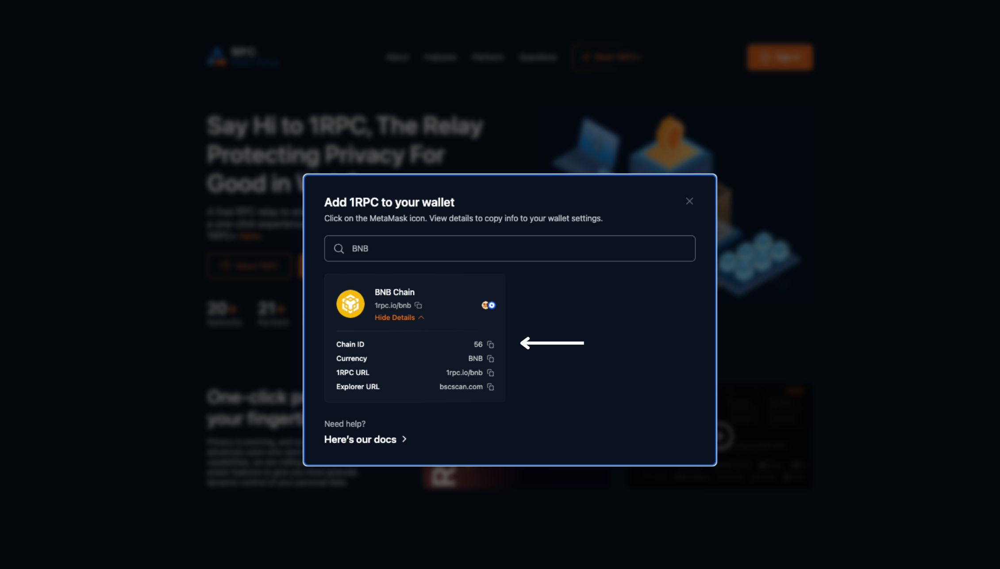

# Introduction

## Overview

1RPC is a free RPC relay to eradicate metadata exposure and leakage with a one-click experience for users within Web3. As a proxy layer that shields user data before it reaches existing RPC endpoints, many of which continue to be centralized today, it is important to us that 1RPC neither collects nor stores user metadata in any part of the relay journey.

To support the evolving needs of our budding community, we’ve rolled out 1RPC+ to give users more granular, dynamic control of how they interact with the blockchain. Read more about 1RPC+ [here](./1rpc+.md) - and how users create their own bespoke RPC endpoint with transaction sanitizers that can be added, edited or removed instantly, at any time. 

## Features

- ### Public good 

    The task for privacy protection as a RPC relay has allowed us rare insight into what it takes to strike the balance between idealism and ease of use. More than ever, we’re committed to making sure 1RPC remains a free service for users within Web3. 

- ### One-click

    An intuitive user experience helps users to get the most out of 1RPC’s privacy features. Clicking on the MetaMask icon for EVM-compatible chains will allow users to switch instantly to 1RPC. 

- ### Zero tracking 

    Even ostensibly private transactions are liable to some form of tracing, but not on 1RPC. Skip ahead to 1RPC’s design to read all about how we make it happen using a number of technical methods. 
    
- ### Multi-chain 

    1RPC currently supports 19 chains, with more being added to the list. Users can easily connect to the relay service either through the network RPC URL or Substrate WebSocket endpoint. 
    
## Supported networks

| Network Name | 1RPC URL | Chain ID | Currency Symbol | Block Explorer URL |
|:------------:|:--------:|:--------:|:---------------:|:------------------:|
| ETH Mainnet | https://1rpc.io/eth | 1 | ETH | https://etherscan.io |
| BNB Chain Mainnet | https://1rpc.io/bnb | 56 | BNB | https://bscscan.com |
| Polygon Mainnet | https://1rpc.io/matic | 137 | MATIC | https://polygonscan.com |
| Avalanche Contract Chain | https://1rpc.io/avax/c | 43114 | AVAX | https://snowtrace.io |
| Avalanche Platform Chain | https://1rpc.io/avax/p | | | |
| Avalanche Exchange Chain | https://1rpc.io/avax/x | | | |
| Arbitrum One | https://1rpc.io/arb | 42161 | ETH | https://arbiscan.io |
| Moonbeam | https://1rpc.io/glmr | 1284 | GLMR | https://moonscan.io |
| | wss://1rpc.io/glmr | | |
| Astar | https://1rpc.io/astr | 592 | ASTR | https://blockscout.com/astar |
| | wss://1rpc.io/astr | | |
| Polkadot | wss://1rpc.io/dot | | |
| Kusama | wss://1rpc.io/ksm | | |
| Acala | wss://1rpc.io/aca | | |
| Optimism | https://1rpc.io/op | 10 | ETH | https://optimistic.etherscan.io |
| zkSync alpha testnet | https://1rpc.io/zksync2 | 280 | ETH | https://zksync2-testnet.zkscan.io |
| Fantom Opera | https://1rpc.io/ftm | 250 | FTM | https://ftmscan.com |
| Celo Mainnet | https://1rpc.io/celo | 42220 | CELO | https://explorer.celo.org |
| Klaytn Mainnet | https://1rpc.io/klay | 8217 | KLAY | https://www.klaytnfinder.io |
| Starknet | https://1rpc.io/starknet | | | https://starkscan.co |
| AltLayer | https://1rpc.io/alt | 9990 | ALT | https://devnet-explorer.altlayer.io |
| Near Mainnet | https://1rpc.io/near | | | https://explorer.near.org |
| Aurora Mainnet | https://1rpc.io/aurora | 1313161554 | ETH | https://explorer.mainnet.aurora.dev |

### Limitations

* Rate limit for 1RPC: 40 requests per second, 20,000 requests per day

Daily usage quota will reset in the following day (00:00 UTC). An error code -32001 will be displayed once the rate limit is reached. 

```shell
{"jsonrpc": "2.0", "error": {"code": -32001, "message": "Exceeded the quota usage"}, "id": 1}
```

* Request content size: 2 Megabytes (MB)

An error code -32600 will be displayed once the request limit is reached. 

```shell
{"jsonrpc": "2.0", "error": {"code": -32600, "message": "JSON RPC Request is too large"}, "id": 1}
```

* Response content size: 2 Megabytes (MB)

An error code -32000 will be displayed once the response limit is reached. Trying to call the eth_getLogs method might increase the content size, which can be brought down by refining the request, such as reducing the block range. 

```shell
{"jsonrpc": "2.0", "error": {"code": -32000, "message": "response size should not greater than 2097152 bytes"}, "id": 1}
```

## Get Started

### User

Visit [1RPC](https://www.1rpc.io/). Click on the "Add 1RPC to Wallet" button.  

{style="zoom:100%"}

Search for the network by token, name or Chain ID.

{style="zoom:100%"}

Click on the MetaMask icon to switch to 1RPC instantly. 

{style="zoom:100%"}

Alternatively, click on View Details. Copy the network information to your wallet settings. 

{style="zoom:100%"}

For Substrate blockchains, switch to 1RPC on [Polkadot.js](https://polkadot.js.org/apps/)

{style="zoom:100%"}

### Developer

Replace the existing URL with 1RPC's endpoint URL to interact with the blockchain.

=== "Curl"

    ```shell
    curl --request POST \
        --url https://1rpc.io/eth \
        --header 'Accept: application/json' \
        --header 'Content-Type: application/json' \
        --data '
    {
        "id": 1,
        "jsonrpc": "2.0",
        "method": "eth_blockNumber"
    }
    '
    ```

=== "Go"

    ```go
    package main

    import (
        "context"
        "fmt"
        "github.com/ethereum/go-ethereum/ethclient"
    )

    func main() {
        const url = "https://1rpc.io/eth"  // url string
        
        rpcClient,err := ethclient.Dial(url)
        
        if err != nil {
            panic(err)
        }
        
        blockNumber, err := rpcClient.BlockNumber(context.Background())
        
        if err != nil {
            panic(err)
        }
        
        fmt.Println(blockNumber)
    }
    ```

=== "Web3.js"

    ```javascript
    const Web3 = require('web3');

    const url = 'https://1rpc.io/eth'  // url string

    const web3 = new Web3(new Web3.providers.HttpProvider(url));

    web3.eth.getBlockNumber((error, blockNumber) => {
        if(!error) {
            console.log(blockNumber);
        } else {
            console.log(error);
        }
    });
    ```

=== "Python"

    ```py
    from web3 import Web3
            
    def test_block_number(self):
        url = 'https://1rpc.io/eth'  # url string
        
        web3 = Web3(HTTPProvider(url))
        print(web3.eth.block_number)
    ```

=== "Websocket"

    ```shell
    $ wscat -c wss://1rpc.io/dot

    > {"jsonrpc":  "2.0", "id": 0, "method":  "system_chainType"}
    ```
