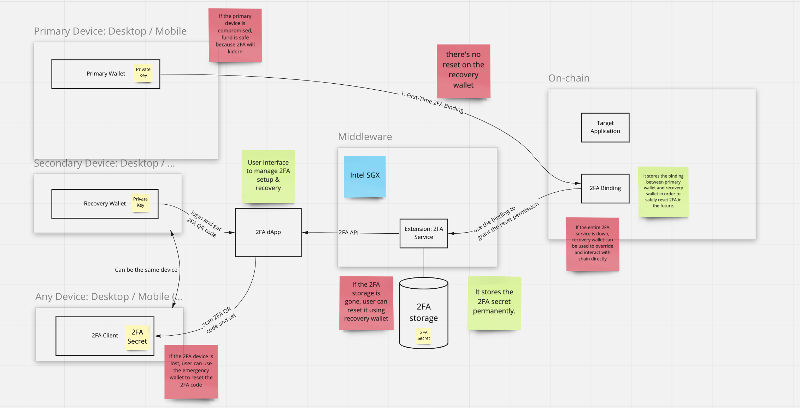
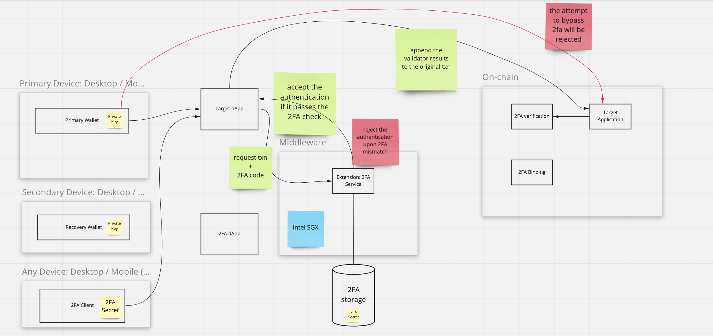

# Architecture

## Setup and Recovery

## Main workflow

### Component definitions
* Primary wallet: the place where users store and control their assets.
* Recovery wallet: used for identifying the users' roles and resetting the 2FA device, the relationship between the primary wallet and the recovery wallet is saved on-chain after binding.
* 2FA client, the device which provides the TOTP(Time-based one-time password).
* [2FA dApp](), the website hosted by the Automata team. It contains the 2FA management panel and wallet assets control panel. Users can sign up 2FA and find the 2FA protected dApps in the management panel, and they can make the authorised transfer under the wallet assets control panel.
* 2FA Guru Geode, the 2FA middleware which is built upon the Intel SGX. It's responsible for the 2FA secret generation, storage and authentication.