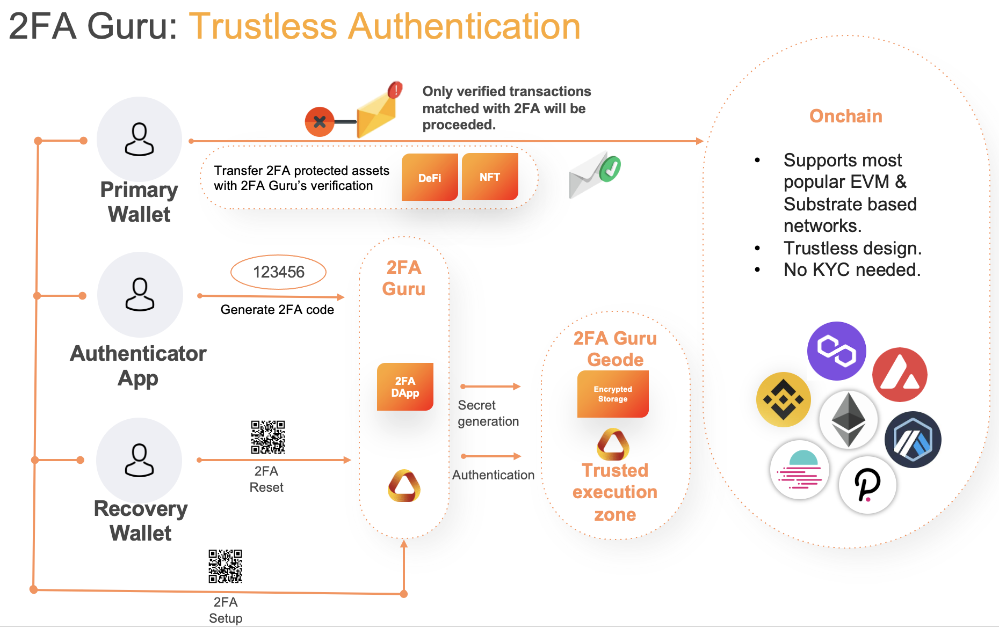

# Workflow

### Key Components
* Primary wallet:

  The wallet where users store and control their assets.

* Recovery wallet:

  Used for identifying users' roles and resetting the 2FA device. The relationship between the primary wallet and the recovery wallet is saved on-chain after binding.

* 2FA client:

  The device which provides the TOTP(Time-based one-time password).

<!-- * [Automata 2FA Guru](https://app.2fa.guru) -->
* Automata 2FA Guru

  The dApp hosted by the Automata team. It contains the 2FA management and wallet assets control panels. Users can sign up for 2FA and find the 2FA protected dApps in the management panel. They can also make authorised transfers under the wallet assets control panel.

* 2FA Guru Geode: 

  The 2FA middleware which is built upon the [Intel SGX](https://medium.com/atanetwork/introduction-to-sgx-the-eli5-3abf25e50057). With the provision of a secure, fully-shielded enclave, the platform connects seamlessly with dApps to provide support for 2FA verification on public blockchains. It's responsible for the 2FA secret generation, storage and authentication. Attackers cannot predict or calculate the valid signature outside the enclave, and its storage is encrypted internally and attackers are unable to view anything even if they managed to steal data.

  Even though the assets are safe under the 2FA protection, it's still possible for attackers to steal the TOTP by using a phishing attack. To prevent this, we use an anti-phishing feature where our 2FA middleware can analyse the original domain and detect whether it's coming from the phishing domains or links by using daily updated phishing blacklists. If a malicious domain is detected, the geode will not provide a signature to keep users' assets safe. To uphold high security standards, we also support a custom domain whitelist for a specified dApp.