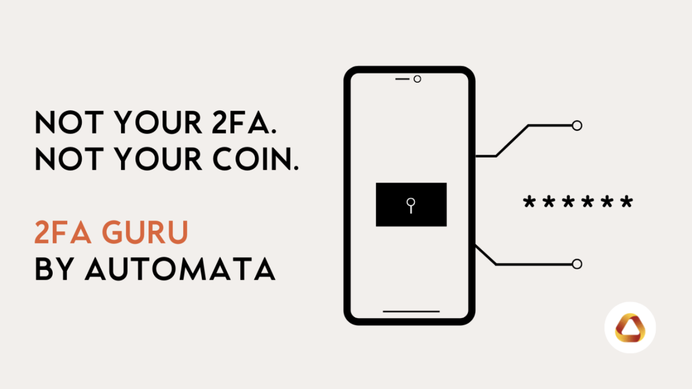

# Introduction

{style="zoom:80%"}

2FA Guru by Automata is a blockchain-based authentication solution that secures access to accounts and protects users with an active defence. 

There are a number of known scenarios where hackers can brute-force attacks: 

- User-controlled private keys can be compromised or stolen
- Exploitation of excessive or unlimited ERC20 allowance 
- Rise of social engineering attacks, such as phishing scams 

Not all security measures are made equal. 2FA Guru’s secret generation, storage and verification is based on the strongest technical guarantees with Automata’s impenetrable technical design. This makes it nigh-impossible for malicious agents to intercept, obtain, or duplicate the authentication factor. 

## Features 
- Anti-phishing protection. Crypto is fun and exciting, but there are serious risks. Make sure your accounts are resistant to real-time identity attacks. 
- Multi-chain support. 2FA Guru is currently live on Polygon mainnet. We’re EVM-compatible and working hard to expand the range of supported networks - If you’d like us to prioritise a chain, submit a proposal [here](https://forms.gle/xnwQZepySGiEyyNy9) or drop us a [message](mailto:2fa.guru@ata.network).
- One-time setup. The additional layer of protection extends across all dApps supported by 2FA Guru on the same blockchain network. 
- Developer-oriented integration. Deploy and secure dApps easily with 2FA Guru’s smart contract. 
- Smooth onboarding. 2FA Guru fits seamlessly into your workflow by working with your favourite tools such as 1Password, LastPass and more. 
