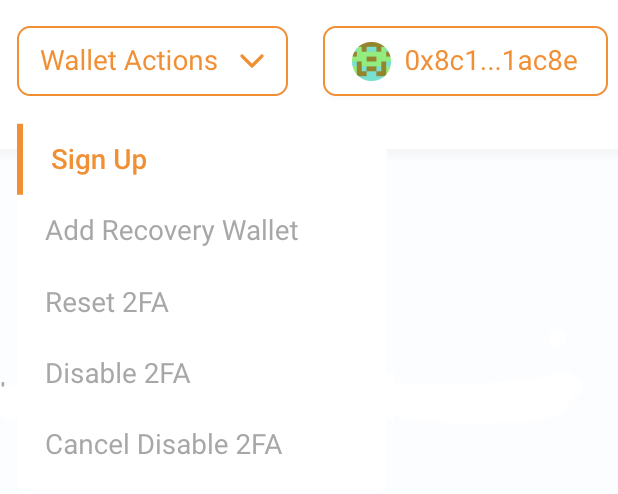
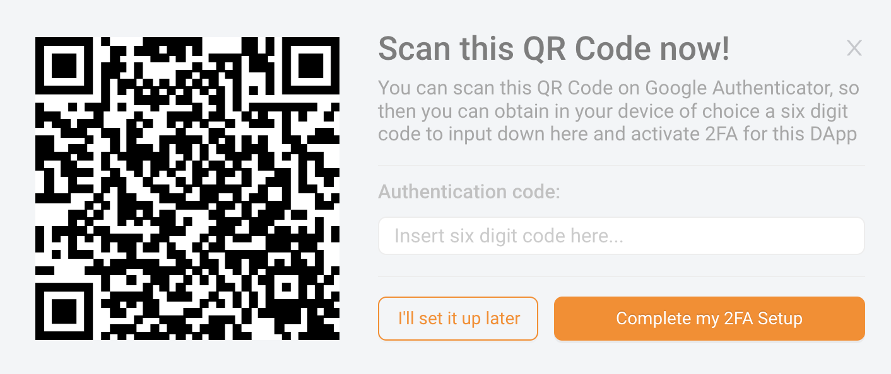
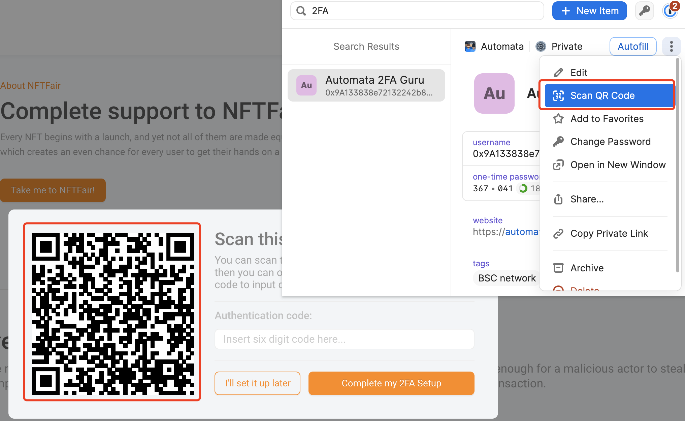
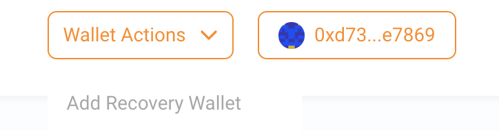
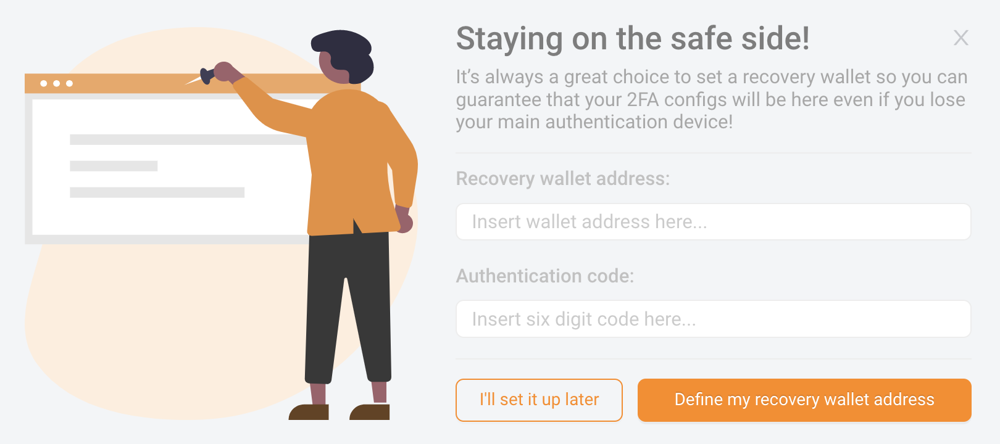
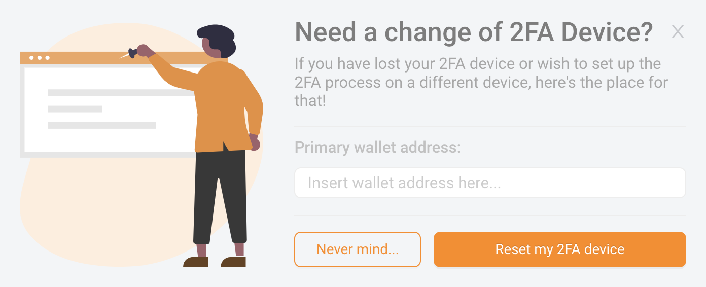
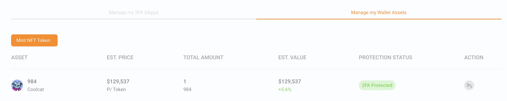
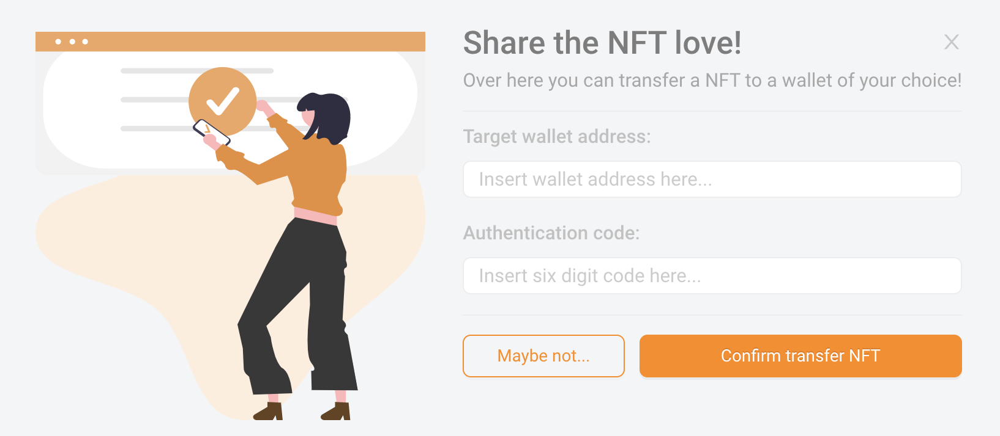
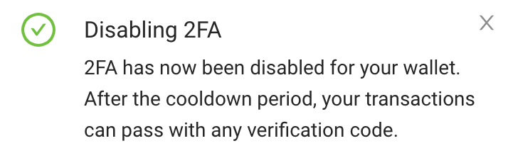
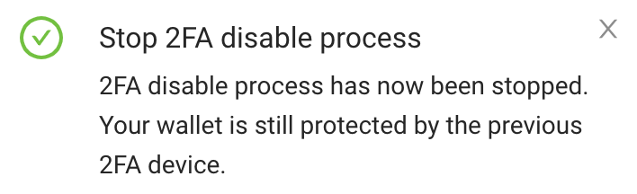

# User Guide

Visit [Automata 2FA Guru](https://app.2fa.guru) to start your 2FA protection.

---

## Setup 2FA
- Visit [Automata 2FA Guru](https://app.2fa.guru).

- Use metamask and connect your wallet.

- If you haven't signed up for an account, you can click the **Wallet Actions** button at the top to initiate the process of signing up. You will be required to sign a message to prove your identity before generating a 2FA secret. Take note, the primary wallet and 2FA device should be different devices.

{width="600" height="150"}

{width="600" height="270"}

{width="600" height="150"}

We support 1Password for storing your 2FA secret. To enable the use of **Scan QR Code** function in 1Password, you would first have to prepare a **Login** item in 1Password and configure the basic information. This makes password retrieval more convenient.

{width="600" height="360"}

Recommended configuration in 1Password

| | |
| --- | --- |
| username | wallet address |
| website | https://app.2fa.guru |
| tags | the target network |

- Once you've successfully signed up, we recommend that you add a recovery wallet for your primary wallet, which can be used to reset your 2FA device. Without a recovery wallet, if you lost your 2FA device, then you can only disable the 2FA protection before you use your 2FA protected assets.

  For binding a recovery wallet, you would need to send a binding transaction to our 2FA management contract after our authentication, and gas fees would be required.

  There is a binding window for each account after signup, If you do not bind a recovery wallet in **7 days**, you would not be allowed to bind one subsequently.

{width="600" height="150"}

{width="600" height="300"}

---

## Reset 2FA devices

If you lost your 2FA device in an unfortunate incident, you can reset it only if you have a recovery wallet. The reset processes are similar to setting up 2FA for the first time:

- Visit [Automata 2FA Guru](https://app.2fa.guru).

- Use metamask and connect your recovery wallet.

- Click **Reset 2FA** button in **Wallet Actions**, input your primary wallet address and sign the message. If the address pair matches, you can scan the new secret to reset the 2FA device. There is no transaction on chain, so no gas fees are required to reset a 2FA device. Take note, the recovery wallet does not need to sign up for 2FA for this to work.

{width="600" height="225"}

{width="600" height="330"}

---

## Make authorised transfer

Once you sign up 2FA for your wallet, your 2FA assets in supported dApps will be protected. If you hold any 2FA protected assets, you will be able to transfer them in **Manage my Wallet Assets** panel.

During the transfer of assets, a 2FA check will be conducted before allowing you to sign a message which would be used in the transfer.

{width="600" height="150"}

{width="600" height="300"}

{width="600" height="120"}

---

## Disable 2FA protection

If you've lost your 2FA device and no respective recovery wallet has been bound, you always have the option to disable 2FA protection in the 2FA dApp. There is a cooldown period for disabling 2FA protection, and you can cancel the disable 2FA protection request before this period ends. The cooldown period is **7 Days**, and after which you would not be able to use **2FA protection** anymore.

Hence, it's recommended to transfer all your 2FA protected assets to another 2FA protected account after you've disabled the 2FA for a primary wallet. This ensures that all assets will stay protected.

### Steps to disable 2FA

- Visit [Automata 2FA Guru](https://app.2fa.guru).

- Use metamask and connect your wallet.

- Click **Disable 2FA** button in **Wallet actions**, sign the message and wait until the cooldown window ends. Do note, 2FA is still active during this period, and all operations will require authorisation.

{width="600" height="180"}

{width="800" height="100"}

If you trigger the disable procedure by mistake, you can cancel it during the cooldown window to keep the 2FA protection.

- Click **Cancel Disable 2FA** button in **Wallet actions**, sign the message and this would cancel the request to disable 2FA on the current wallet. You can then continue to use the previous 2FA device with 2FA protection.

{width="600" height="180"}
