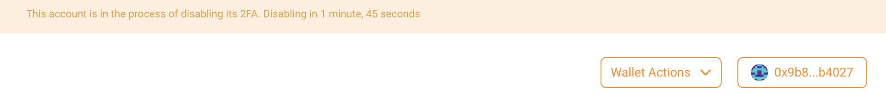

## How to setup
- Head to [2FA Guru](https://app.2fa.guru).
- Connect your Metamask wallet 
- If this is your first time using 2FA Guru, click on `Wallet Actions` to sign up
- Sign a message to prove your identity before a unique 2FA secret is generated 
- Your primary wallet and 2FA device should be on two separate devices 

{width="600" height="150"}

{width="600" height="270"}

{width="600" height="150"}

- 2FA Guru is compatible with numerous authenticators which can store the 2FA secret
- This includes 1Password, LastPass, Authy, and more. 

{width="600" height="360"}

Recommended configuration in 1Password

| | |
| --- | --- |
| username | wallet address |
| website | https://app.2fa.guru |
| tags | the target network |

- We recommend linking a recovery wallet so that you are able to reset the 2FA anytime
- There is a window of 7 days after signing up for users to complete this step
- To set up a recovery wallet, send a binding transaction to 2FA management contract. Gas fees are required

{width="600" height="150"}

{width="600" height="300"}

## Reset 2FA device

- In the event that a user has lost access to the 2FA application or device, reset is only possible when a recovery wallet has been linked
- The process is straightforward and similar to the first-time set up for 2FA Guru 
  - Head to [2FA Guru](https://app.2fa.guru).
  - Connect your recovery wallet using Metamask
  - Click on `Reset 2FA` under `Wallet Actions`
  - Provide the primary wallet address and sign the message
  - A match between the address pair will allow the user to scan a new secret
  - The 2FA device is successfully reset. No gas fees are required 

{width="600" height="225"}

{width="600" height="330"}

## Make authorised transfers

- Once 2FA Guru has been set up, all assets across supported dApps will enjoy the same protection
- These assets can be transferred under the `Manage my wallet assets` panel
- Users will have to sign a message in order to secure the transfer 

{width="600" height="150"}

{width="600" height="300"}

{width="600" height="120"}

## Disable 2FA protection

- After a user has disabled 2FA, there is a cooldown period of 7 days during which the request can be cancelled
- Once the request has been confirmed after 7 days, the user will not be able to use 2FA Guru again 

## Steps to disable 2FA

- Head to [2FA Guru](https://app.2fa.guru)
- Connect your wallet using Metamask
- Click on `Disable 2FA` button under `Wallet actions`
- After signing the message, there is a cooldown window of 7 days during which the request can be cancelled
- 2FA Guru remains active during this period and assets will continue to be protected 

{width="600" height="180"}

{width="800" height="100"}

- To cancel the disable request, click on `Cancel Disable 2FA` under `Wallet Actions`

{width="600" height="180"}
