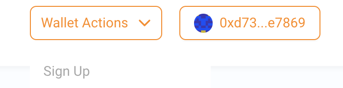
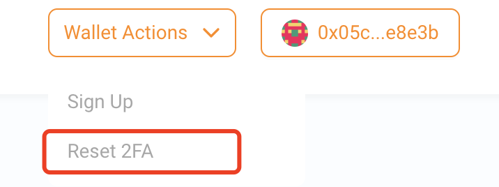
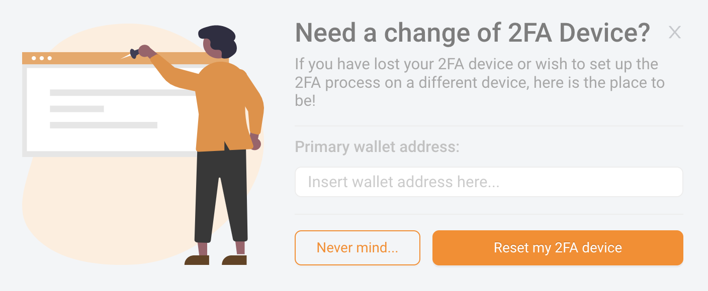

# User Guide

Visit [Automata 2FA Guru](https://app.2fa.guru) to start your 2FA protection.

---

## Setup 2FA
- Visit [Automata 2FA Guru](https://app.2fa.guru).

- Use metamask and connect your wallet.

- If your account hasn't signed up, you can click the **Wallet Actions** button on the top, and go through the signup process. You need to sign a message to prove your identity before generating a 2FA secret. Attention, you must use a different device to store the 2FA secret, don't keep the 2FA device and your wallet in the same one.

- Once you successfully sign up, we recommend you add a recovery wallet for your primary account, which can be used to reset your 2FA device. Otherwise, if you lost your 2FA device, then the only thing you can do is to disable the 2FA protection before you use your 2FA protected assets.

  You need to send a bind transaction to our 2FA management contract after our authentication, which means the gas fee is required.

  There is a binding window for each account after signup, you must bind the recovery wallet in **7 days**, otherwise you cannot bind anymore.

---

## Reset 2FA devices

If you lost your 2FA device unfortunately, you can reset it if you have been bind a recovery wallet, the reset processes are quite similar as setup's:

- Visit [Automata 2FA Guru](https://app.2fa.guru).

- Use metamask and connect your recovery wallet.

- Click **Reset 2FA** button in **Wallet Actions**, input your primary wallet address and sign the message. If it's matched, then you can scan the new secret to reset the 2FA device. There is no transaction on chain, so it's free to reset a 2FA device. And the recovery wallet is not required to sign up for 2FA.

---

## Make authorised transfer

Once you sign up 2FA for your wallet, you will benefit from all 2FA protected assets and dApps. If you get any 2FA protected assets, you will be able to transfer them in **Manage my Wallet Assets** panel.

It will check your 2FA code first and return you a valid signature, which will be used in the transfer transaction.

---

## Disable 2FA protection

If you lost your 2FA device and don't bind any recovery wallet, or you don't want to use 2FA anymore, you can disable 2FA protection in 2FA dApp. There is a cooldown period when disabling 2FA protection, you can cancel the disable 2FA protection request before this window. Attention, the cooldown period is **7 Days**, and you cannot use **2FA protection** anymore.

So it's recommended to transfer all your 2FA protected assets to another account after you disable the 2FA, and sign up the 2FA protection for this new account as soon as possible, to make sure all assets are safe.

### Steps to disable 2FA:

- Visit [Automata 2FA Guru](https://app.2fa.guru)

- Use metamask and connect your wallet

- Click **Disable 2FA** button in **Wallet actions**, sign the message and wait the cooldown window ends. Attention, the 2FA is still active during this period, and all authorised operations are required.

If you trigger the disable procedure by mistake, you can cancel it during the cooldown window to keep the 2FA protection.

- Click **Cancel Disable 2FA** button in **Wallet actions**, sign the message and you can use the previous 2FA device to get the 2FA protection.

