# User Guide
## Claim Testing Token
- Assume you have set up your wallet account, if not, please refer to [here](../canarynet/userguide/setupwallet.md)
- Ahead to the [Automata Faucet](./spec.md#faucet), you may need to login via Twitter account to get access to the faucet page.
- Choose ContextFree under the Network drop-down field
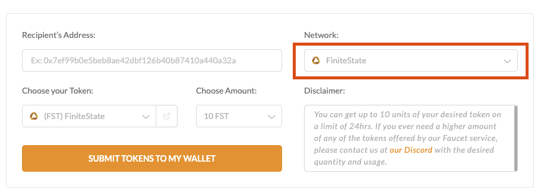
- Input your ContextFree wallet address and submit, 10 CTX native token will be sent to your account, can check on our [Blockchain Dashboard](./spec.md#explorer).
## Interface Layout
- Now let's explore our [AnyDAO frontend](./spec.md#frontend)
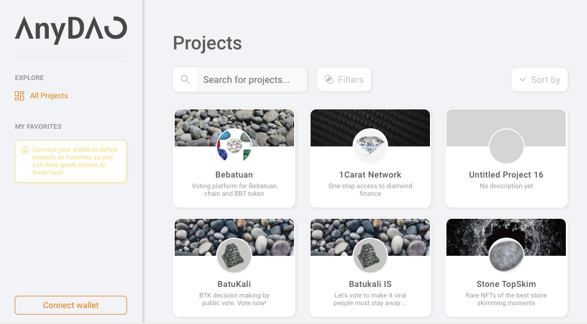
- The left panel are the directory, the right panel shows the contents.
- Currently you can see all the projects registered on AnyDAO
## Connect Wallet
- The connect button is located at the bottom of the left panel.
- If you want to disconnect, click on your connected wallet and you can find the disconnect button there
- Currently you have to connect with a PolkadotJS wallet to proceed to the following operations: `Register Project`, `Update Project`, and `Create Proposal`.

## Create Project
- Once you have connected with a wallet, you will see another entry `Project Management` appears at your left panel. Make sure you are connected with a Polkadot Extension Wallet.
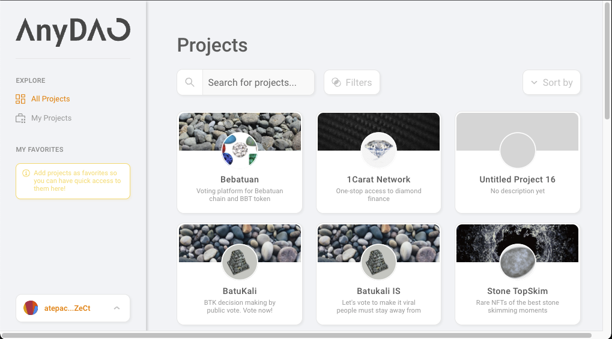
- Go to `Project Management`, then `Add a new project`
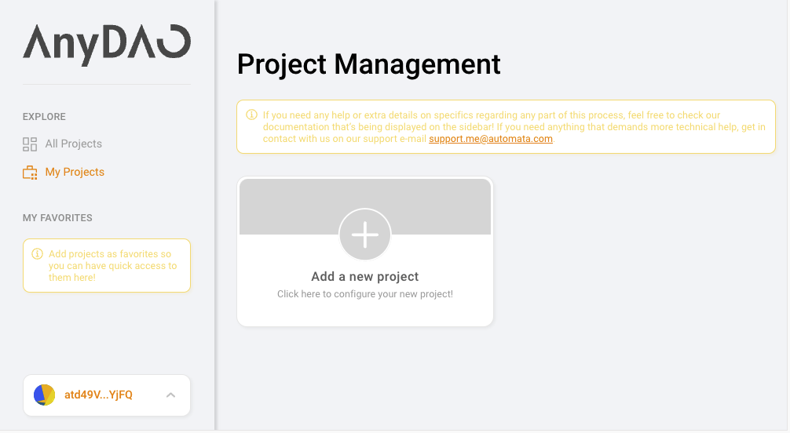
- Fill in your Project title, description
- Upload your project icon, banner
- Then add workspaces for your project, choose the chain you want to add
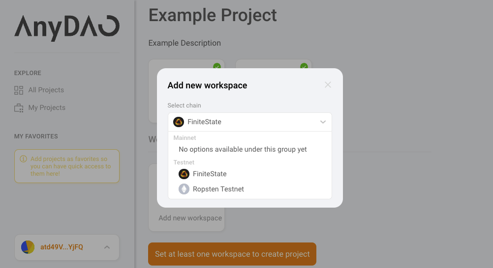
- Attach available strategy to it, such as
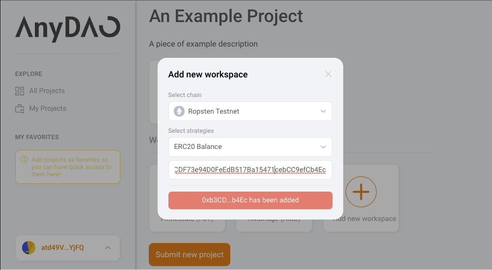
- *Notice: If you want to set up your own ERC20 on Ropsten, can follow some tutorial such as https://athamidn.medium.com/step-by-step-get-erc20-test-token-faucet-on-ropsten-d20850375f2c (there is no guarantee the link always work)*
- You should be able to see like this if everything set up
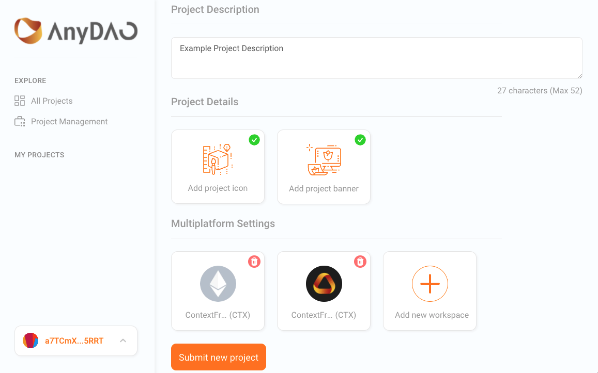
- Press `Submit new project` and follow the wallet instructions to submit the transaction. Ensure your wallet has enough tokens to pay for the transaction fee.
- If you see this it means you succeeded. You can check your created project
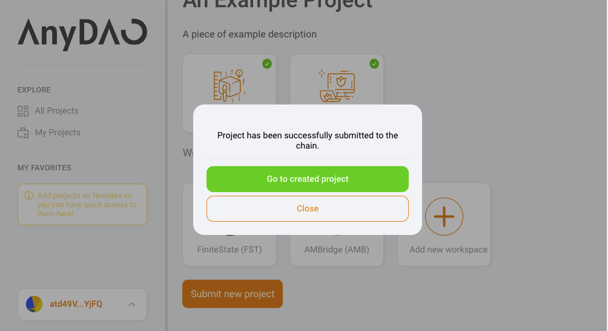
### Update Project
- Upon successfully created your project, you should be able to see your project in `Project Management` page
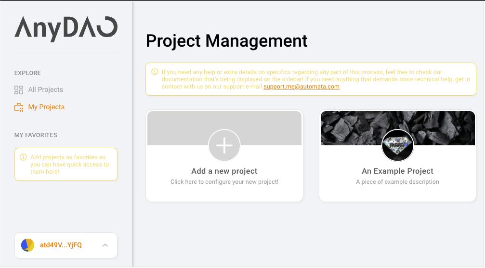
- Go into your created project, you should be able to see your previous configuration for your project.
- Change any of the fields you wish to, and click `Save project settings`, follow the wallet instructions and submit the transaction.
## Create Proposal
- Go to any project, you should see the detail page. Click `New Proposal`
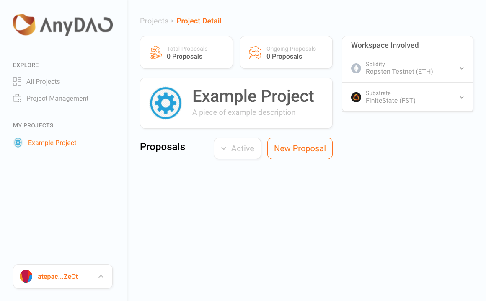
- Fill in the title, description as you want for the proposal (currently there is no size limitation, please show mercy🙏🏼)
- Then click `Define proposal configurations` to configure your proposal.
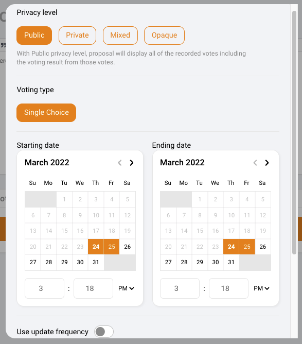
  - Here you can see more details of [Privacy level](./design.md#privacy-level)
  - Here you can see more details of [Voting Type](./spec.md#voting-type)
  - Starting date & Ending data: the actual timing you want to start and end your proposal voting period. Here you can see more details of [Time Restriction](./spec.md#configurations)
  - Here you can see more details of [Update Frequency](./design.md#update-frequency)
- Here is an example of everything set
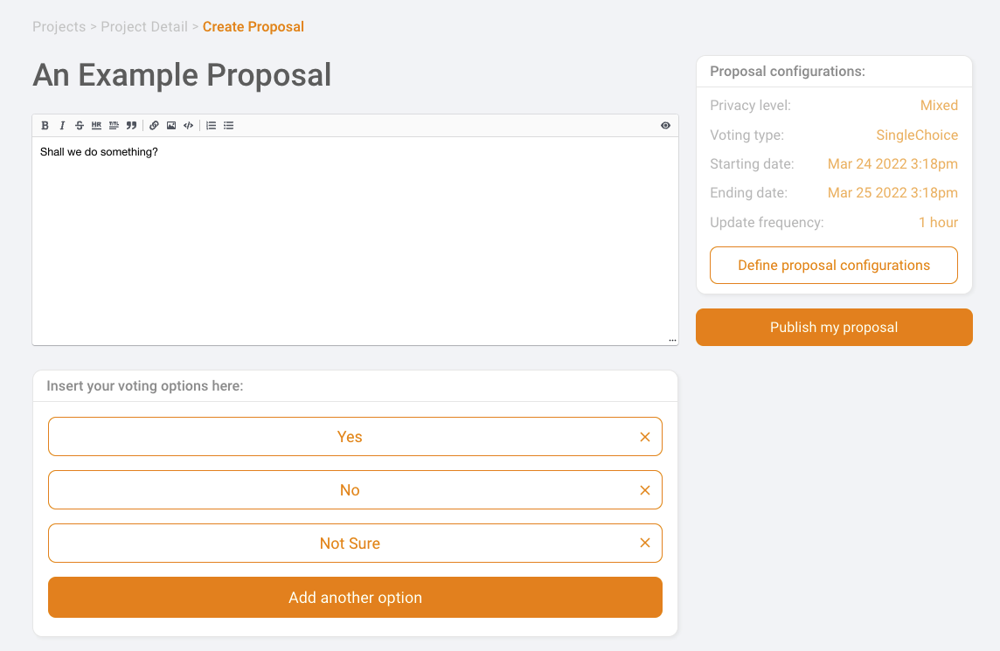
- Click `Publish my proposal` and follow the instructions to submit your transaction. You should be able to see your proposal once it's successfully created.
## Vote
- Go to any on-going proposal or the one you just created.
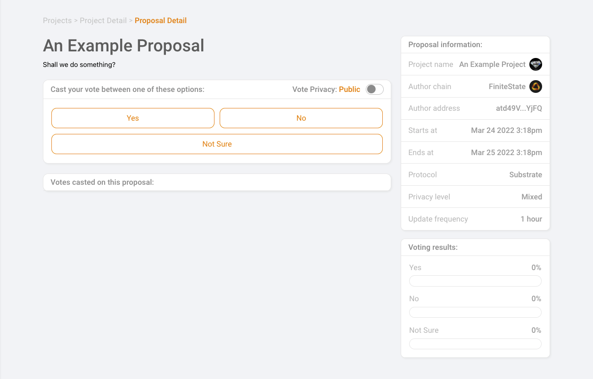
- Check the detail about the proposal, make sure what are you voting with :D
- For proposal with privacy level `Mixed`, you can toggle the `Vote Privacy` to choose whether vote publicly or anonymously
- Click on the option you want to cast your vote.
- The voting only requires the signature from your wallet, no fee will be charged for voting. 
- You can use either Metamask wallet or Polkadot Extension Wallet according to the project workspace configuration.
- Here is an example of a closed proposal, it's the time to try your own, cheers! 🙌
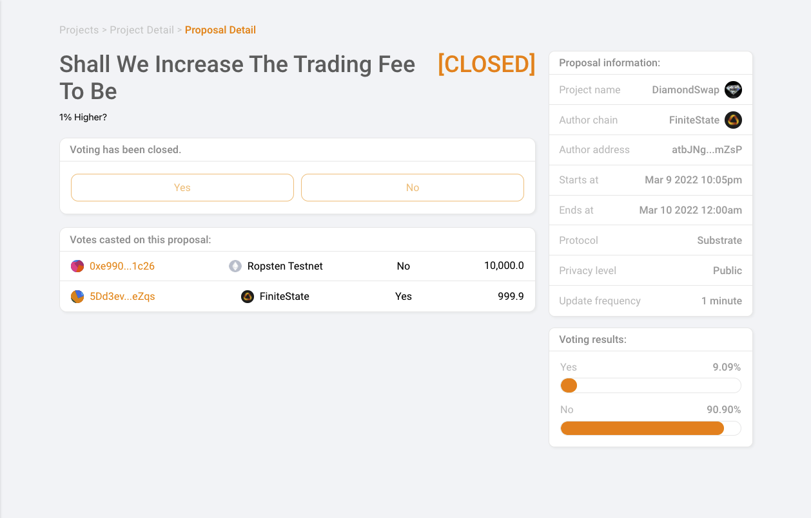