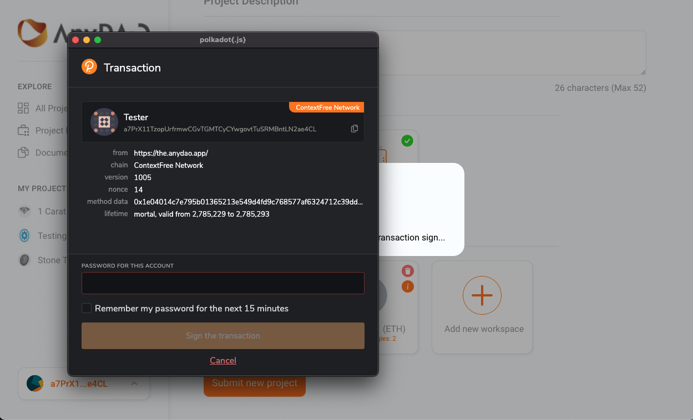
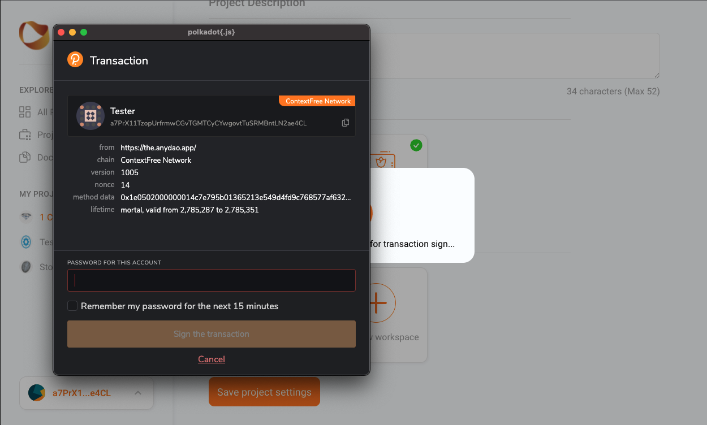
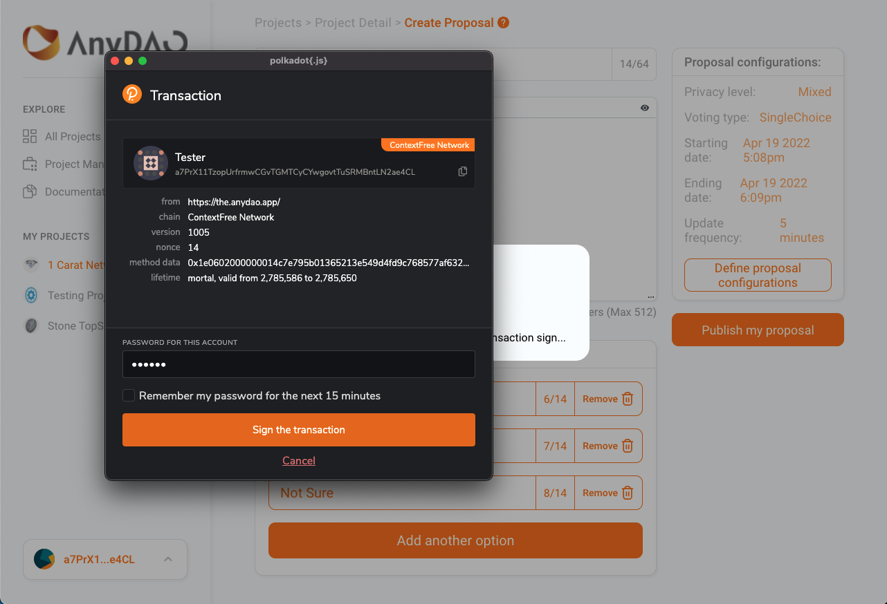
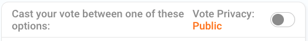
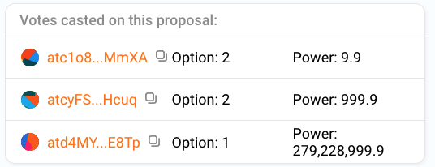

## Claim test tokens
- This guide assumes you have set up your wallet account. If not, please refer [here](../canarynet/userguide/setupwallet.md)
- Head to the [Automata Faucet](./spec.md#faucet). You may need to login via a Twitter account
- Choose ContextFree under the Network drop-down field

- Input your ContextFree wallet address and click Submit
- 10 CTX tokens will be sent to your account. You can also check this on our [dashboard](./spec.md#explorer)

## Interface layout
- Let's take a look at the [AnyDAO](https://anydao.app) [frontend](./spec.md#frontend)

- The left panel contains the directory
- The right panel displays all projects currently registered on [AnyDAO](https://anydao.app)

## Connect wallet
- The connect button is located at the bottom of the left panel
- To disconnect, click on your connected wallet to locate the Disconnect button
- Connect with a PolkadotJS wallet to carry out the following: `Register Project`, `Update Project`, and `Create Proposal`

## Create project
- Having followed the steps above, `Project Management` should appear on the left panel. Make sure you are connected with a Polkadot Extension Wallet

- Go to `Project Management`, then `Add a new project`

- Fill in your project title and description
- Upload your project icon, as well as banner
- Add workspaces for your project and select the chain

- Select a strategy from the drop-down menu

- You should arrive at this page once done 

- Click on `Submit new project` and follow the wallet instructions to submit the transaction. Ensure your wallet has enough tokens to pay for the transaction fee

- A message should appear which means your project has been created successfully

## Update Project
- Upon successfully creating your project, you should be able to see it under `Project Management` 

- Select a project that has been created previously 
- Adjust your settings. Once you're done, click on `Save project settings`. 
- Follow the wallet instructions to submit the transaction.

## Create Proposal
- Click on `New Proposal`

- Fill in a title and short description 

- Click on `Define proposal configurations` to adjust your settings 

  - Understand the different [privacy levels](./design.md#privacy-level)
  - Understand the different [voting types](./spec.md#voting-type)
  - Starting date & ending date refers to the proposal voting period. Understand more about [time restriction](./spec.md#configurations)
  - Understand more about [update frequency](./design.md#update-frequency)
- Click on `Publish my proposal` and follow the instructions to submit your transaction. You should be able to see your proposal once it has been successfully created

## Vote
- Go to any on-going proposal or one you have just created

- For proposals with `Mixed` privacy level, toggle `Vote Privacy` to choose whether to vote publicly or anonymously

  - Choose to vote publicly and details of the vote will be visible, such as:
  
  - Choose to vote anonymously and no details will be revealed
- Click on an option to cast your vote
- Voting only requires a signature from your wallet. No fees will be charged for voting
- You can use either Metamask wallet or Polkadot Extension Wallet according to the project's workspace configuration

[This](https://the.anydao.app/#/project/1/proposal/1) is an example of a closed proposal
