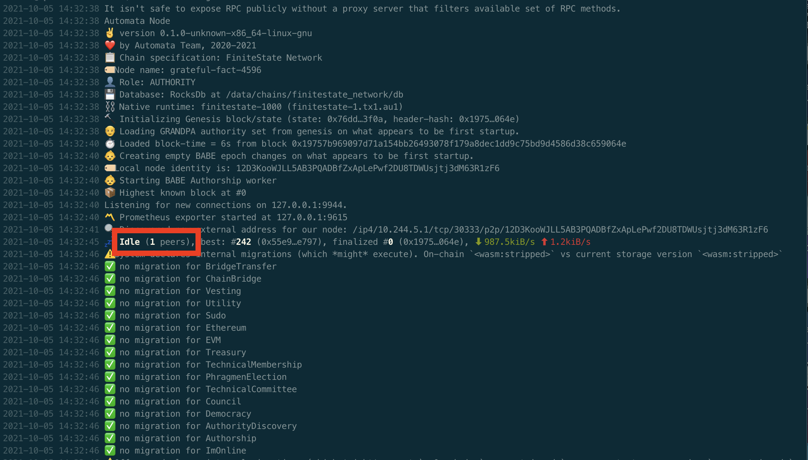
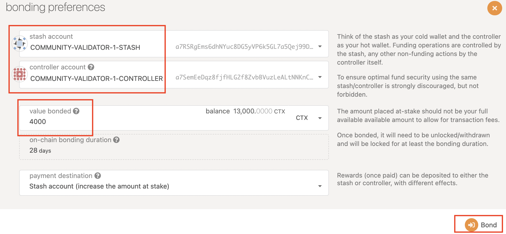
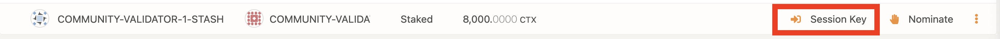
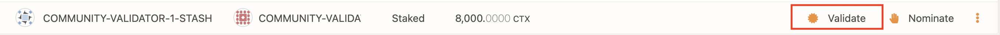
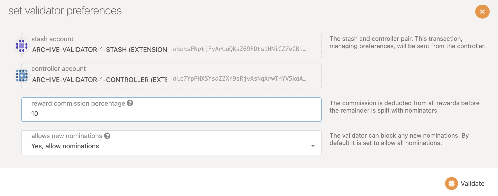
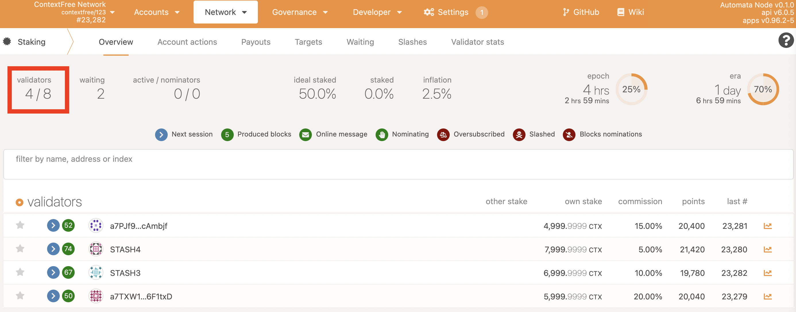

## Introduction
You may want to run a validator, which means if you are elected into the validator set, you will be able to earn rewards. To run a validator, you need to run a full node and stake some tokens, we will show you how to do it step by step.

## Steps
### Install Dependencies
- Install Docker
  - Please go to [this link](https://docs.docker.com/get-docker/) to download the docker engine for your Operating System accordingly.

### Launch the Validator Node
- Firstly create a folder to store the synchronized on-chain data
    ```
    mkdir chain-base
    ```
- Launch the node under the same folder
    ```
    docker run -it \
    -v chain-base:/data \
    -p 9933:9933 \
    -p 9944:9944 \
    -d \
    atactr/automata:v0.1.0-rc1 \
    --chain=contextfree \
    --port=30333 \
    --base-path /data \
    --validator \
    --no-telemetry \
    --rpc-cors=all \
    --rpc-methods=Unsafe \
    --unsafe-rpc-external
    ```
  Which will return the container ID of your node
- Check whether your node downloading blocks by checking the log
    ```
    docker logs --follow <YOUR_CONTAINER_ID>
    ```
  If it works fine, the beginning of the log should look like
  {width="673" height="463"} 
  Notice that you should have a **non-zero** number of peers connected as shown in the image above.

### Get Session Keys of your node
- Run the following command
    ```
    curl http://127.0.0.1:9933 \
        -H "Content-Type:application/json;charset=utf-8" \
        -d \
        '{
            "jsonrpc":"2.0",
            "id":1,
            "method":"author_rotateKeys",
            "params": []
        }'
    ```
- You will get a response like this
    ```
    {
        "jsonrpc": "2.0",
        "result":"0xc05a9d093e4db4c1bde31977716e7a0a39d6f3d1f1bf749e7fec8371147de730af6860aeef81a11130c9fcd317b96e736f6c36141c28f382a18f9faf6e7df797eaa951ead00d12db10937003f0956e3d3444d1774d452ed045dbc1b84d1bf1471abf5d77bf5033845f01be1188a852c6f0ba703042b4d06d14314841c1096c50",
        "id":1
    }
    ```
- The content after `"result"` is the session keys of your validator node

### Set Up Accounts
- For running a validator, you need to set up two accounts:
  - Stash account: This account holds funds bonded for staking, but delegates some functions to the Controller account. It can be kept in a cold wallet, meaning it can stays offline all the time.
  - Controller account: This account acts on behalf of the Stash account, signalling decisions and necessary execution for staking. It only needs enough funds to pay transaction fees.
  - For more details, refer to [Polkadot Keys](https://wiki.polkadot.network/docs/learn-keys).
- You can refer [here](../userguide/setupwallet.md) to set up accounts with the Polkadot-JS extension.

### Get Token
- Your Stash account and Controller account need to be funded with some native token
  - If you already had some native token on other account, you can simply transfer to the stash and controller accounts you have created, using the dashboard by opening the `Transfer` page under the `Accounts` tab.
  - If you don't have any native token, visit [Get Token from Faucet](../userguide/gettoken.md) to get some native token.
  - Alternatively, if you have some [ContextFree ERC20 token](https://ropsten.etherscan.io/token/0x8289b901CAC48EbBB1B5cb0049d1459EA1240EF7), you can follow the [Token Bridge user guide](../userguide/tokenbridge.md) to convert it into native token.

### Stake tokens
- Visit the [Automata Dashboard](https://dashboard.ata.network/?rpc=wss%3A%2F%2Ffs-api.ata.network#/explorer)
-  Go to the `Staking` section.
{width="673" height="463}
- Set Stash and Controller.
{width="673" height="463}
- Choose the stash account and controller account accordingly, set the value for staking and press `Bond` to submit the transaction.
{width="673" height="463}

### Set session keys
- Click `Session Keys` and set the session keys you got previously. 
{width="673" height="463}
- If you are nominating someone, you need to stop nominating or you will not be able to set session keys.

### Set validate parameters
- Click `Validate`
{width="673" height="463}
- Set the value of `reward commission percentage`, which is the rate that your validator will be commissioned with. The remaining rewards will be split among your nominators.
{width="673" height="463}
- Besides, you can choose to accept nominating or not.

### Joining validator set
- If you go to the "Staking" tab, you will see a list of active validators currently running on the network. At the top of the page, it shows the number of validator slots that are available as well as the number of nodes that have signaled their intention to be a validator. You can go to the "Waiting" tab to double check to see whether your node is listed there.
{width="673" height="463}
- The validator set is refreshed every era. In the next era, if there is a slot available and your node is selected to join the validator set, your node will become an active validator. Until then, it will remain in the waiting queue. If your validator is not selected to become part of the validator set, it will remain in the waiting queue until it is. There is no need to re-start if you are not selected for the validator set in a particular era. However, it may be necessary to increase the number of native token staked or seek out nominators for your validator in order to join the validator set.

### Congratuation
If you have followed all of these steps, and been selected to be a part of the validator set, you are now running a ContextFree validator!