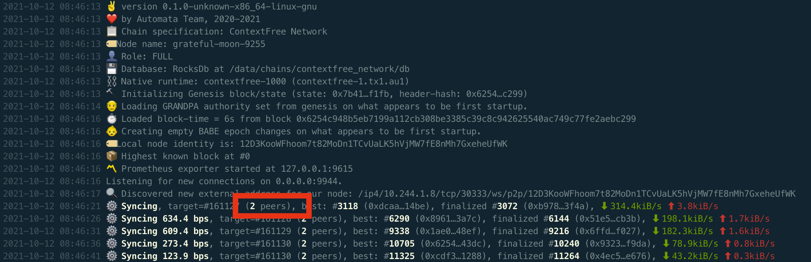

# Run ContextFree Node
## Introduction
According to description in [Type of Nodes](./node-type.md), you can run a Full Node or an Archive Node on ContextFree Network.

## Preparation
### Dependencies
- Install Docker
  - Please go to [this link](https://docs.docker.com/get-docker/) to download the docker engine for your Operating System accordingly.
### Create a local directory to store the chain data
- You may need `sudo` permission to run the following commands.
  - Firstly create a folder to store the synchronized on-chain data
    ```
    mkdir /chain
    ```
  - Change the ownership and permission of your local storage directory to current user
    ```
    sudo chown -R $(id -u):$(id -g) /chain
    ```
## Launch Node
### Launch Full Node
- Run the following command to launch a Full Node, you may need sudo permission:
  ```
    docker run -it \
    -v "/chain:/data" \
    -u $(id -u ${USER}):$(id -g ${USER}) \
    -p 9933:9933 \
    -p 9944:9944 \
    -d \
    atactr/automata:contextfree-v0.1.0-rc2 \
    --chain=contextfree \
    --port=30333 \
    --base-path /data \
    --no-telemetry \
    --rpc-cors=all \
    --rpc-external \
    --ws-external
  ```
  Which will return the **container ID** of your node

### Launch Archive Node
- Run the following command to launch a Archive Node, you may need sudo permission:
    ```
    docker run -it \
    -v "/chain:/data" \
    -u $(id -u ${USER}):$(id -g ${USER}) \
    -p 9933:9933 \
    -p 9944:9944 \
    -d \
    atactr/automata:contextfree-v0.1.0-rc2 \
    --chain=contextfree \
    --port=30333 \
    --base-path /data \
    --pruning archive \
    --no-telemetry \
    --rpc-cors=all \
    --rpc-external \
    --ws-external
  ```
  Which will return the **container ID** of your node

## Check Launch Status
- Check whether your node downloading blocks by checking the log
  ```
  docker logs --follow <YOUR_CONTAINER_ID>
  ```
- If it works fine, the beginning of the log should look like
  {width="673" height="463"}
- Notice that you should have a **non-zero** number of peers connected as shown in the image above.