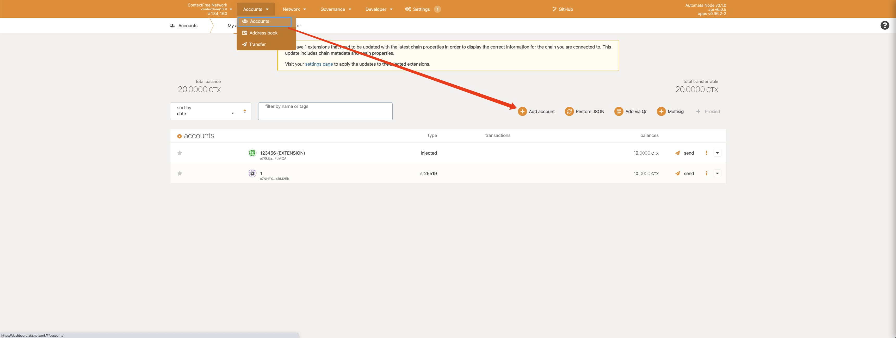
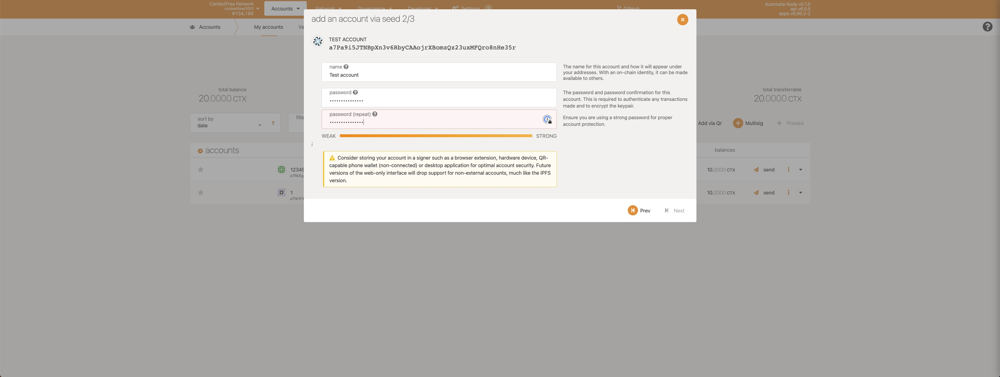
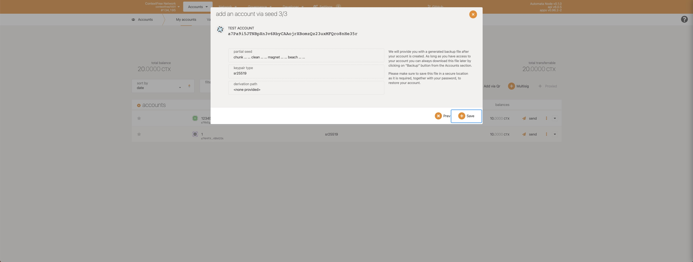
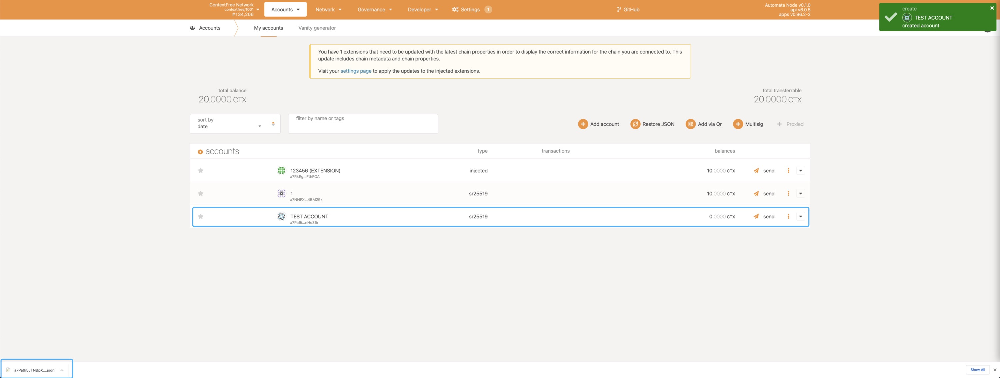

# Accounts
This document introduce you to the basics of ContextFree accounts.
## Account basic
The address format used in ContextFree network is **SS58**, which is a modification of Base-58-check from Bitcoin with some miner changes. More details can be found on the [Substrate github wiki](https://github.com/paritytech/substrate/wiki/External-Address-Format-(SS58)).

| Network | Address type prefix | Leading characters | Example(Alice) |
| -- | -- | -- | -- |
| Automata Network | 2349 | aA |  |
| **ContextFree Network** | 11820 | a7 | a7SvTrjvshEMePMEZpEkYMekuZMPpDwMNqfUx8N8ScEEQYfM8 |
| FiniteState Network | 13107 | at | ateYGxACWo2Yu8wVi7RGJQsEQLAB25xbAHkSRpzTqMabJ38zx |
| Substrate default | 42 | 5 | 5GrwvaEF5zXb26Fz9rcQpDWS57CtERHpNehXCPcNoHGKutQY |

As we known, the secret seed of account **Alice** is: `0xe5be9a5092b81bca64be81d212e7f2f9eba183bb7a90954f7b76361f6edb5c0a`. In ContextFree network, the address of **Alice** will be `a7SvTrjvshEMePMEZpEkYMekuZMPpDwMNqfUx8N8ScEEQYfM8`. But all addresses above are merely different representations of the same public key in a private-public keypair. In another word, the account in ContextFree network is compatible with other substrate-based chains.

## Create account
There are several ways to create an ContextFree account, we will suggest you to use our official [blockchain explorer](https://dashboard.ata.network).
### Create account using explorer
1. Open official [blockchain explorer](https://dashboard.ata.network) of Automata, check the connected network on the left upper corner of web page. If the connected network is not **ContextFree Network**, click and choose **Automata ContextFree** in **TEST NETWORKS**.
{width="673" height="463"}
2. Click **Accounts** in the top menu and choose **Accounts**, you will enter the accounts page. Then click **Add account** and start to create a new account.
{width="673" height="463"}
3. You will see a auto generated mnemonic in the popup box, please copy this mnemonic and save it safely.
{width="673" height="463"}
4. Enter an alias for this account and create a password, we suggest you to use a strong and unique password.
{width="673" height="463"}
5. Click **Save** and we finish the process of creating an account.
{width="673" height="463"}
6. The newly created account will be show in the list, and there will be a auto downloaded file which describe the details of this account.
{width="673" height="463"}

## Import existing account
The process of importing an existing account into blockchain explorer is similar to the process of creating one. We will show you how to import the well known **Alice** account.
1. Override the auto generated **Mnemonic** or **Raw seed** with mnemonic or seed of your existing account.
{width="673" height="463"}
2. Create an alias and enter the password, the imported account will be show in the list.
{width="673" height="463"}
## Wallet
Please refer to [Wallet tutorial](./setupwallet.md) if you want to create and manage accounts in polkadot extention.