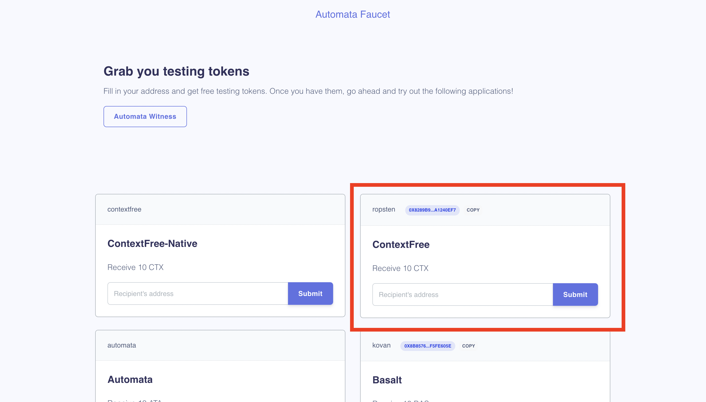

# Get Test Token
**This is a guide on how to claim test token on the ContextFree**

- Assume you have set up your wallet account, if not, please refer to [here](./setupwallet.md)

## Use Automata Faucet 
- Visit the [Automata Faucet](https://dashboard.ata.network/?rpc=wss%3A%2F%2Ffs-api.ata.network#/explorer), you may need to login via Twitter account to get access to the faucet page.

### Get ContextFree native token
- Input your canary network wallet address under this tab, and press `Submit`.
{width="673" height="463"}
- Then 10 CTX native token will be sent to your address, you can check on the [Automata Dashboard](https://dashboard.ata.network).
- *Notice: You can request funding for your address for once per 24 hours.*

### Get ContextFree ERC20 Token On Ropsten Testnet
- Input your Ropsten ETH address under this tab, and press `Submit`.
{width="673" height="463"}
- Then 10 CTX ERC20 token will be sent to your Ropsten address, you can check on [Ropsten Explorer](ropsten.etherscan.io).
- However the ERC20 token cannot be utilized as native token on the canary network, you can follow the instruction [here](../userguide/tokenbridge.md) to use the **Automata Token Bridge** to convert it into the ContextFree native token.
- *Notice: You can request funding for your address for once per 24 hours.*