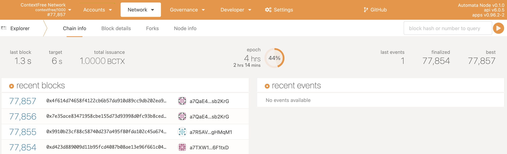
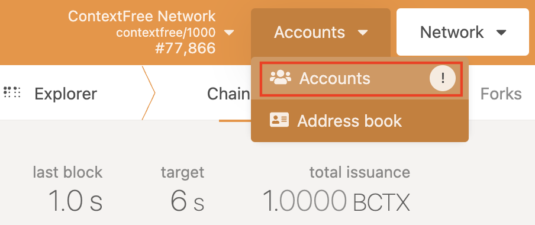
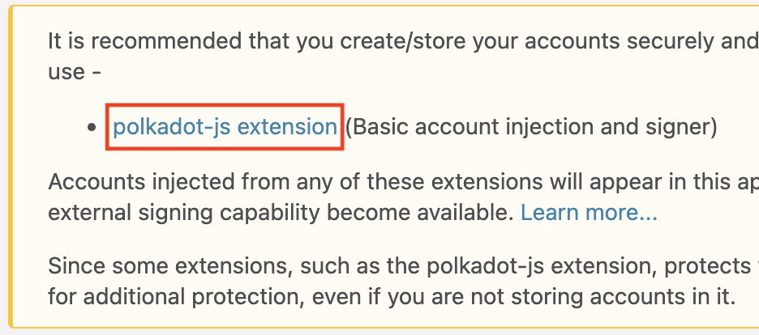
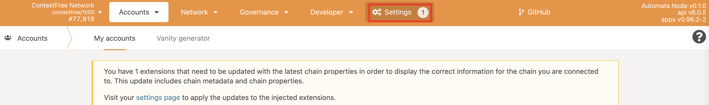
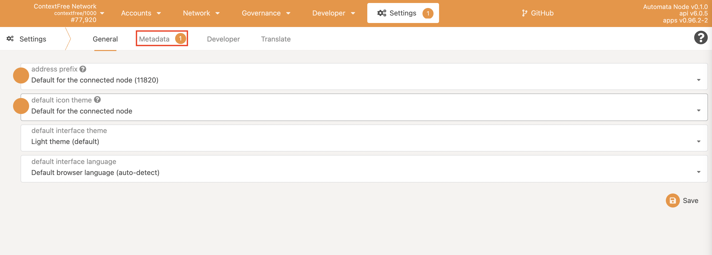
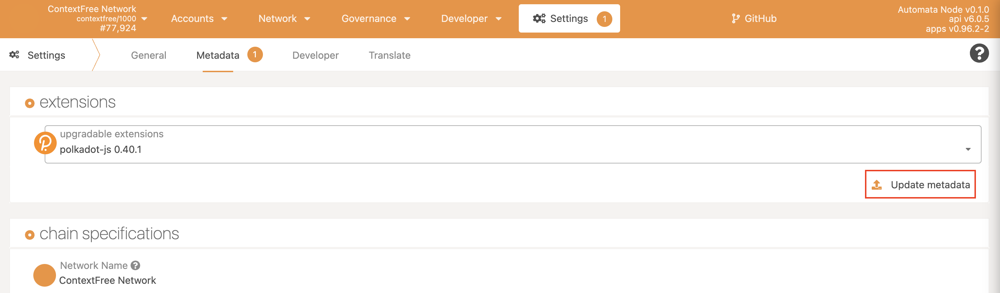
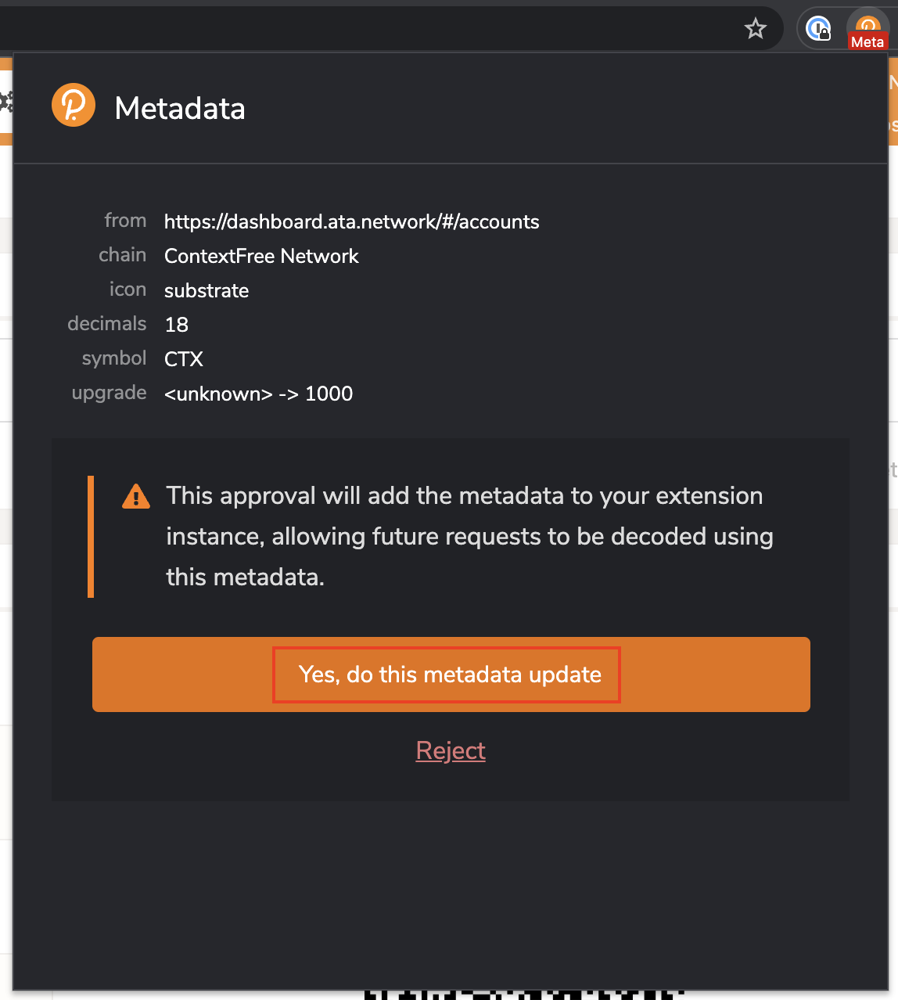

#**ContextFree Network Wallet Setup Guide**  

**This is a guide on how to get onto the Automata Canary Net for Chrome users(recommended).**  

1. Go to website url - ['Dashboard.ata.network'](https://dashboard.ata.network)  
*You should reach a website which looks like the picture below.*  
  
  
2. Hover over the Accounts taskbar and click on Accounts.  
*Picture showing what is needed to be clicked.*  
   
*You should then reach this page.*  
  
  
3. Then you must click on the link called [polkadot-js extension](https://chrome.google.com/webstore/detail/polkadot{js}-extension/mopnmbcafieddcagagdcbnhejhlodfdd) on the page.  
  
This will direct you to an extension which needs to be downloaded. You should then add this to chrome.  
  

4. You must then click on the plugin to create an account. This process is very easy and just requires you to record your seed phrase, which should be noted to ensure you have a way to restore control of your account, create a username and then a password. You will then have an account.  
*The account should look like this in the plugin.*  
  

5. Once you have created your account, it will be necessary to refresh your page on Dashboard.ata.network. This will then prompt you to authorise polkadot{.js}, which you should approve.  
*What the Authorize prompt looks like.*  
  

6. After you have allowed the application access, you should then click on the settings tab at the top of the screen.  
*Click on Settings.*  
  
Then click on Metadata.  
  
Then click on update metadata.  
  
This will give you another prompt from polkadot{.js} asking to add the metadata to your extension instance. Click ‘yes, do this metadata update’  
  

7. After you have done this, click on the polkadot{.js} plugin again. After this click on the three dots next to your account, click on the drop down box which currently says ‘Allow Use On Any Chain’ and change it to ‘ContextFree Network.’  
  
After you have done this, refresh your page and click on Accounts again. If there is no exclamation mark next to your account then everything should be set up correctly.  
*It should look like this.*  
  
However, if there is an exclamation mark, then ensure that you have followed all the steps above. If you believe you have done all the steps properly, try the whole process once more and if you are still having problems then get in touch with us.  
*If you have problems it would look like this.*  
  

---

**Now that you have set up everything, complete our google form with your name, email, Discord username, Telegram handle and your ContextFree Network wallet address and we will airdrop you some $CTX tokens for you to take part in the upcoming Canary Games.**  

*To participate in the Canary Games, register now with [this form](https://forms.gle/VnjEjj8x8sNxvW4Q9).*
