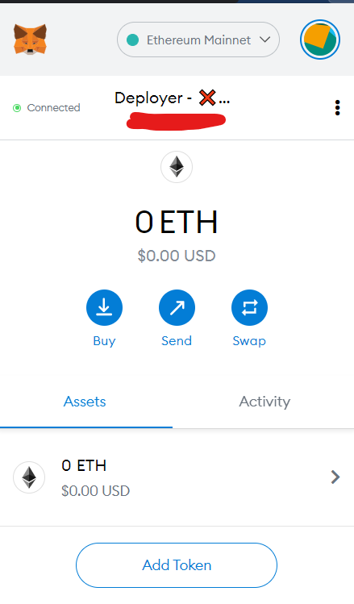
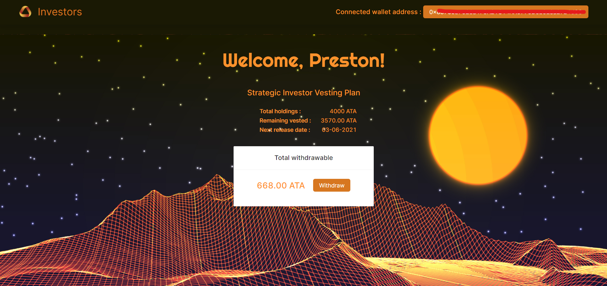
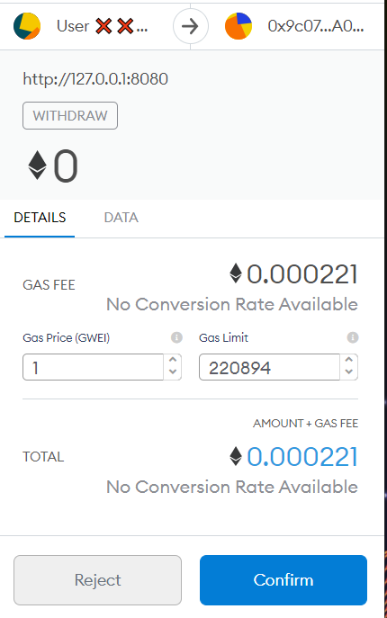
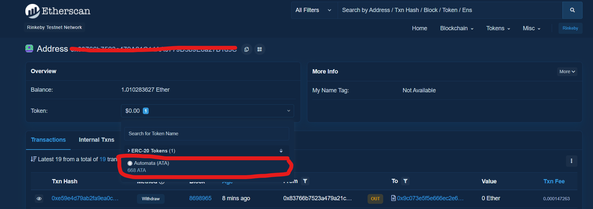

# User Guide

The Automata Tokens are now available to claim. Click [here](/) or go to 'url here' to withdraw your tokens.

## Prerequisites

1. You must install Metamask to connect your wallet to the claim page. If you haven't done so, download it from the official [website](https://metamask.io/download).

2. The ATA Tokens are available as both [ERC20](https://etherscan.io/token/0xa2120b9e674d3fc3875f415a7df52e382f141225) and [BEP20](https://bscscan.com/token/0xa2120b9e674d3fc3875f415a7df52e382f141225) tokens.
 
    - To claim ERC20 tokens, simply connect Metamask to the Ethereum Mainnet when prompted.

    

    - To claim BEP20 tokens, connect Metamask to the BSC Mainnet. If you are new to Metamask, you might need to add a BSC Mainnet configuration to the Metamask settings. Read this [article](https://academy.binance.com/en/articles/connecting-metamask-to-binance-smart-chain) on Binance Academy to learn more.

!!! Note
    At this point, Metamask should only be connected to either the Ethereum or BSC Mainnet. The claim page would not work on other network.

---
## General

The landing page shows your total ATA holdings, remaining ATA vested (locked ATA tokens that will be released periodically) and the withdrawalable ATA amount.

Your wallet address can be found on the upper-right corner. **This is the receiving address for withdrawn tokens**.

## Claim Tokens

!!! Note
    You must deposit some ETH into your wallet to pay for transaction fee.

To withdraw tokens, click on the *Withdraw* button. The transcation fee can be found on the Metamask prompt, click on *Confirm*.

Once the transaction is complete, do one of the following methods to verify that the tokens have been transferred to your account.

1. Etherscan
    
    - Go to Metamask, then click on the triple-dot on the upper-right, then click *View On Etherscan*.

    - On Etherscan, click on "Token" to find your ATA token balance.

    

2. Add ATA Token to Metamask

    - Check out this official [guide](https://metamask.zendesk.com/hc/en-us/articles/360015489031-How-to-view-see-your-tokens-custom-tokens-in-Metamask) to learn how to add tokens in Metamask.

    - ERC-20 Token Address: `0xA2120b9e674d3fC3875f415A7DF52e382F141225`

    - BEP-20 Token Address: `0xA2120b9e674d3fC3875f415A7DF52e382F141225`
