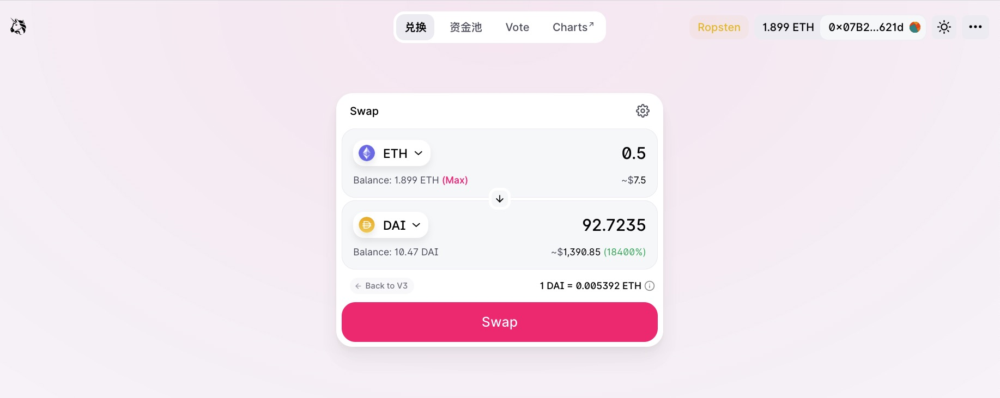
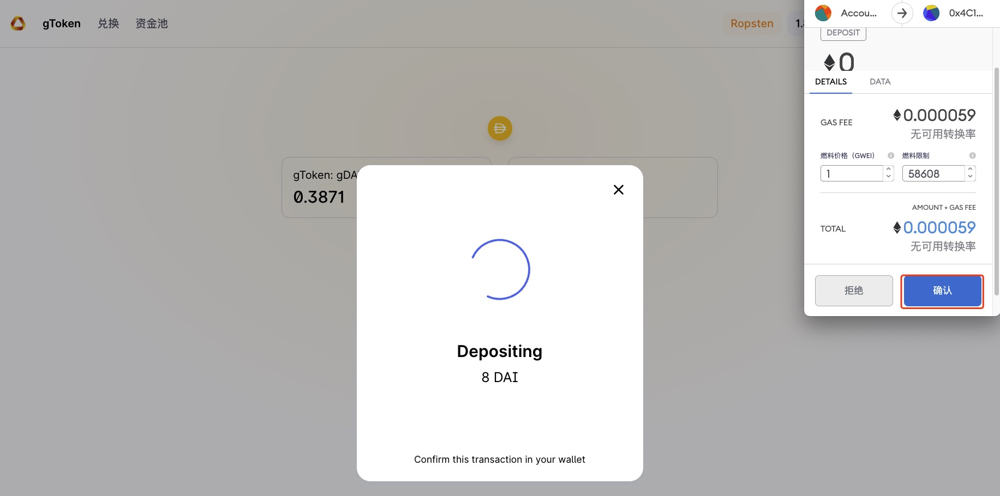
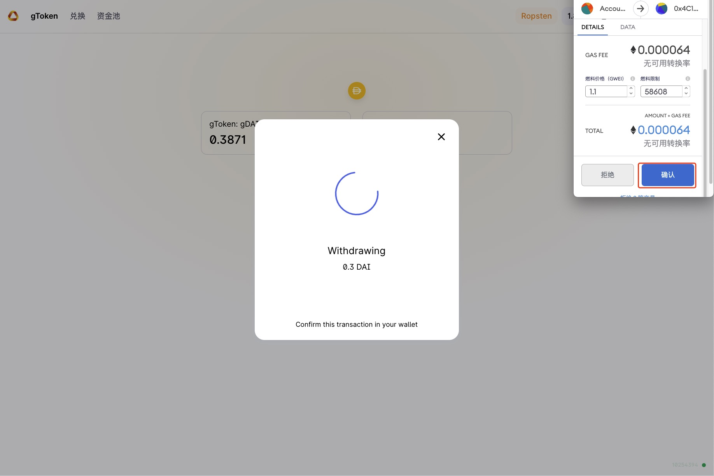

# Getting started
## Preparation
At first, you need to get some DAI and USDC tokens, the following steps show how to get these tokens on the Ethereum Ropsten testnet

1. using [ropsten faucet](https://faucet.ropsten.be/) to get eth of ropsten testnet
2. using [uniswap](https://app.uniswap.org/#/swap) to swap DAI and USDC, don't forget to connect to the ropsten test network in your Metamask
{width="673" height="463"}
{width="673" height="463"}

## Deposit
In order to use conveyor, you need deposit your DAI and USDC to get the Wrapped token, such as gDAI or gUSDC
{width="673" height="463"}

1. Click `Deposit` and enter deposit amount
{width="673" height="463"}

2. Click `Deposit` again and use metamask to sign the transaction 
{width="673" height="463"}

## Withdraw
You can withdraw your deposit at any time
1. Click `Withdraw` and enter amount
{width="673" height="463"}

2. Click `Withdraw` again and use metamask to sign the transaction
{width="673" height="463"}

## Swap
Select the token pair, the `From` represents token you own, `To` represents the token you want to exchange. Then enter the amount of `From` token, and the amount of `To` token will be estimated automatically.
{width="673" height="463"}

Then click `Swap` and confirm, also need to use Metamask to sign the transaction.

After the transaction is submitted, you can view the transaction on Etherscan
{width="673" height="463"}

## Add Liquitity
You can add liquitity to a existing pool, or create a pair, the processes are similar
{width="673" height="463"}

Choose the pair and enter the amount, then click `Supply` and sign transactions using Metamask
{width="673" height="463"}

## Import Pool
After adding liquitity to some pool, you can import the pair for better management
{width="673" height="463"}

You will see the pooled tokens, and you can add or remove liquitity from the quick entry
{width="673" height="463"}
