# Getting started
## Preparation
You need to make sure that your wallet is funded with some DAI and USDC tokens. If you don't have the necessary tokens yet, follow the steps below to get funded.

1. Get some test ETH from the [ropsten faucet](https://faucet.ropsten.be/).
2. Swap ETH for USDC and DAI tokens on [uniswap](https://app.uniswap.org/#/swap) to swap DAI and USDC. Don't forget to connect Metamask to the ropsten test network.

{width="673" height="463"}

!!! Attention

    **Please connect your Metamask to the Ropsten Test Network**

## Deposit
In order to use conveyor, you need to deposit your DAI and USDC to get the Wrapped token, such as gDAI or gUSDC.

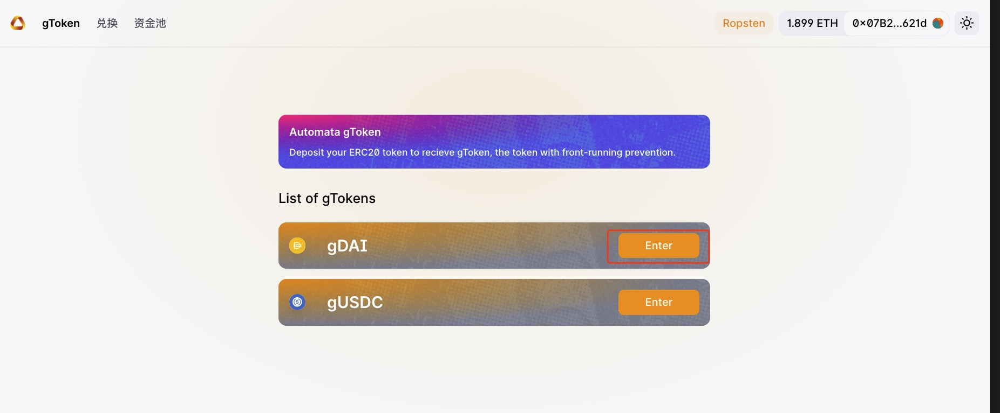{width="673" height="463"}

Enter the deposit amount and click `Approve`(If you have already approved, please skip this step), then you need to confirm in the pop-up window of Metamask.

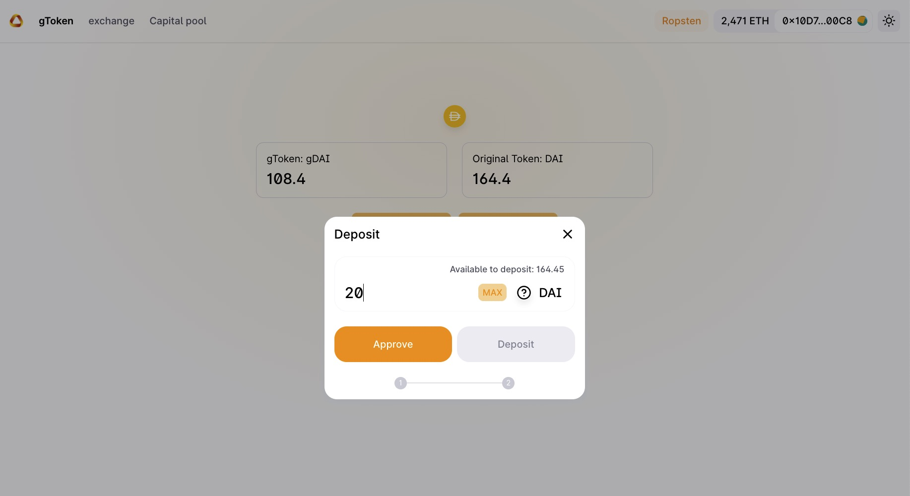{width="673" height="463"}

Click the `Deposit` and confirm in Metamask
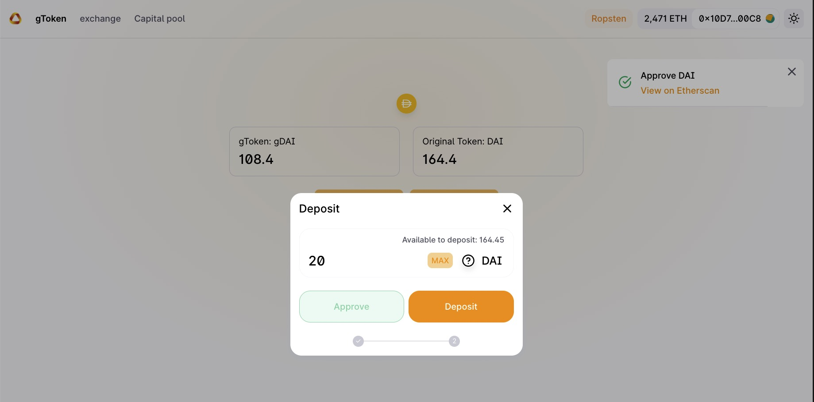{width="673" height="463"}

## Withdraw
You can withdraw your deposit at any time
Click `Withdraw`, enter the amount in pop-up window and click `Withdraw` again, also need to confirm in Metamask

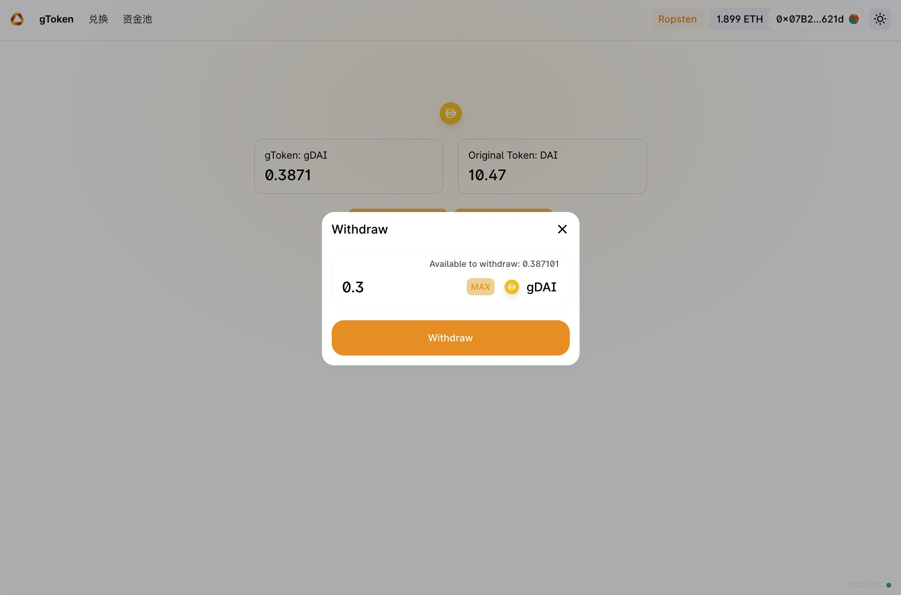{width="673" height="463"}

## Swap
Select the token pair, the `From` represents the token you own, `To` represents the token you want to exchange. Then enter the amount of `From` token, and the amount of `To` tokens will be estimated, based on the liquidity of tokens and the current market price.

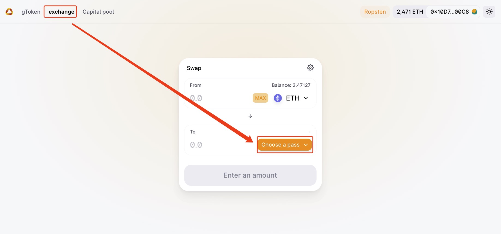{width="673" height="463"}
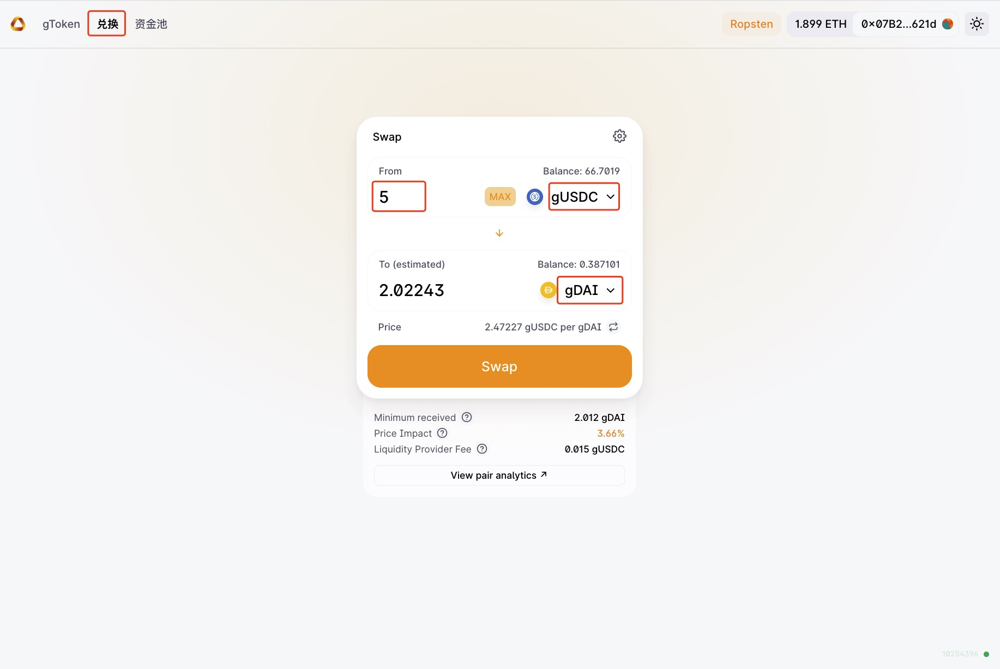{width="673" height="463"}

Click `Swap` and `Confirm Swap`, you would also need to use Metamask to sign the transaction.

After the transaction is submitted, you can view the transaction on Etherscan.

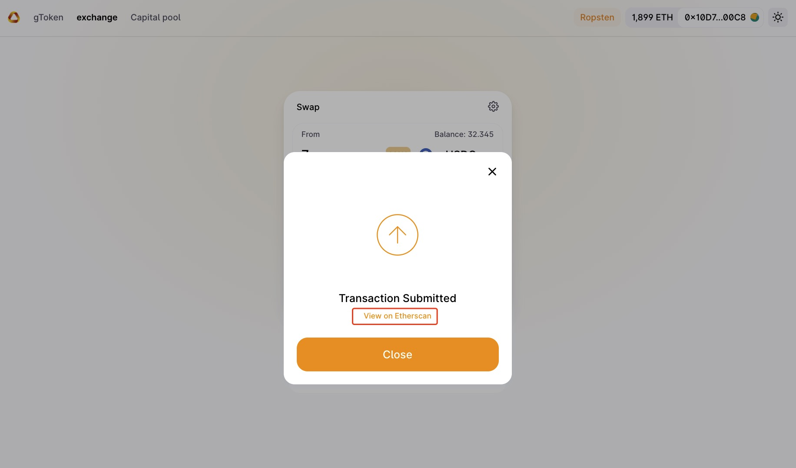{width="673" height="463"}

You can change the transaction settings here.

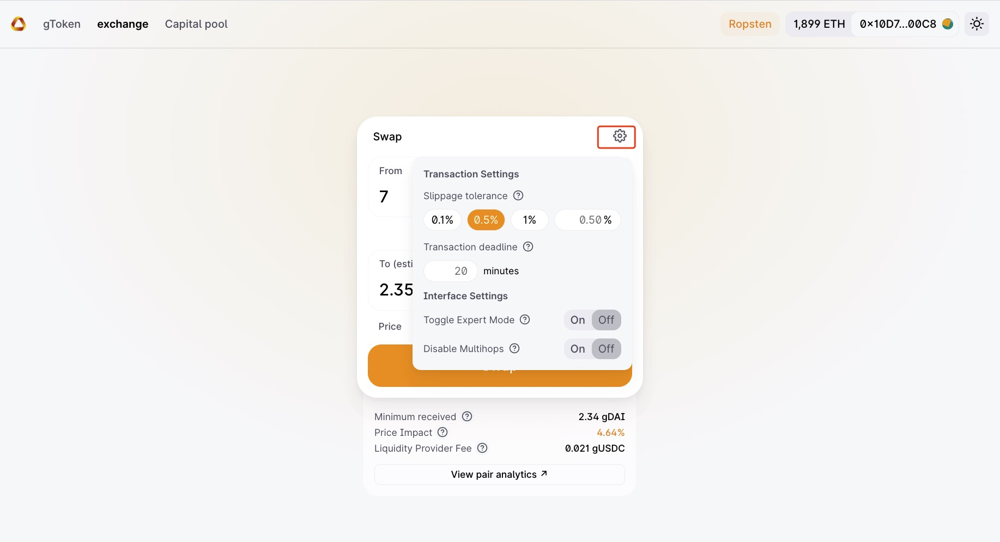{width="673" height="463"}

If the pool does not exist, you will not allowed to swap.

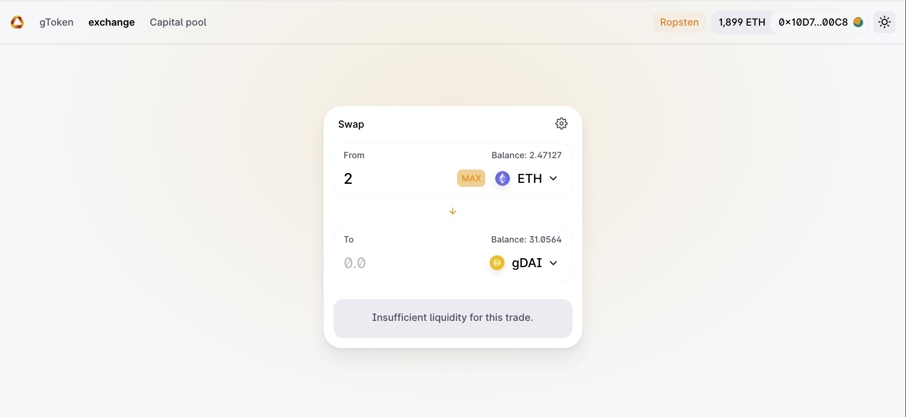{width="673" height="463"}

## Add Liquitity
You can add liquidity to an existing pool, or create a new pair. The process is similar.

{width="673" height="463"}

Choose the pair and enter the amount, then click `Supply` and sign transactions using Metamask.

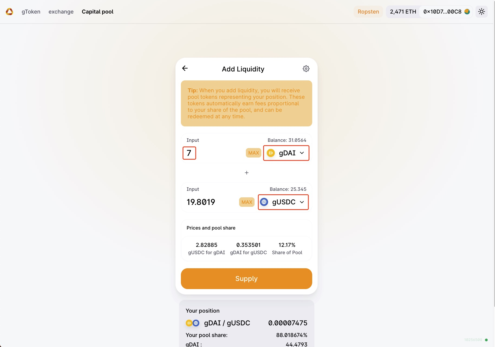{width="673" height="463"}

## Import Pool
After adding liquitity to a pool, you can import the pair for better management.

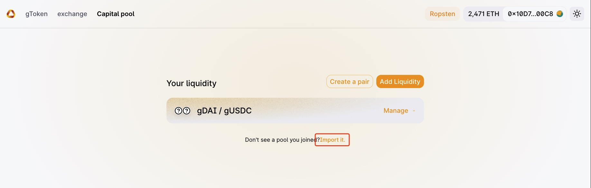{width="673" height="463"}

You will see the pooled tokens, where you can add or remove liquidity directly.

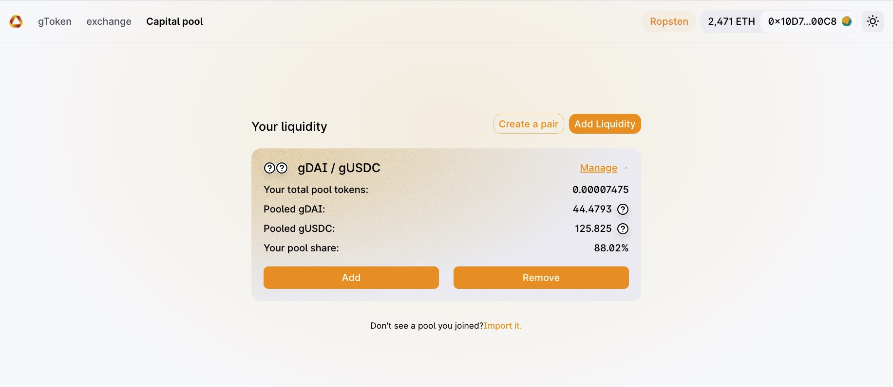{width="673" height="463"}
