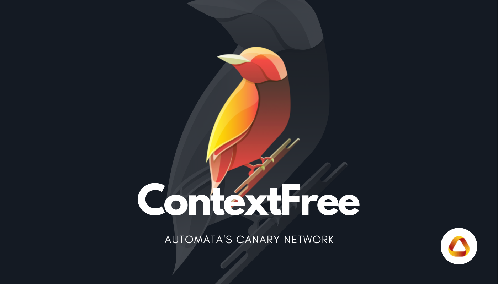

# Automata Network

**Automata Network** is a decentralized service protocol that provides middleware-like services for dApps to achieve traceless privacy, high assurance and frictionless computation.

## [**The MEV Wiki**](./mev/introduction.md)

**Flashboys, Flashbots, Dark Forests and more..**

[{style="zoom:60%"}](./mev/introduction.md)
## [**Witness**](./witness/introduction.md)

[{style="zoom:60%"}](./witness/introduction.md)

**Witness** is a privacy-first off-chain governance solution with on-chain execution.

Please see the [guide](./witness/introduction.md) to start.

## [**ContextFree**](./canarynet/getstarted/introduction.md)
[{style="zoom:60%"}](./canarynet/getstarted/introduction.md)

**ContextFree** is the canary network of Automata Network.

Please see the [wallet guide](./canarynet/userguide/setupwallet.md) here!

<!-- 
## Links

* [Website](https://www.ata.network/)
* [Witness](https://witness.ata.network/)
* [Dashboard](https://d.ata.network/)
* [Faucet](https://faucet.ata.network) -->
