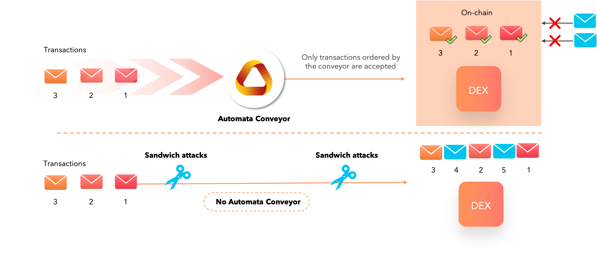

# MEV Minimization/Prevention

At Automata Network we are in the Defense camp, where we use privacy (SGX and ORAM) to minimize MEV.

## :robot: Conveyor - The Automata Network approach to tackling MEV

At Automata, we have created **Conveyor**, a service that ingests and outputs transactions in a determined order. This creates a front-running-free zone that removes the chaos of transaction reordering.

When transactions are fed into Conveyor, it determines the order of the incoming transactions and makes it impossible for block producers to perform the following:
Inject new transactions into the Conveyor output: The inserted transactions bypassing Conveyor is detectable by anyone because of signature mismatch.
Delete ordered transactions: Transactions accepted by Conveyor are broadcasted everywhere so transactions cannot be deleted unless ALL block producers are colluding and censoring the transactions at the same time.

From the DEX’s perspective, they can choose to accept either

1. Ordered transactions from Automata’s Conveyor which is free from transaction reordering and other front-running transactions
2. Other unordered transactions (which include front-running etc) that may negatively impact their users

### Okay. But why should users trust Conveyor?

And we hear you. Let us break it down.

Automata’s Conveyor runs on a decentralized compute plane backed by many Geode instances. Each Geode instance can be attested so anyone can publicly verify that the Geode is running on a system with genuine hardware (i.e., CPU) and that the Geode application code matches the version that is open-sourced and audited. This provides a strong guarantee that:

* The Geode code is untampered with
* The Geode data is inaccessible to even Geode providers (In which case they cannot act on said data to front-run transactions)

Importantly, Automata’s Conveyor is a chain-agnostic solution to the MEV issue, and works seamlessly on various platforms — zero modifications needed. Watch our demo to see it in action.

### An industry-first: Oblivious RAM

In fully public computation, access pattern leakage is not negligible as everything is exposed. But in privacy-preserving computation, any tiny bit of information leakage becomes a significant issue. Studies have shown that access pattern leakage leads to exposure of sensitive information such as private keys from searchable encryption and trusted computing.

This is where the Oblivious RAM algorithm comes into play. Automata’s implementation is the first-of-its-kind in the blockchain industry, providing an exceedingly high degree of privacy in dApps.

This greatly reduces the probability of user privacy being leaked even as access patterns are being monitored and analyzed by malicious actors. The Automata team has authored multiple research papers on state-of-the-art ORAM and hardware technologies to enhance the privacy and performance of existing networks.

* Robust P2P Primitives Using SGX Enclaves [RAID 2020](https://www.usenix.org/system/files/raid20-jia.pdf)
* PRO-ORAM: Practical Read-Only Oblivious RAM [RAID 2019](https://www.usenix.org/system/files/raid2019-tople.pdf)
* OblivP2P: An Oblivious Peer-to-Peer Content Sharing System [USENIX Security 2016](https://www.usenix.org/system/files/conference/usenixsecurity16/sec16_paper_jia.pdf)
* Preventing Page Faults from Telling Your Secrets [Asia CCS 2016](https://n.ethz.ch/~sshivaji/publications/pfdefense_asiaccs16.pdf)

## :robot: The Fair Sequencing Service by ChainLink

The idea behind FSS is to have an oracle network order the transactions sent to a particular contract SC, including both user transactions and oracle reports. Oracle nodes ingest transactions and then reach consensus on their ordering, rather than allowing a single leader to dictate it.

FSS is a framework for implementing ordering policies, of which [Aequitas](https://eprint.iacr.org/2020/269.pdf){target=_blank}) (protocol for order-fairness in addition to consistency and liveness) is one example. It can alternatively support simpler approaches, such as straightforward encryption of transactions, which can then be decrypted in a threshold manner by oracle nodes after ordering. It will also support various policies for inserting oracle reports into a stream of transactions. (It can even support MEV auctions, if desired.)

**<u>Links</u>**

[https://blog.chain.link/chainlink-fair-sequencing-services-enabling-a-provably-fair-defi-ecosystem/](https://blog.chain.link/chainlink-fair-sequencing-services-enabling-a-provably-fair-defi-ecosystem/){target=_blank}

White paper to be released later.

## :robot: Arbitrum by Offchain Labs

Arbitrum is against MEVA and FaaS.

Minimizing L2 MEV capabilities

3 Modes of Arbitrum:

**1. Single Sequencer: L2 MEV-Potential (\**\*Mainnet Beta)\*\****

For Arbitrum’s initial, flagship Mainnet beta release, the Sequencer will be controlled by a single entity. This entity has transaction ordering rights within the narrow / 15 minute window; users are trusting the Sequencer not to frontrun them.

**2. Distributed Sequencer With Fair Ordering: L2-MEV-minimized** *Mainnet Final Form*

The Arbitrum flagship chain will eventually have a distributed set of independent parties controlling the Sequencer. They will collectively propose state updates via [the first BFT algorithm that enforces fair ordering within consensus (Aequitas)](https://eprint.iacr.org/2020/269.pdf){target=_blank}. Here, L2 MEV is only possible if >1/3 of the sequencing-parties maliciously collude, hence “MEV-minimized.”

**3. No Sequencer: No L2 MEV**

A chain can be created in which no permissioned entities have Sequencing rights. Ordering is determined entirely by the Inbox contract; lose the ability to get lower latency than L1, but gain is that no party involved in L2, including Arbitrum validators, has any say in transaction ordering, and thus no L2 MEV enters the picture.

**<u>Links</u>**

[https://offchainlabs.com/](https://offchainlabs.com/){target=_blank}

[https://medium.com/offchainlabs/front-running-as-a-service-334c929c945](https://medium.com/offchainlabs/front-running-as-a-service-334c929c945){target=_blank}

[https://docs.google.com/document/d/1VOACGgTR84XWm5lH5Bki2nBcImi3lVRe2tYxf5F6XbA/edit](https://docs.google.com/document/d/1VOACGgTR84XWm5lH5Bki2nBcImi3lVRe2tYxf5F6XbA/edit){target=_blank}

## :robot: Vega Protocol

Vega's proposal is to add a module to blockchains that supports the concept of relative fairness so that competing transactions may be sequenced under a known and understood protocol, and not subject to a validator’s discretion.

"*If there is a time t such that all honest validators saw a before t and b after t, then a must be scheduled before b”.* This is a property that can be assured of at any time with a minimal impact on performance.

To get the best combination, their current approach is a hybrid of the two. In normal operation, the protocol will assure block fairness. If the network detects that this causes a bottleneck, it temporarily switches to the timed approach (thus sacrificing a little fairness for performance), before switching back once the bottleneck is resolved. However, Vega will ultimately make the level of fairness customisable by market.

**<u>Links</u>**

[https://vega.xyz/](https://vega.xyz/){target=_blank}

[https://blog.vega.xyz/new-paper-fairness-and-front-running-an-invitation-for-feedback-cbb39a1a3eb](https://blog.vega.xyz/new-paper-fairness-and-front-running-an-invitation-for-feedback-cbb39a1a3eb){target=_blank}

Wendy, the Good Little Fairness Widget [https://vega.xyz/papers/fairness.pdf](https://vega.xyz/papers/fairness.pdf){target=_blank}

Video [https://www.youtube.com/watch?v=KjfLj5fhkGQ&t=18s&ab_channel=VegaProtocol](https://www.youtube.com/watch?v=KjfLj5fhkGQ&t=18s&ab_channel=VegaProtocol){target=_blank}

## :robot: Veedo by StarkWare

VeeDo is StarkWare’s STARK-based Verifiable Delay Function (VDF), and its PoC is now live on Mainnet. VeeDo's time-locks allow information to be sealed for a predetermined period of time (during the sequencing phase), and then made public.

2 approaches using privacy to minimize MEV

1. Time-locks as part of the protocol layer
2. Time-locks on Ethereum with smart contracts - supported today

**<u>Links</u>**

[https://starkware.co/](https://starkware.co/){target=_blank}

[https://medium.com/starkware/presenting-veedo-e4bbff77c7ae](https://medium.com/starkware/presenting-veedo-e4bbff77c7ae){target=_blank}

[https://docs.google.com/presentation/d/1C_Rb_rtUXT2Nkettu_GPSlD9yCge8ioBNLRj5OBNbyY/edit#slide=id.gb576f94980_0_836](https://docs.google.com/presentation/d/1C_Rb_rtUXT2Nkettu_GPSlD9yCge8ioBNLRj5OBNbyY/edit#slide=id.gb576f94980_0_836){target=_blank}

## :robot: LibSubmarine

LibSubmarine is an open-source smart contract library that protects your contract against front-runners by temporarily hiding transactions on-chain.

**<u>Links</u>**

[https://libsubmarine.org/](https://libsubmarine.org/){target=_blank}

Video [https://www.youtube.com/watch?v=N8PDKoptmPs&feature=emb_imp_woyt&ab_channel=IC3InitiativeforCryptocurrenciesandContracts](https://www.youtube.com/watch?v=N8PDKoptmPs&feature=emb_imp_woyt&ab_channel=IC3InitiativeforCryptocurrenciesandContracts){target=_blank}

GitHub [https://github.com/lorenzb/libsubmarine](https://github.com/lorenzb/libsubmarine){target=_blank}

## :robot: Sikka

Sikka's MEV solution to censorship and frontrunning problems is using a technique called Threshold Decryption, as a plugin to the Tendermint Core BFT consensus engine to create mempool level privacy. With this plugin, users are able to submit encrypted transactions to the blockchain, which are only decrypted and executed after being committed to a block by a quorum of 2/3 validators.

**<u>Links</u>**

[https://sikka.tech/](https://sikka.tech/){target=_blank}

[https://docs.google.com/presentation/d/1tQEUpZjy_U9J-VQAx1Wf5W9oOX5rrCY3AwjAb7ZgA68/edit#slide=id.p](https://docs.google.com/presentation/d/1tQEUpZjy_U9J-VQAx1Wf5W9oOX5rrCY3AwjAb7ZgA68/edit#slide=id.p){target=_blank}
