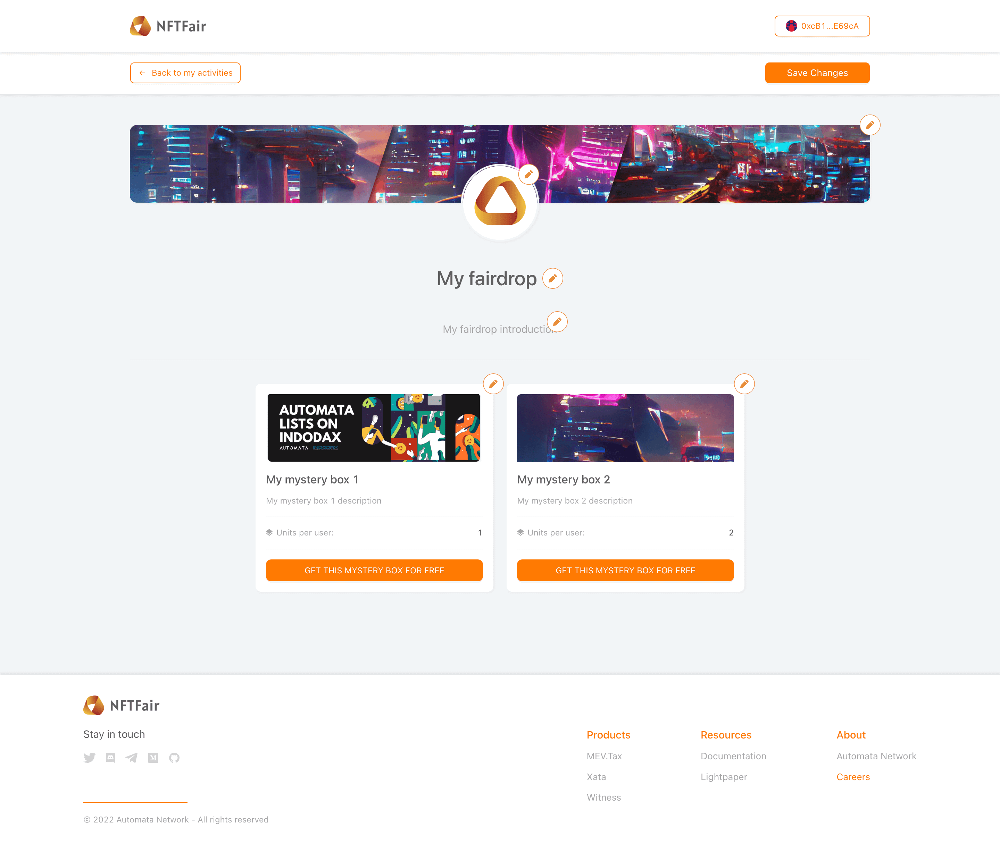

# NFTFair Console User Guide

This instruction will show you how to create an activity on the NFTFair console.

## Sign in

First, you need to sign in to our console using your wallet. Click the connect button and sign the message to sign in.

## Set up your profile

Next, you need to set up your profile, click "My Profile" on the sidebar, fill in your information, and click the "Save" button.

## Create your collection

Before you create your activity, you need to create an NFT collection. Click the "Create" button on the sidebar and select "Create a new NFT collection".

Then select the collection cover, and input your collection title and description. Next, click the asset uploader to select your NFT images.

Fill in your NFT title and description and click "Create NFT Collection".

You can visit the collection detail page and click actions on the top right of the page to add or update your NFT collection.

## Deploy your collection

Once you finish editing the NFT collection, you can deploy it to the network. Select the network you want to deploy your NFT contract and select the NFT contract type, then click "Deploy NFT contract".

Note: Once you deploy an NFT contract, you will no longer be able to add or update your NFT.

## Create a new activity

If your collection is successfully deployed, go back to the NFT collection details page and click the "Create Activity" button on the right top.

Next, input your activity name, activity time, and introduction. Choose your activity type. As the example shown below, we are going to create a mystery box activity,

Then, we need to set up the mystery box content. Select the mystery box cover, and input the title, description, and purchase limit.

In the mystery box content section, select those NFTs you want to put into this box.

Finally, click the "Create" button to create the activity.

## Configure activity themes

Next, you can preview or configure your activity themes. Click on the configure themes button to set up your page themes.

On the theme configuration page, you can update the activity banner, icon, title, description, etc... After you finish the configurations, click on the "Save Changes" button.

If your activity is ready, you can click the "Publish" button on the activity listing to set up your activity online.

Finally, you can click the preview button on the activity list page, copy and post the activity link to your users.
