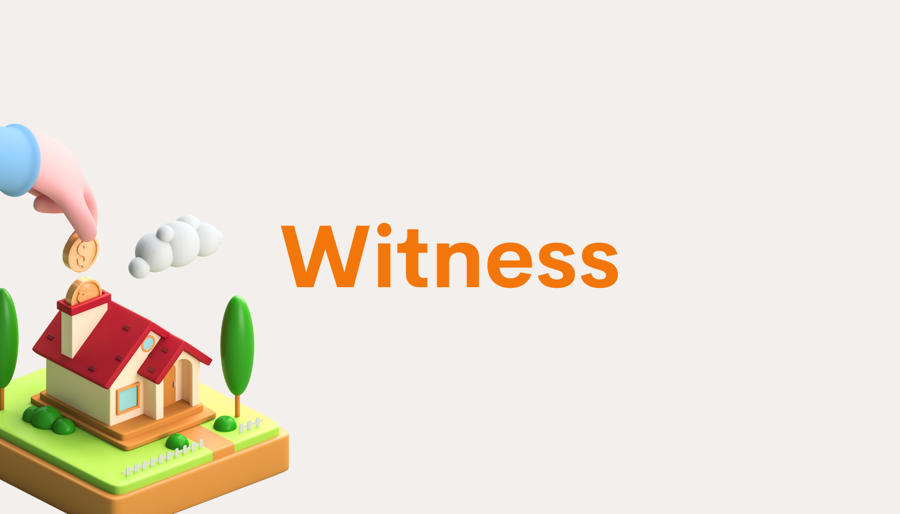

## Overview

{style="zoom:80%"}

The concept of community takes on tangible form and value as blockchain gains velocity. People with real financial stake change not only the proverbial status quo, but also foster new economies and polities in the image of Web3. With so many going about to decide the future of some of the biggest and most impactful decentralized projects, we thought about the experience we wanted communities to have, and how we could value-add to that journey. 

[Witness](https://witness.ata.network) was the result. A privacy-first, off-chance governance solution with on-chain execution. 

## Features 

- Privacy 
  Users can select and change different privacy settings, which allows for specific results to be displayed. Public: Voter address, number of votes. Medium: Number of votes. Private: Only the overall result is shown. 
- Gasless 
  Off-chain voting is gas-free. Users do not have to grapple with prohibitive gas fees to create proposals and vote on them.
- On-chain execution 
  Chainhook enables calling of the on-chain contract registered at proposal creation. 
- Multi-chain support 
  Witness currently supports ERC20 on Ethereum, with other [EVM-based chains](https://chainlist.org/) and [Substrate-based chains](https://polkaproject.com/#/projects?cateID=1&tagID=0) in the pipeline. 
- Modular 
  Each function can be used standalone or together. It is entirely possible for a project to use Witness solely as a signaling tool. 

## Platforms

Witness currently supports the following networks: 

- Ethereum (Mainnet, Kovan Testnet)
- Binance Smart Chain (Mainnet, Testnet)
- Plasm Network (Dusty Testnet)
- Clover Finance (Testnet)
- Darwinia (Pangolin Testnet)
- Moonbase (Alpha Testnet)
- Polygon (Matic Mainnet)
- Avalanche (Mainnet)
- HECO (Mainnet, Testnet)

## Support

|          Platform           |   Private Voting   |     Chainhook      |    Public Voting   |
|:---------------------------:|:------------------:|:------------------:|:------------------:|
|      Ethereum Mainnet       | :white_check_mark: |   :construction:   | :white_check_mark: |
|   Ethereum Kovan Testnet    | :white_check_mark: | :white_check_mark: | :white_check_mark: |
| Binance Smart Chain Mainnet | :white_check_mark: |   :construction:   | :white_check_mark: |
| Binance Smart Chain Testnet | :white_check_mark: | :white_check_mark: | :white_check_mark: |
| Plasm Network Dusty Testnet | :white_check_mark: |   :construction:   | :white_check_mark: |
| Clover Finance Testnet      | :white_check_mark: |   :construction:   | :white_check_mark: |
| Darwinia Pangolin Testnet   | :white_check_mark: |   :construction:   | :white_check_mark: |
| Moonbase Alpha Testnet      | :white_check_mark: |   :construction:   | :white_check_mark: |
|          Polygon            | :white_check_mark: |   :construction:   | :white_check_mark: |
|         Avalanche           | :white_check_mark: |   :construction:   | :white_check_mark: |
|         HECO Mainnet        | :white_check_mark: |   :construction:   | :white_check_mark: |
|         HECO Testnet        | :white_check_mark: |   :construction:   | :white_check_mark: |       

[evm-chains]: https://chainlist.org/
[substrate-chains]: https://polkaproject.com/#/projects?cateID=1&tagID=0
