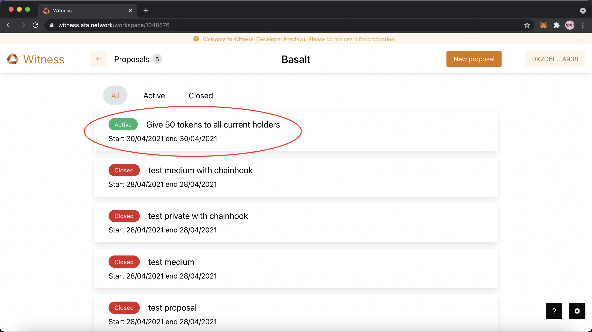
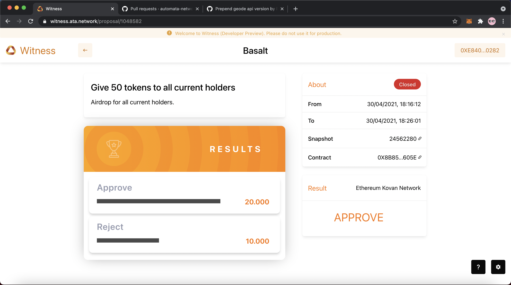
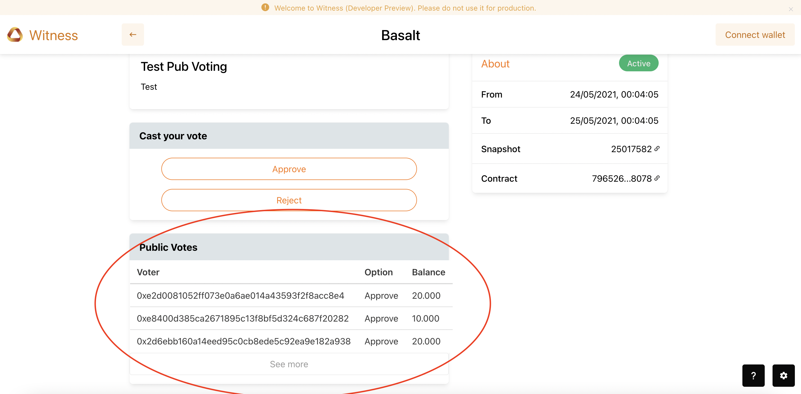
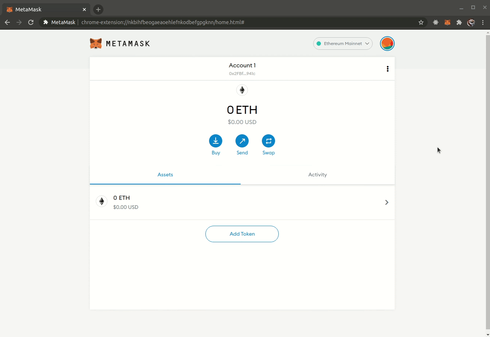
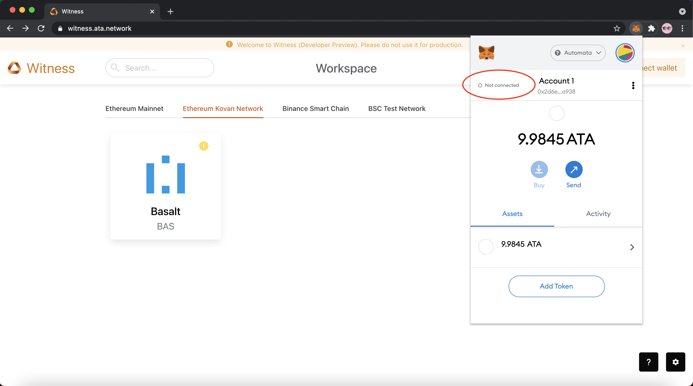
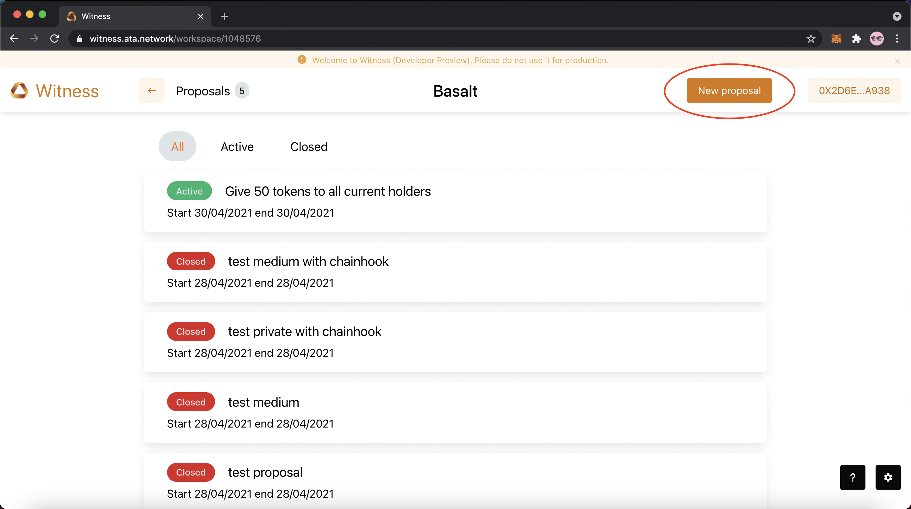
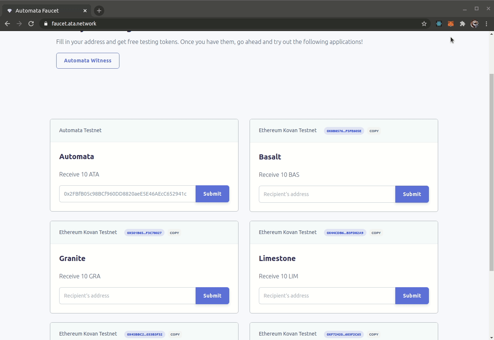

# Getting started

<!-- ## Table of Contents

- [Getting started](#getting-started)
  - [For Users](#for-users)
  - [For Project Owners](#for-project-owners)
    - [Adding the Automata Network testnet to your network](#adding-the-automata-network-testnet-to-your-network)
    - [Connecting Your Metamask Wallet](#connecting-your-metamask-wallet)
    - [Creating a workspace](#creating-a-workspace)
    - [Creating a new proposal](#creating-a-new-proposal)
  - [Chainhook](#chainhook)
  - [Appendix](#appendix)
    - [Setting up MetaMask](#setting-up-metamask)
    - [Getting tokens](#getting-tokens)
      - [Getting ERC20 tokens (Ethereum Kovan Network)](#getting-erc20-tokens-ethereum-kovan-network)
      - [Getting BEP20 tokens in the Binance Smart Chain test network](#getting-bep20-tokens-in-the-binance-smart-chain-test-network)
    - [Supported Chain Info](#supported-chain-info)
    - [Get supported by Witness](#get-supported-by-witness)

-->

## For Users

First, choose the blockchain network that you wish to connect to. Then search for the project in the Search bar. Look for the proposal that you are interested in voting for.

!!! attention

    Before voting, please ensure that:

    - Your MetaMask wallet is connected to the corresponding network you are voting in. You can get necessary info about the blockchains we support [here](#supported-chain-info) and follow these [instructions](#adding-automata-network-testnet-to-your-networks) to add to your MetaMask wallet
    - Your account has the necessary number of ERC20/BEP20 tokens to qualify for the vote **as specified by the block height in the snapshot**.

{width="673" height="463"}
{width="673" height="463"}
{width="673" height="463"}

!!! Note

    **If you wish to get tokens for the testnet, please refer to the [Getting tokens](#getting-tokens) section for more information**

Once you have obtained tokens, you can participate in the vote by clicking on your option of choice. Currently, we are calculating the token balance for each voter based on the block height that each proposal mandates. 

{width="673" height="463"}

The results of vote can be seen after the vote has concluded and finazlied. 

For Private Proposals: Only the final winning option will be shown

{width="673" height="463"}

For Medium Proposals: The number of votes for each option will be shown. 

{width="673" height="463"}

For Public Proposals: The voter information will be transparent to the public.

{width="673" height="463}

## For Project Owners

Project owners can create a workspace for hosting proposals. Project teams or community members can then proceed to create proposals. Currently the metadata is stored on the [testnet](https://d.ata.network) of Automata Network. Connect to the testnet to create workspaces or propsals.

### Adding the Automata Network testnet to your network  

Add the Automata Network to your existing network using the following details:  

|        Field        |          Value           |
|:-------------------:|:------------------------:|
|  **Network Name**   |     Automata Network     |
|   **New RPC URL**   | https://rpc.ata.network/ |
|    **Chain ID**     |            86            |
| **Currency Symbol** |           ATA            |

The option to add network can be found by clicking on:  

* **Profile Picture >> Settings >> Networks >> Add Network**  

or:

* **Network name >> Custom RPC**  

{width="673" height="463"}

### Connecting Your Metamask Wallet

If you see **Connect wallet** or **Not connected** show up in your MetaMask, this means that you are **not connected**!

{width="673" height="463"}
{width="673" height="463"}

You can follow these steps to connect your wallet:  

- Click on **Connect wallet** at the top right corner
- Click on **MetaMask**
- Select the account you wish to connect with MetaMask
- Connect your account

{width="673" height="463"}

### Creating a workspace

You can create a workspace from the landing page [Witness](https://witness.ata.network/).  

!!! tips
    Before creating a workspace for your token, please ensure the following:

    - **Your MetaMask wallet is connected to Automata Network**
    - **Your account has the necessary ATA tokens**

    If you do not have the necessary tokens, please refer to [Getting tokens](#getting-tokens).

Once ready, you can create a workspace by:

- Clicking on **Create**
- Choose the correct blockchain network for your workspace
- Fill in your workspace name
- Fill in your workspace specifications
- Enter your token contract hash
- Click on **Create**

{width="673" height="463"}

### Creating a new proposal

Head over to the workspace of a project you're interested in creating a proposal for.  If the workspace has not been created yet, refer to [Creating a Workspace](#creating-a-workspace).

{width="673" height="463"}

!!! tips
    Before creating a proposal, please ensure that:

    - **Your MetaMask wallet is connected to Automata Network**
    - **Your account has the necessary ATA tokens**

    If you do not have the necessary tokens, you can refer to [Getting tokens](#getting-tokens).

Once ready, you can create a proposal by:

- Clicking on **New Proposal** 
- Fill in your proposal title
- Fill in content for your proposal
- Add / Edit / Remove your voting options
- Select the start and end date
- Click on **Publish**

{width="673" height="463"}

## Chainhook

This feature enables calling of the on-chain contract which was registered at proposal creation. Note this is still in beta so it's only enabled for [selected platform](../introduction/#feature-support) currently. Each voting option can be followed with a chainhook or, you can create a chainhook by:

- Clicking on **Add Chainhook** followed by the option field
- Choose the smart contract language for your Chainhook
- Fill in the contract address where your Chainhook will take effect
- Fill in the function name
- Add arguments for your callback function
  - Each argument is paired with the type and the value field
  - Currently only `uint256, uint256[], address, address[]` are supported as argument types
  - Follow the example for input value by hovering above the value field

{width="673" height="463"}

## Appendix

### Setting up MetaMask

[MetaMask](https://metamask.io/) is a cryptocurrency wallet used to interact with the Ethereum blockchain. As it is required when using Automata Network, you can install the extension via the official download page [here](https://metamask.io/download.html), or simply add the extension for your browser using the links below:

- [Chrome](https://chrome.google.com/webstore/detail/metamask/nkbihfbeogaeaoehlefnkodbefgpgknn?hl=en)
- [Firefox](https://addons.mozilla.org/en-US/firefox/addon/ether-metamask/)
- [Brave](https://chrome.google.com/webstore/detail/metamask/nkbihfbeogaeaoehlefnkodbefgpgknn?hl=en)
- [Edge](https://microsoftedge.microsoft.com/addons/detail/metamask/ejbalbakoplchlghecdalmeeeajnimhm?hl=en-US)

### Getting tokens
#### Getting ERC20 tokens (Ethereum Kovan Network) 
To get your tokens, head over to our faucet at <https://faucet.ata.network/>.

Copy the address of your account in MetaMask by clicking on **'Copy to Clipboard'** and then paste the address into the input field for your desired token. Click **Submit**.  

{width="673" height="463"}

When receiving ERC-20 tokens, the relevant contract hash can be found right next to the words "Ethereum Kovan Network". You can copy this by clicking on the **Copy** button next to it.  

{width="673" height="463"}

#### Getting BEP20 tokens in the Binance Smart Chain test network
To get tokens in the BSC test network, you can search for the contract address using <https://testnet.bscscan.com/>. Use the faucet <https://testnet.venus.io/faucet> or <https://testnet.binance.org/faucet-smart> to get tokens.

### Supported Chain Info

|        Field        |          Value           |
|:-------------------:|:------------------------:|
|  **Network Name**   |        BSC mainnet       |
|   **New RPC URL**   | https://bsc-dataseed1.defibit.io/ |
|    **Chain ID**     |            56            |

|        Field        |          Value           |
|:-------------------:|:------------------------:|
|  **Network Name**   |        BSC testnet       |
|   **New RPC URL**   | https://data-seed-prebsc-1-s1.binance.org:8545/ |
|    **Chain ID**     |            97            |

|        Field        |          Value           |
|:-------------------:|:------------------------:|
|  **Network Name**   |    Plasm Dusty testnet   |
|   **New RPC URL**   | https://rpc.dusty.plasmnet.io:8545/ |
|    **Chain ID**     |            80            |

|        Field        |          Value           |
|:-------------------:|:------------------------:|
|  **Network Name**   |      Clover testnet      |
|   **New RPC URL**   | https://rpc.clover.finance/ |
|    **Chain ID**     |           1023           |

|        Field        |          Value           |
|:-------------------:|:------------------------:|
|  **Network Name**   | Dawinia Pangolin testnet |
|   **New RPC URL**   | https://pangolin-rpc.darwinia.network/ |
|    **Chain ID**     |            43            |

|        Field        |          Value           |
|:-------------------:|:------------------------:|
|  **Network Name**   |  Moonbase Alpha testnet  |
|   **New RPC URL**   | https://rpc.testnet.moonbeam.network/ |
|    **Chain ID**     |           1287           |

|        Field        |          Value           |
|:-------------------:|:------------------------:|
|  **Network Name**   |         Polygon          |
|   **New RPC URL**   | https://rpc-mainnet.matic.network |
|    **Chain ID**     |           137            |

- Ethereum Mainnet and Kovan Testnet are not listed here since they are natively supported by Metamask

### Get supported by Witness

We are open to onboard any EVM networks as our first batch of supported networks by Witness. The following details are required for us to complete the onboarding. The integration only involves small changes in Witness on our side.

- Chain ID
- JSON-RPC URL
- Blockchain Explorer URL (optional)
- Faucet (for testnet) 