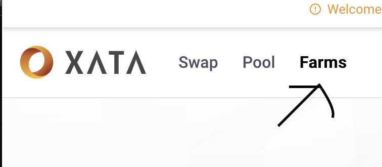
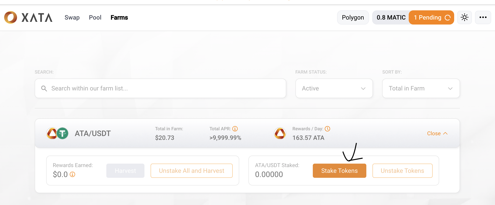

# Farming Guide

## Step-by-Step Guide to farming on XATA

### Step 1 : Visit the Farm Page 
You should be able to see the available farming pools by clicking on the 'Farm' tab in [https://app.xata.fi/](https://app.xata.fi/#/swap)

{style="zoom:80%"}

Feel free to use the filter/search functions to find a pool for your favorite token, or the one you wish to stake.

### Step 2: Add Liquidity
If you have not already done this, head over to our [Liquidity Pool Guide](./liquiditypool-guide.md) to add liquidity to the token pair.

### Step 3: Stake LP tokens
After adding liquidity, return to the Farm page to stake.
Click on the 'Stake Tokens' button after opening a farm

{style="zoom:80%"}

That's it, you're done! You should start seeing rewards in 'Rewards Earned' over time.

## Claim Rewards
At any point in time, you can claim your rewards without unstaking, by clicking ' Harvest' after opening a farm. This will send all accumulated reward tokens to your wallet.

## Withdraw or exit the farm
When you want to, you can unstake any amount of your LP tokens by clicking the 'Unstake Tokens' button. The remainder of your LP tokens will continue receiving rewards.

If you wish to stop everything, you should click the 'Unstake All and Harvest' button instead. This will claim all rewards and unstake all of your LP tokens in the same transaction.