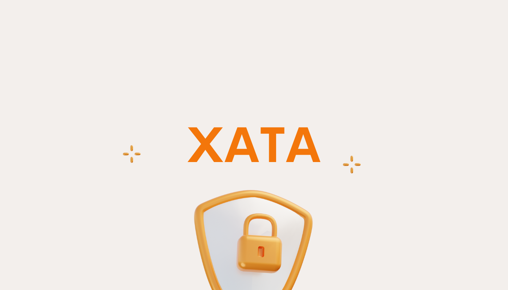

# Introduction

{style="zoom:80%"}

XATA is a Fair Liquidity Provisioning protocol that minimizes Maximal Extractable Value (MEV), with anti-front-running supported across multiple chains including Polygon Network and Binance Smart Chain. 

Notably, Automata's approach does not rely on any miner bribe nor modification to address MEV. 

## Features 
Powered by Conveyor, XATA creates an unalterable, front-running-free zone:

* **Ordered privacy** - Transaction ordering is not revealed unless it is determined and unalterable. No one, including hosting nodes, will know the ordering before it is decided.
* **Gasless Transactions** - Users pay gas fee directly in the tokens to be swapped. Native tokens (i.e. BNB, ETH) are no longer required when users are swapping tokens frequently. 
* **Chain Agnostic** - XATA provides anti-front-running across multiple chains, including Polygon Network and Binance Smart Chain, with further support planned in the near future.
* **No 3rd party involvment** - As a stand-alone protocol, XATA does not require any additional miner bribe nor any prior modification on miners' part to work.

## How XATA works 

XATA arranges transactions in a determined, unbiased order. On the protocol, users are able to view the amount of tokens saved from front-running directly as a result of MEV protection. 

* It is impossible for malicious actors to inject new transactions into XATA's output due to signature mismatch. 

* It is also not possible to delete ordered transactions either, as transactions are broadcasted throughout the network.

## Get started 

Check out this 2 minute video overview:

<iframe width="732" height="412" src="https://www.youtube.com/embed/ydu6iRdlFpQ" title="YouTube video player" frameborder="0" allow="accelerometer; autoplay; clipboard-write; encrypted-media; gyroscope; picture-in-picture" allowfullscreen></iframe>

  Follow our in-depth [guide](./liquiditypool-guide.md) to learn the basics of using XATA.

## Resources
* [Twitter](https://twitter.com/teamxata)
* [MEV.tax](https://mev.tax)
* [Telegram](https://t.me/xataprotocol)
* [Medium](https://www.medium.com/@teamxata)
