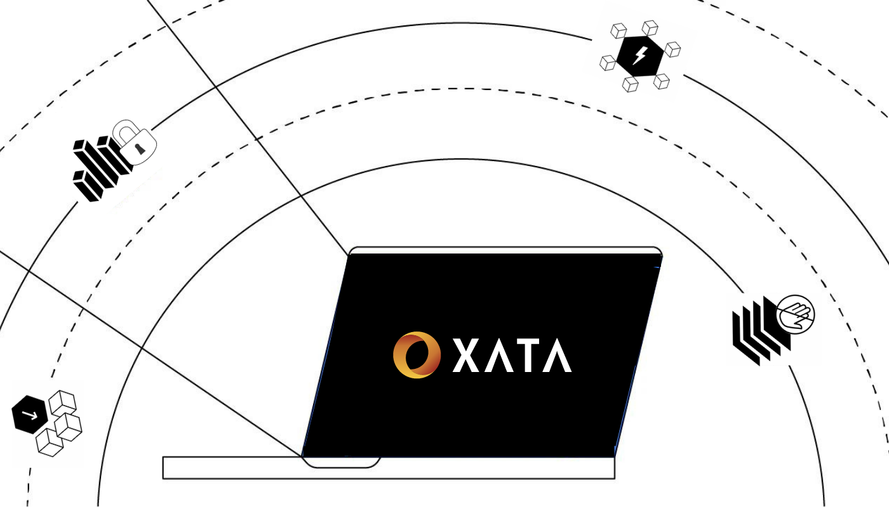
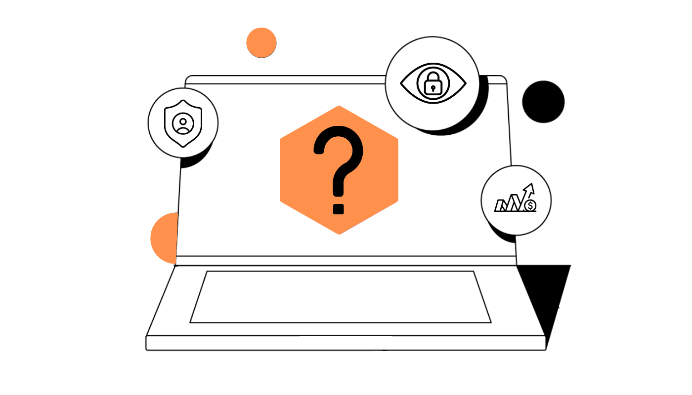

# **XATA**

Learn more about XATA, a Fair Liquidity Provisioning protocol to minimize MEV.

## About XATA

{style="zoom:80%"}

!!! note
    Since 2020, [MEV](https://app.gitbook.com/o/-MjTHc7BOHyVLIwg4MYT/s/-MjTHhnx55kZnU8_VVc-/) has extracted over $730 millions from users, the upper boundaries of the figure is only expected to increase with the incredible velocity of DeFi.

[XATA](https://www.xata.fi/) is a Fair Liquidity Provisioning protocol that minimizes Maximal Extractable Value (MEV). Incubated by Automata Network’s ecosystem, XATA provides multi-chain support for anti-front-running across various blockchains such as Polygon Network and Binance Smart Chain.

Leveraging Automata Network's [Conveyor](https://medium.com/atanetwork/whats-automata-iv-conveyor-93c9335e4f43), XATA does not require any miner bribe nor modification to address MEV.

## Features
Powered by Conveyor, XATA creates an unbiased, front-running-free zone with ordered privacy. Private transactions are arranged in an unalterable order:

* **Ordered privacy** - Transaction ordering is not revealed unless it is determined and unalterable. No one, including hosting nodes, will know the ordering before it is decided.
* **Gasless Transactions** - Users can pay gas fee directly in the tokens to be swapped. Native tokens are no longer required when users are swapping tokens frequently. 
* **Chain Agnostic** - XATA provides anti-front-running across multiple chains, including Polygon Network and Binance Smart Chain, with further support planned in the near future.
* **No 3rd party involvement** - As a stand-alone protocol, XATA does not require any additional miner bribe nor any prior modification on miners' part to work.

!!! info "Links"
    [What’s Automata (IV): Conveyor](https://medium.com/atanetwork/whats-automata-iv-conveyor-93c9335e4f43)

## How XATA works

* XATA arranges transactions in a determined, unbiased order. Users are able to view the amount of tokens saved from front-running, a direct and tangible effect of MEV protection. 

* It is impossible for malicious actors to inject new transactions into XATA's output due to signature mismatch. 

* It is also not possible to delete ordered transactions either, as transactions are broadcasted throughout the network.

XATA is the very first liquidity provisioning protocol protected by Automata Network's [Conveyor](https://medium.com/atanetwork/whats-automata-iv-conveyor-93c9335e4f43), which eliminates potential leakages from bots and miners. We envision users to benefit from and contribute to fair trading flow with XATA, while DEXes share users and volume in a constructive manner to push the boundary for DeFi.

## How to use XATA?

To understand how XATA works in practice, check out this 2 minute video overview:

<iframe width="732" height="412" src="https://www.youtube.com/embed/ydu6iRdlFpQ" title="YouTube video player" frameborder="0" allow="accelerometer; autoplay; clipboard-write; encrypted-media; gyroscope; picture-in-picture" allowfullscreen></iframe>

### Get started
Follow our in-depth [Guide](https://app.gitbook.com/o/-MjTHc7BOHyVLIwg4MYT/s/gqCCsfqAud7IrQymu673/~/changes/u3Ag5ra2KTLlc8KWQfKs/xata/swap-and-liquidity-pool-guide) to learn the basics of using XATA.

### Get involved
We are on Telegram - Join the conversation [here](https://t.me/xataprotocol) on telegram now!

### Get the details
Learn the fundamentals of MEV at [MEV Wiki](https://mev.wiki/)
Find out how much MEV has been stolen from you on [MEV Tax](https://mev.tax/).

## Resources
* [Twitter](https://twitter.com/teamxata)
* [Tegegram](https://t.me/xataprotocol)
* [Medium](https://www.medium.com/@teamxata)