# Swap & Liquidity Pool Guide

## Connecting Your Wallet

!!! note
	Please note: Currently, XATA only supports the Polygon (MATIC) network & Binance Smart Chain (BSC). Support for other chains will be launched very soon.

For this guide, we will be using Metamask with a Polygon wallet address to connect to XATA. Please ensure that you have these ready:

* [Metamask extension](https://chrome.google.com/webstore/detail/metamask/nkbihfbeogaeaoehlefnkodbefgpgknn?hl=en) installed to your chrome browser.
 
* Wallet address created on the Polygon Network - See this [guide on how to set up a wallet and custom RPC for the Polygon Network.](https://medium.com/stakingbits/setting-up-metamask-for-polygon-matic-network-838058f6d844)
 
* Ensure that you have some MATIC on your wallet address to pay for gas fees.

Once you have prepared everything, let's begin connecting our wallet to XATA:

* Head over to XATA at [app.xata.fi.](https://app.xata.fi/)
* Click on “Connect to a Wallet” on the top right corner.

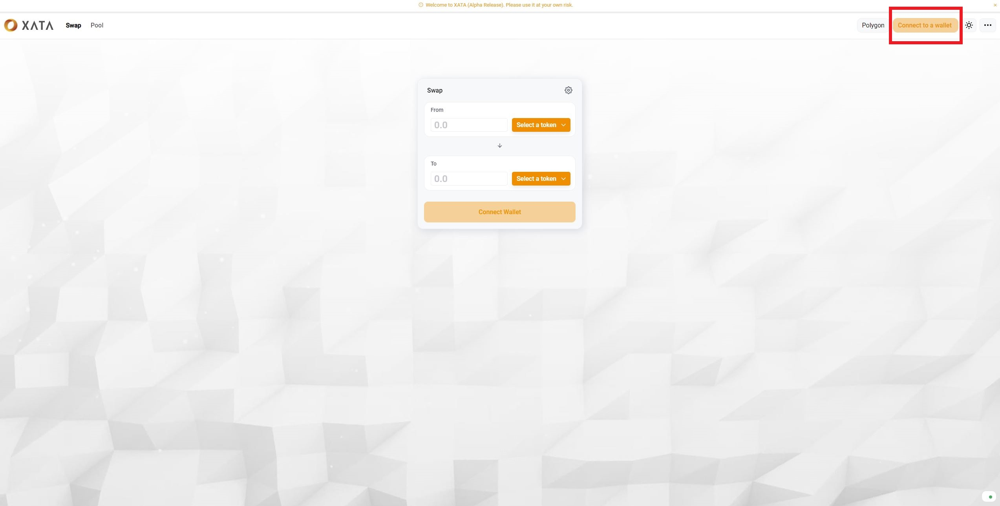{style="zoom:80%"}

* Select “Metamask”

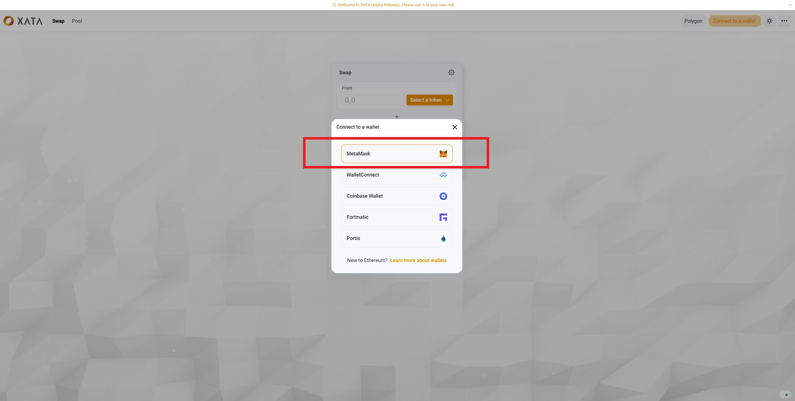{style="zoom:80%"}

* The Metamask extension prompt will appear. Ensure that your account is checked with a tick and click "Next".

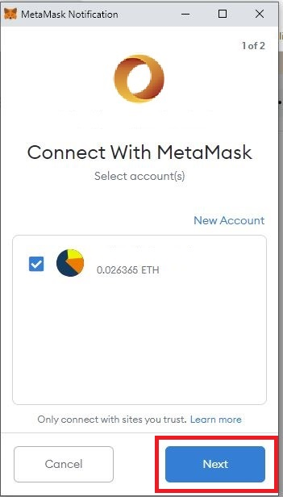{ style="display: block; margin: 0 auto" }
	
* Another Metamask extension prompt will appear, click on "Connect".

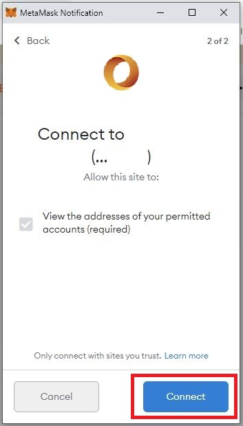{ style="display: block; margin: 0 auto" }
	
If you have done everything right, the user’s address and balance should appear on the top-right corner as shown in this image.
{style="zoom:80%"}

## Swapping Tokens

* Click on "Swap" at the top left corner.
* Select the tokens that you are swapping for.
	
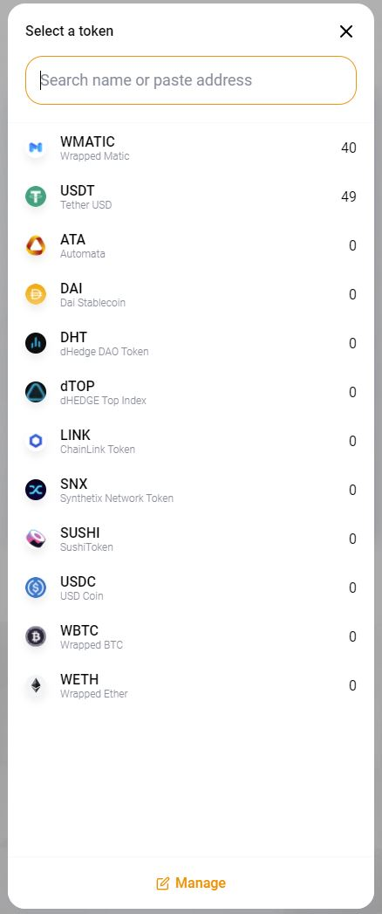{style="zoom:60%; display: block; margin: 0 auto"}

* The token at the bottom is what you will receive for trading in the tokens at the top. The estimated output token amount will be calculated based on the tokens' monetary value ratio from the liquidity pool.
	
{style="zoom:80%"}

* Click on the gear icon to adjust the "Slippage Tolerance" and "Transaction Deadline" & "Multihop" for your transaction if necessary.

{style="zoom:80%"}

* **Slippage tolerance**: The % of the price change that a user can tolerate. For instance, if the value were set at 0.5%, then the transaction will be reverted if the token price change is greater than 0.5%.
* **Transaction deadline**: The amount of time in seconds after the transaction is submitted. If a transaction were executed past the deadline, it will be reverted.
* **Multihop**:  When a user is attempting to swap USDC for DAI, and such a LP pair does not exist, this trade must go through an intermediary token (USDT) from another existing LP pair. The trade route would look like this: USDC -> USDT -> DAI.

* Once you are ready, click on "Swap" and a prompt on XATA will appear. Click on "Confirm Swap" to proceed.

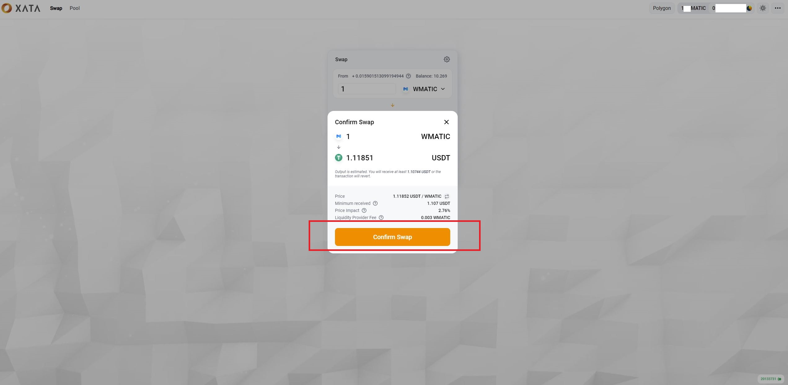{style="zoom:80%"}
	
* Do take note that if you have not used these tokens on XATA before, you will need to approve each tokens when prompted before conducting the swap.

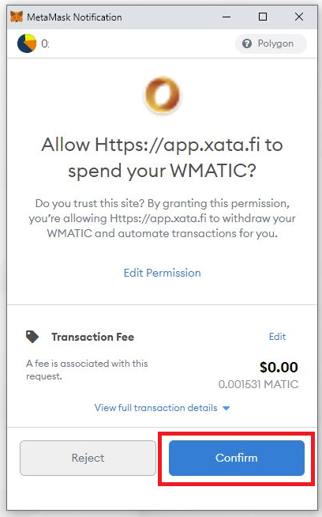{style="zoom:80%; display: block; margin: 0 auto"}

* Next, a Metamask extension prompt will popup to request for signature. Click "Sign" to proceed.

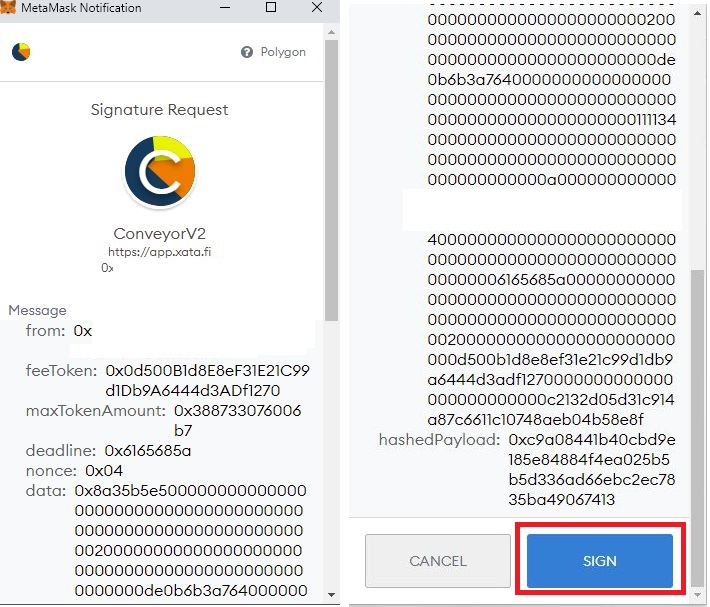{style="zoom:80%; display: block; margin: 0 auto"}

* Once this is done, your swap will be completed when the transaction is confirmed on the blockchain. You can also see how much MEV was protected in your trade using XATA.

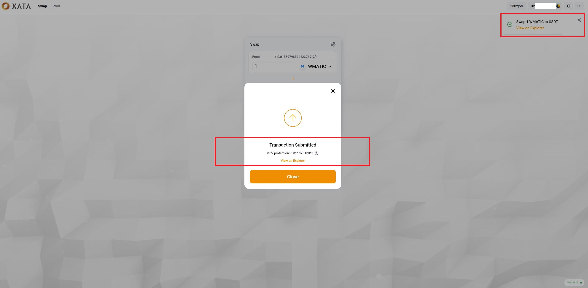{style="zoom:80%"}

## Liquidity Pools
You are also given the option to provide liquidity to XATA by creating a LP (Liquidity Pool) token pair.
### Adding Liquidity
To do this, please follow these steps:

* Click on "Pool" in the top left hand corner.

{style="zoom:80%"}

* Click on "Add Liquidity"

{style="zoom:80%"}

* Click on the dropdown arrow to select each tokens for your LP pair, then key in the quantity for each.
 
{style="zoom:80%"}

{style="zoom:60%; display: block; margin: 0 auto"}
	
* If you have not used these tokens on XATA before, you will need to click on approve tokens for each of them before you can "Create Pool & Supply"

{style="zoom:80%; display: block; margin: 0 auto"}

* Once both tokens are approved, click "Supply", then click "Create Pool & Supply" if you're creating a new liquidity pool.

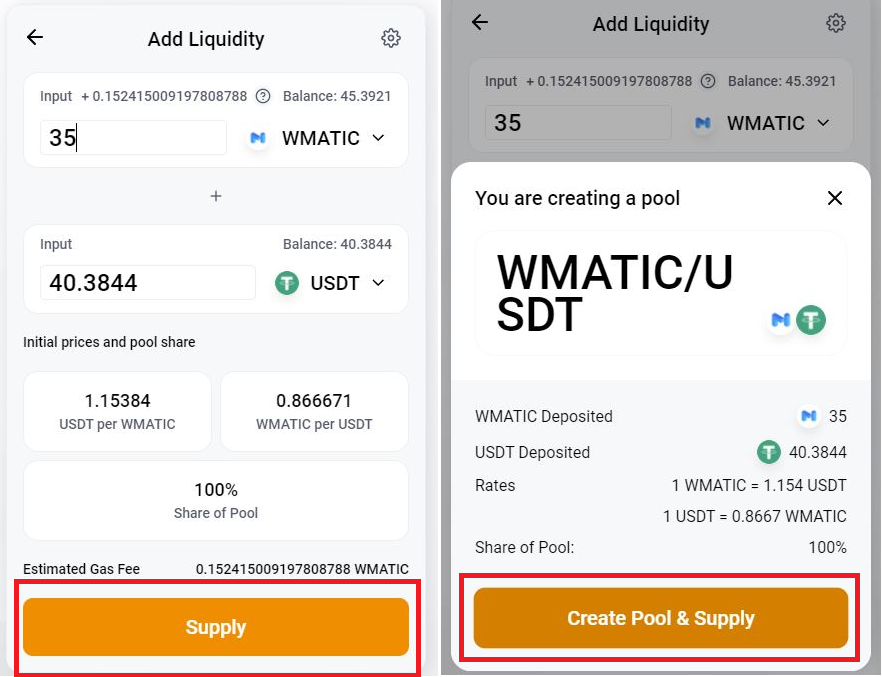{style="zoom:80%; display: block; margin: 0 auto"}

* A Metamask extension prompt for a Signature Request will popup. Click "Sign" to complete the process.

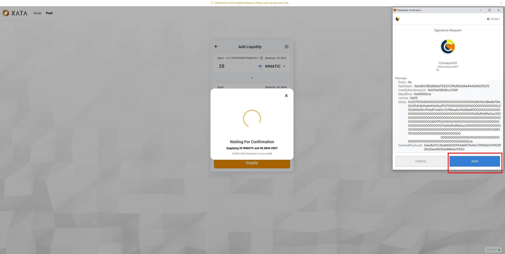{style="zoom:80%"}

* Once your transaction has been confirmed on the blockchain, you will receive your LP token as a representation of your equity of the pool.

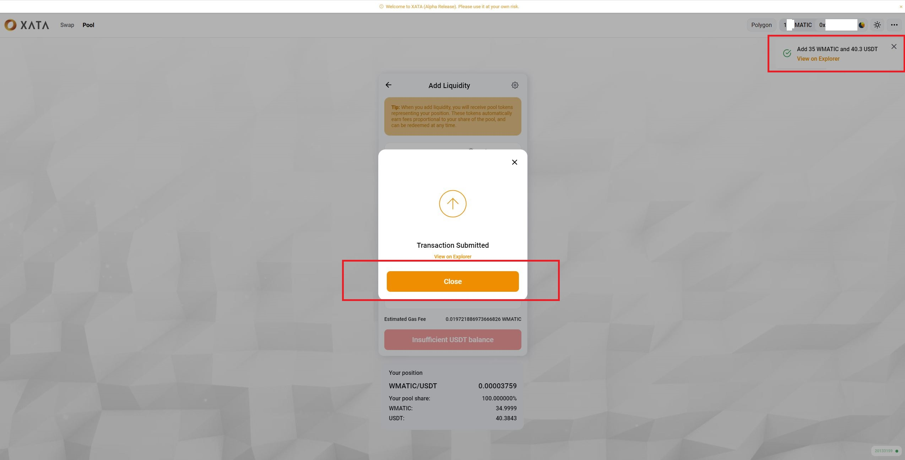{style="zoom:80%"}

### Removing Liquidity
* To remove liquidity, click on “Pool” to view all your liquidity pools. Then click on "Manage" on the liquidity pool of your choice. Then click "Remove".

{style="zoom:80%"}

* Next, select the percentage of liquidity you would like to remove from your pool. Then click "Approve".

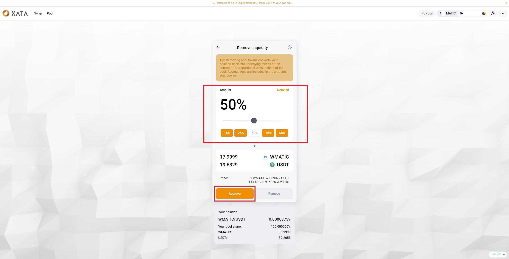{style="zoom:80%"}
	
* A Metamask extension prompt will appear for an approval, Click on "Sign" to proceed.

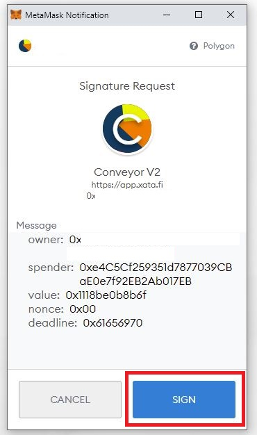{style="display: block; margin: 0 auto"}
	
* Once approved, you can now click on the "Remove" button to trigger another signature request.

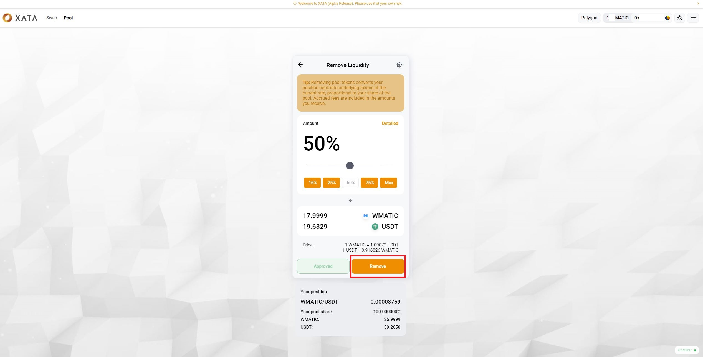{style="zoom:80%"}
	
* A Metamask extension prompt for signature request will popup. Click on "Sign" again to proceed.

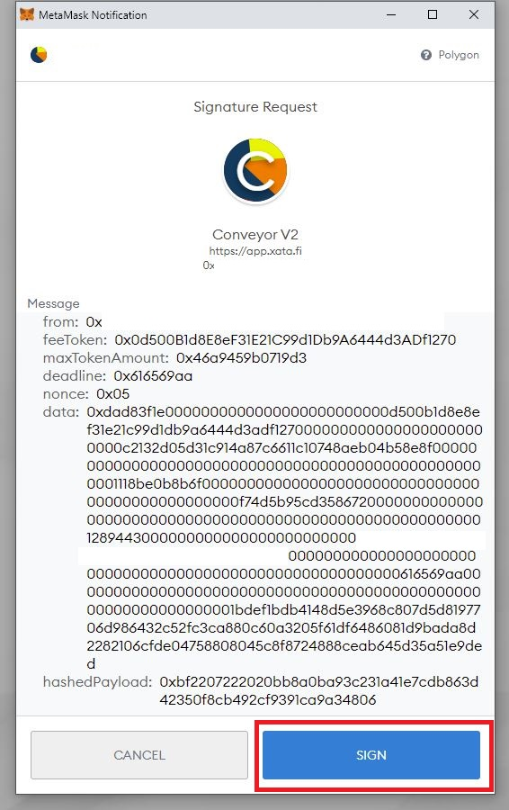{style="zoom:60%; display: block; margin: 0 auto"}
	
* The final confirmation popup on XATA will appear. Click on "Confirm" to complete the process.

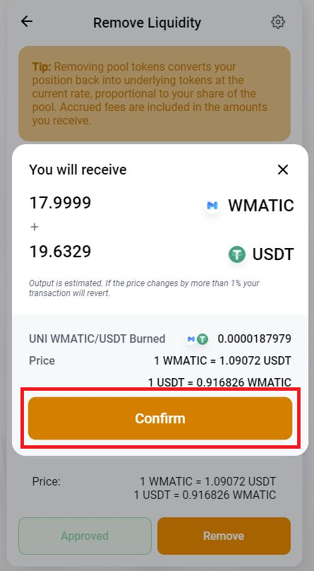{style="zoom:60%; display: block; margin: 0 auto"}
	
* Once your transaction is confirmed on the blockchain, you will receive your tokens from the removed liquidity pool.

{style="zoom:80%"}
	

